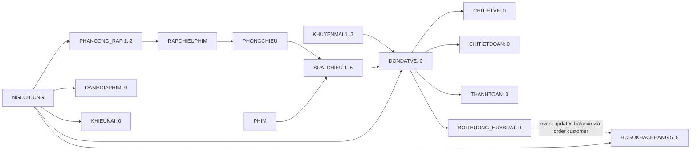

# R6A — Historical Data Audit & Classification

**R6A PASS — audit và phân loại hoàn tất; không sửa production.**

1. **Main inventory.** CinemaBookingDB; mốc phân loại 2026-10-05T05:16:27.677Z, business date 2026-10-05, Asia/Saigon UTC+7 qua fn_HomNay/fn_NgayKinhDoanh. 27 bảng,159 module(125 SP,6 view,21 function,7 trigger);63 index;161 constraint(56 CHECK,36 DEFAULT,31 FK,27 PK,11 UNIQUE). DONDATVE/THANHTOAN/BOITHUONG_HUYSUAT vàticket/food detail đều0. [Trước](evidence/main-before.json), [metadata trước](evidence/inventory-before.json), [sau](evidence/main-after.json).
2. **9 finding đã re-scan**, query/result riêng và bảng phân loại bên dưới. Không dùng kết luận cũ thay cho kết quả current main.
3. **Record hiện còn có biểu hiện finding:** SUATCHIEU2/3/4/5 củaDATA-009. Những record khác được kiểm nhưng hợp lệ: Customer5–8/profile5–8; assignment1/2; promo1–3; toàn bộshow1–5.
4. **Provenance.** [Seed/phase/source evidence](evidence/provenance.json): main đã khớp immutable R0 seed trước R1; financial tables đã0 tại đó. R1 chỉ chuyển timestamp của seed proven, không sửa ambiguous history. Tất cả27 data fingerprints +module/schema/grants hiện khớp R5 kết thúc. Seed schedule hiện khớp seed day2026-10-03 (suy ra từ timestamps, không phải execution log). Sự kiện loại bỏ các record pre-R0 và nguồn của các record cũ ngoài fixture chưa được chứng minh; không gọi việc vắng record là đã sửa đúng.
5. **Classification.** Scope rõ theo current/old/fixture; label INSUFFICIENT_EVIDENCE áp cho reconstruction lịch sử, không phủ nhận scan hiện tại đã thành công. Xem [classification JSON](CLASSIFICATION.json).
6. **Already resolved/fixture.** DATA-001..008 không còn finding hiện tại. Chỉ phần user26(DATA-005), user34(DATA-006), active assignment13/14(DATA-007) có manifest fixture. Chúng từng nằm trong DB chính của old audit và hiện vắng; không gắn FIXTURE_ONLY cho toàn bộ9 finding. [Historical evidence đã lọc](evidence/historical-evidence-sanitized.json).
7. **Cần R6B:** 0 candidate có đủ chứng cứ và record hiện tại cần sửa. Không backfill cho đơn/account vắng. Chỉ mở lại đánh giá lịch sử nếu có chứng từ/event/lineage mới.
8. **Preserve/no-change.** Giữ SUATCHIEU2/3/4/5 và status/timestamps; giữ balance profiles, counter1–3 và mọi payment/history. Không tái tạo old records, không clamp discount, không inventDOB, không merge assignment.
9. **Action plan.** [R6B plan](R6B_ACTION_PLAN.md), [JSON](R6B_ACTION_PLAN.json) có candidate list rỗng và gates về before/after/evidence/rollback/dependency/transaction/invariant cho audit sau; không tạo/chạy data migration.
10. **Risk.** Không có remediation candidate. Risk nếu sửa thiếu evidence được nêu theo từng dòng: HIGH cho finance/loyalty/counter/scope,MEDIUM–HIGH cho lịch sử vàprofile. Confidence current HIGH; origin/reconstruction thiếu chứng cứ LOW.
11. **Safety/health.** Fingerprint27/27 bảng, schema, module, DB grants và toàn inventory metadata trước/sau giống nhau. R1–R5 production source +shared/tests/tooling hash không đổi. Health Healthy;source/baseline parity159/159 PASS;27table inventory parity PASS. ChỉCinemaBookingDB ONLINE còn trên server theo filterCinemaBookingDB%; không tạo fixture, không cần xóa fixture. Không thêm table/index/constraint/SP/function/view/trigger. Chỉ SELECT và2SP đã inspect chỉ-read(HealthCheck/ListByMovie). Full R1–R5/backend/frontend suite không rerun vì không sửa source, theo scopeR6A; không reset main. [Health/cleanup](evidence/health-and-cleanup.json), [parity](evidence/source-parity.json), [fingerprint](evidence/main-after.json).
12. **Kết luận R6A PASS.** 9/9 đã được xác minh và phân loại; quyết định R6B=NO CHANGE có căn cứ. PASS không có nghĩa9 finding đã được sửa. Không mở GAP, sửa BUG hay đổi policyR1–R5.

Sau khi tạo báo cáo, [final-check](evidence/main-final.json) kiểm tra lại toàn bộ fingerprint/metadata/source parity, query digest và đường dẫn evidence.

## Bảng tổng hợp

Risk là rủi ro của quyết định hoặc giả thuyết sửa, không phải bằng chứng record hiện hỏng. Production Records chỉ là record hiện vi phạm/biểu hiện finding; checked valid IDs nằm ở phần chi tiết/JSON.

| DATA | Current Evidence | Production Records | Classification | Proposed R6B Action | Risk | Confidence |
|---|---|---|---|---|---|---|
| DATA-001 | 0 đơn âm; #20 vắng; payment attempts/ticket/food/promo liên quan đều 0. | 0 record vi phạm | ALREADY_RESOLVED / INSUFFICIENT_EVIDENCE | NO CHANGE; không clamp, tái tạo đơn, sửa discount/total/payment. | LOW khi giữ nguyên; HIGH nếu sửa/tái tạo tài chính thiếu chứng từ. | HIGH cho hiện trạng; LOW cho nguồn/giá trị lịch sử. |
| DATA-002 | 26/27/28 và show34 vắng; 0 paid/cancelled pairs, 0 payments, 0 compensation. | 0 record vi phạm | ALREADY_RESOLVED / INSUFFICIENT_EVIDENCE | NO CHANGE; không backfill điểm hay tạo ledger giả cho đơn vắng. | LOW khi giữ nguyên; HIGH nếu tự cộng điểm, double-credit hoặc viết lại payment. | HIGH cho hiện trạng; LOW cho compensation cũ. |
| DATA-003 | Quét đủ 5 suất: 0 ngắn; duration 166/166/166/131/110 phút; tất cả PAST. | 0 record vi phạm | ALREADY_RESOLVED / INSUFFICIENT_EVIDENCE | NO CHANGE; không kéo dài end time của seed/lịch sử. | LOW khi giữ nguyên; MEDIUM/HIGH nếu đổi lịch gây overlap hoặc bóp méo lịch sử. | HIGH cho hiện trạng; LOW cho nguồn 15 suất cũ. |
| DATA-004 | 0 suất ngoài cửa sổ phim theo ngày kinh doanh UTC+7; ID6/7/8/43 vắng. | 0 record vi phạm | ALREADY_RESOLVED / INSUFFICIENT_EVIDENCE | NO CHANGE; không đổi ngày phim để hợp thức hóa suất. | LOW khi giữ nguyên; HIGH nếu sửa cửa sổ phim/lịch sử theo giá trị suy đoán. | HIGH cho hiện trạng; LOW cho lịch sử thay đổi ngày phim. |
| DATA-005 | 0 DOB tương lai trong 4 profile; user17/26 vắng; NgaySinh nullable. | 0 record vi phạm | ALREADY_RESOLVED / FIXTURE_ONLY / INSUFFICIENT_EVIDENCE | NO CHANGE; không có record hiện tại đủ điều kiện NULL hóa. | LOW khi giữ nguyên; MEDIUM nếu bịa DOB hoặc sửa nhầm account. | HIGH cho scan/fixture26; LOW cho nguồn user17. |
| DATA-006 | Customer5/6/7/8 đủ profile và khớp seed; 0 ngoài lineage; user21/34 vắng; dependencies tài chính/review/complaint đều 0. | 0 record vi phạm | ALREADY_RESOLVED / FIXTURE_ONLY / INSUFFICIENT_EVIDENCE | NO CHANGE; không backfill default NULL/NULL/0 cho account vắng. | LOW khi giữ nguyên; MEDIUM nếu tạo profile hoặc mất loyalty balance không có chứng cứ. | HIGH cho current/fixture34; LOW cho nguồn user21. |
| DATA-007 | 0 exact duplicate trên toàn PHANCONG_RAP kể cả Đã hủy; 0 overlap; assignment1/2 là seed khác user/rạp. | 0 record vi phạm | ALREADY_RESOLVED / FIXTURE_ONLY / INSUFFICIENT_EVIDENCE | NO CHANGE; không merge/xóa assignment hoặc coi mọi overlap khác key là bug. | LOW khi giữ nguyên; HIGH nếu xóa lịch sử/sai phạm vi quản lý. | HIGH cho scan/fixture13-14; LOW cho nguồn nhóm cancelled cũ. |
| DATA-008 | Promo1/2/3 counter0/0/0; mọi tập đơn/payment/compensation đều 0; phù hợp seed hiện tại. | 0 record vi phạm | ALREADY_RESOLVED / NOT_CORRUPTION / INSUFFICIENT_EVIDENCE | NO CHANGE; không reset counter hoặc gán COUNT(current orders). | LOW khi giữ nguyên; HIGH nếu reset làm thay đổi quota/history. | HIGH cho source semantics/current seed; LOW cho historical event reconstruction. |
| DATA-009 | 4 suất PAST Mở bán:2/3/4/5; booking/payment0; public SP loại cả4; booking time guard authoritative. | SUATCHIEU2/3/4/5 | NOT_CORRUPTION / PRESERVE_HISTORY / ALREADY_RESOLVED | NO CHANGE cho2/3/4/5; không auto-update status. | LOW khi giữ nguyên; MEDIUM nếu đổi status làm lệch báo cáo lịch sử. | HIGH (DB scan, seed/phase lineage, source parity, public SP read smoke). |

## Chi tiết kiểm chứng

### DATA-001

0 đơn âm; #20 vắng; payment attempts/ticket/food/promo liên quan đều 0. [Query/result](evidence/DATA-001.json).

**ALREADY_RESOLVED:** DB hiện tại không còn finding. **INSUFFICIENT_EVIDENCE:** Nguồn và giá trị đúng của đơn cũ; không chứng minh payment âm hoặc discount đúng.

Evidence cũ tốt nhất: #20 Hết hạn; vé80000, đồ ăn0, giảm120000, tổng−40000; detail sums vé80000/food0. Không có promoID, receipt, nguyên lịch sử payment attempts hoặc giá trị discount đúng. Old payment mismatch scan rỗng chỉ chứng minh không có mismatch trong tập đã quét; không chứng minh chưa từng thu tiền âm. Current main không có bất kỳ payment nào.

Quyết định R6B: NO CHANGE; không clamp, tái tạo đơn, sửa discount/total/payment.

### DATA-002

26/27/28 và show34 vắng; 0 paid/cancelled pairs, 0 payments, 0 compensation. [Query/result](evidence/DATA-002.json).

**ALREADY_RESOLVED:** Không có đơn hiện tại cần đối chiếu/backfill. **INSUFFICIENT_EVIDENCE:** Không có snapshot/receipt/posting để chứng nhận compensation cũ.

Đối chiếu riêng mỗi đơn26/27/28: ABSENT; thiếu snapshot/payment/cancel/ledger event gốc → INSUFFICIENT_EVIDENCE, không eligible backfill. Không xác nhận các đơn này đã được bồi thường đúng. Profile5/6/7/8 còn150/80/45/0 điểm và khớp seed; số dư không chứng minh compensation cũ. R2 giữ success payment, không refund, tỷ lệ vé/đồ ăn, FLOOR(net ticket/1000), transaction và UNIQUE(DonDatVeID); source hiện tại khớp DB.

Quyết định R6B: NO CHANGE; không backfill điểm hay tạo ledger giả cho đơn vắng.

### DATA-003

Quét đủ 5 suất: 0 ngắn; duration 166/166/166/131/110 phút; tất cả PAST. [Query/result](evidence/DATA-003.json).

**ALREADY_RESOLVED:** 0 vi phạm hiện tại; 15 ID cũ đều vắng. **INSUFFICIENT_EVIDENCE:** Nguồn/phiên bản duration và lịch sử booking của 15 suất cũ chưa xác định.

Predicate chính xác dùng end < DATEADD(MINUTE,current movie duration,start), không làm tròn DATEDIFF(MINUTE). Query thu past/current/future, booking/payment và overlap nếu kéo dài cho từng anomaly; tập anomaly rỗng. [Toàn bộ5 suất](evidence/all-showtimes.json) đều PAST, duration đủ, không có booking. Không có current/future candidate.

Quyết định R6B: NO CHANGE; không kéo dài end time của seed/lịch sử.

### DATA-004

0 suất ngoài cửa sổ phim theo ngày kinh doanh UTC+7; ID6/7/8/43 vắng. [Query/result](evidence/DATA-004.json).

**ALREADY_RESOLVED:** Không còn finding trên 5 suất hiện tại. **INSUFFICIENT_EVIDENCE:** Không có revision/event log xác định release/end date tại thời điểm tạo các suất cũ.

Ngày chiếu lấy fn_NgayKinhDoanh(start) UTC+7, không CAST UTC timestamp thành DATE. Suất1 ngày kinh doanh2026-10-01;2–5 ngày2026-10-04; tất cả nằm trong release2026-09-03..end2027-10-03 của phim tương ứng. Available evidence không có revision log cho cửa sổ phim cũ. Validator hiện tại kiểm tra duration/time; không tuyên bố nó đã có rule release/end-date hay mở GAP mới.

Quyết định R6B: NO CHANGE; không đổi ngày phim để hợp thức hóa suất.

### DATA-005

0 DOB tương lai trong 4 profile; user17/26 vắng; NgaySinh nullable. [Query/result](evidence/DATA-005.json).

**ALREADY_RESOLVED:** Không còn DOB tương lai. **FIXTURE_ONLY:** Chỉ phần user26 có manifest fixture và evidence API cũ. **INSUFFICIENT_EVIDENCE:** Nguồn user17 và DOB thật không xác định.

Quét toàn bộ4 profile theo business date2026-10-05. NgaySinh nullable; không có invalid current production record để đề xuất NULL hóa. Không export DOB thường; provenance chỉ lưu boolean khớp seed.

Quyết định R6B: NO CHANGE; không có record hiện tại đủ điều kiện NULL hóa.

### DATA-006

Customer5/6/7/8 đủ profile và khớp seed; 0 ngoài lineage; user21/34 vắng; dependencies tài chính/review/complaint đều 0. [Query/result](evidence/DATA-006.json).

**ALREADY_RESOLVED:** 0 Customer orphan/outside seed lineage hiện tại. **FIXTURE_ONLY:** Chỉ phần user34 được manifest xác nhận fixture Admin-create. **INSUFFICIENT_EVIDENCE:** User21 có trước run cũ; prefix/email không chứng minh nguồn.

Quét mọi role KHACH_HANG, không chỉ danh sách orphan cũ. Customer5–8 role/profile khớp seed và R1→R5 lineage; dependency booking/payment/compensation/review/complaint đều0. User34 có manifest fixture; user21 không suy nguồn từ email/prefix. Contract NULL/NULL/0 chỉ là default R5 khi có customer hợp lệ cần backfill; hiện không áp dụng.

Quyết định R6B: NO CHANGE; không backfill default NULL/NULL/0 cho account vắng.

### DATA-007

0 exact duplicate trên toàn PHANCONG_RAP kể cả Đã hủy; 0 overlap; assignment1/2 là seed khác user/rạp. [Query/result](evidence/DATA-007.json).

**ALREADY_RESOLVED:** 0 duplicate theo exact identity R5 (NULL= NULL). **FIXTURE_ONLY:** Chỉ nhóm active13/14 được manifest xác nhận test concurrent. **INSUFFICIENT_EVIDENCE:** Nguồn nhóm cancelled user3/rạp3 cũ chưa xác định; nhóm hiện vắng.

Identity: user+cinema+start+end(NULL= NULL)+status; GROUP BY quét cảactive vàcancelled. Hai assignment seed: ID1 user2/rạp1 vàID2 user3/rạp2; không exact duplicate, không overlap same user/cinema. Nhóm cancelled cũ user3/rạp3 hiện vắng.

Quyết định R6B: NO CHANGE; không merge/xóa assignment hoặc coi mọi overlap khác key là bug.

### DATA-008

Promo1/2/3 counter0/0/0; mọi tập đơn/payment/compensation đều 0; phù hợp seed hiện tại. [Query/result](evidence/DATA-008.json).

**ALREADY_RESOLVED:** Mismatch cũ không còn trên current main. **NOT_CORRUPTION:** Counter hiện phù hợp seed/lifecycle; COUNT đơn còn lại không đủ chứng minh corruption. **INSUFFICIENT_EVIDENCE:** Không có event ledger đầy đủ để reconstruct counter cũ; seed cũ có offset 5/20 theo audit.

Semantics nguồn: booking hợp lệ trong transaction tăng1, rollback không tiêu lượt; hủy đơn Chờ thanh toán giảm1; expire pending giảm theo số đơn vừa chuyển; hủy suất R2 giảm theo paid orders liên quan sau xử lý expired holds. Payment thành công không là điểm tăng riêng. Counter là lượt đã reserve/commit chưa release theo lifecycle, với initial seed offset, không là COUNT tất cả đơn còn lưu hoặc lifetime payment count. Hold hết giờ nhưng job chưa chuyển có thể vẫn còn trong counter. Seed hiện tại đặt0/0/0. Audit cũ ghi16/20/5 và seed offset5/20; không có event ledger đủ để tái dựng. Không gán COUNT hay reset.

Quyết định R6B: NO CHANGE; không reset counter hoặc gán COUNT(current orders).

### DATA-009

4 suất PAST Mở bán:2/3/4/5; booking/payment0; public SP loại cả4; booking time guard authoritative. [Query/result](evidence/DATA-009.json).

**NOT_CORRUPTION:** Status được truyền từ Admin/Manager; khả năng bán được suy ra từ status + giờ bắt đầu. Không có contract/job tự hoàn tất. **PRESERVE_HISTORY:** Giữ 4 suất seed đã qua giờ; không normalize lịch sử. **ALREADY_RESOLVED:** Chỉ phần ID43/44 cũ đã vắng.

Seed show2–5 được tạo tương lai theo seed day; đã qua giờ ở audit ngày2026-10-05. Admin/Manager truyền status rõ ràng khi create/update; shared R5 enum chỉ whitelist, không yêu cầu auto lifecycle. Job hiện chỉ expire pending orders. Booking_Create chặn start<=fn_BayGio trước expirePending và phần tạo đơn; kiểm bằng source đã parity, không gọi SP ghi. FE MovieDetail→API public list→ShowtimeBrowser dùng kết quả đã lọc Mở bán ANDstart>now; gọi read-only sp_Showtime_ListByMovie cho phim1/2/4 đều trả0. API/detail hoặc trang quản trị có thể vẫn đọc lịch sử; không suy diễn availability chỉ từ nhãn. ID43/44 cũ vắng.

Quyết định R6B: NO CHANGE cho2/3/4/5; không auto-update status.

## Liên kết dependency

Mũi tên đi từ record cha đến record phụ thuộc; cạnh nét đứt là nghiệp vụ, không FK trực tiếp. [FK/record dependency evidence](evidence/dependencies.json) lưu trusted/enabled và delete/update action. Ledger chỉ FK DonDatVeID→DONDATVE, UNIQUE(DonDatVeID), không duplicate user/show/financial snapshots; không suy balance hiện tại thành compensation history.

## Row inventory

| Table | Rows |
|---|---:|
| BANGGIA | 7 |
| BOITHUONG_HUYSUAT | 0 |
| CHITIETDOAN | 0 |
| CHITIETVE | 0 |
| DANHGIAPHIM | 0 |
| DIENVIEN | 6 |
| DONDATVE | 0 |
| GHE | 240 |
| HINHANH_RAPCHIEUPHIM | 3 |
| HOSOKHACHHANG | 4 |
| KHIEUNAI | 0 |
| KHUYENMAI | 3 |
| NGUOIDUNG | 8 |
| PHANCONG_RAP | 2 |
| PHIM | 4 |
| PHIM_DIENVIEN | 4 |
| PHIM_THELOAI | 7 |
| PHONGCHIEU | 6 |
| QUYEN | 23 |
| RAPCHIEUPHIM | 3 |
| SANPHAM | 5 |
| SUATCHIEU | 5 |
| THANHTOAN | 0 |
| THELOAI | 7 |
| VAITRO | 4 |
| VAITRO_QUYEN | 40 |
| XULY_KHIEUNAI | 0 |

## Giới hạn và tái lập

Historical JSON là evidence quan sát cũ, không receipt hay event ledger và không được tự diễn dịch sang UTC sauR1. Không đủ chứng cứ biết ai xóa/archived pre-R0 records hoặc giá trị đúng cần sửa. Không export password/password hash/token/credential/email/phone/ordinary DOB; fingerprintSHA256 là digest cả bảng/source để kiểm integrity, không account authentication hash.

Read-only scripts: [capture before](../../../scripts/r6a/before.mjs), [audit](../../../scripts/r6a/audit.mjs), [provenance](../../../scripts/r6a/provenance.mjs), [report offline](../../../scripts/r6a/report.mjs). Queryfiles có guard chỉSELECT; mốc phân loại bind từmain-before. Muốn audit lần mới phải capturebefore mới rồi chạy audit→provenance→report→final-check; không gọi reset/migrate/booking/cancel/payment/job. Các file R6A chỉ tooling/report/evidence, không import vào Backend.
