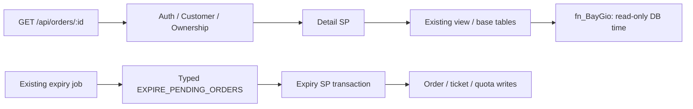

# Task 15 — R4.7 / I-22: Read-only Order Detail

## 1. Scope

Chỉ read-only Detail và kiểm chứng independent expiry lifecycle. Không R5–R9, không dataset rebuild, không full45-UC regression, không redesign Frontend hoặc scheduler. Baseline working state cuối Task14 trên branch `tuan`, HEAD `8796e9b86f840e9f0ad56c843787fe9c4a08b737`, Tasks9–14 chưa commit; không reset/commit/overwrite evidence cũ.

## 2. Root cause I-22

`sp_Order_GetDetailByCustomer` kiểm ownership rồi lookup showtime và gọi `sp_Order_ExpirePending @SuatChieuID`. SP nested UPDATE đơn pending quá hạn của **toàn showtime**, cancel tickets và decrement coupon usage trước SELECT. Vì thế đọc một đơn có thể ghi cả đơn Customer khác. Backend GET service chỉ gọi typed Detail đúng contract; lỗi nằm trong SQL call graph.

## 3. Audit before

[Audit](r47/audit-before.json): main27 bảng/159 modules source parity, role/ownership/signature, schema/CHECK/FK, dependencies; main expiredPending0 và order0. [Frozen SHA](r47/preserved-before.json)1584 file, before-source SP/Service/Audit. Đã đối chiếu roadmap R4.7, I-22, thiết kế booking/payment/chi tiết đơn, R0–R4.6 evidence và consumers.

```powershell
node scripts/r47/audit-before.mjs --database=CinemaBookingDB
node scripts/r47/detail-before.mjs --database=CinemaBookingDB_R0_R33_20261008_01
```

[Before reproduction](r47/detail-before.json) **REPRODUCED** bằng SQL trực tiếp và HTTP200 thật: hai Customer orders→Hết hạn, tickets→Đã hủy, usage2→0; changed tables chính xác DONDATVE/CHITIETVE/KHUYENMAI. Full cleanup fingerprint PASS. Không tái hiện trên main, không chạy lại audit-before sau fix.

## 4. Database lifecycle findings

CHECK order có sáu states: Chờ thanh toán/Đã thanh toán/Đã hủy/Hết hạn/Hoàn tiền/Hoàn thành. `HanGiuCho DATETIME2(7)` nullable theo column, nhưng trusted CHECK bắt pending NOT NULL. Không disable CHECK để dựng NULL pending. Refund/completed tests chỉ là schema-valid read fixtures, không triển khai workflow mới.

Booking hold300 seconds, không gia hạn; expiry predicate pending AND(NULL OR <=fn_BayGio). `fn_BayGio`=SYSUTCDATETIME, datetime/timezone convention giữ nguyên. Expiry chỉ đổi order/ticket/promo usage; không physical GHE/payment/monetary snapshots. Availability đã dùng `fn_DonDangGiuGhe` để bỏ qua overdue holds, không cần GET/job cleanup mới được đọc ghế trống. Payment SP tự kiểm deadline/state,50111 hiện hữu vẫn authoritative; không sửa late-payment policy.

## 5. Stored Procedure before/after

Production fix cuối **chỉ xóa hai dòng**: show lookup không còn dùng và nested expiry. Không sửa JOIN/columns/guards/signature/view, không SP mới. [Independent Task15 diff](r47/source-changes.patch). Kế hoạch audit ban đầu cân nhắc CASE NULL; sau xác minh trusted CHECK, projection hiện hữu đủ cho mọi dữ liệu hợp lệ nên không thêm CASE/field thừa.

Before: GET→Detail→Expiry→order/ticket/promotion writes. After:



[Versioned unit call-graph test](../../backend/tests/orderDetailReadOnly.test.js) traverses canonical module references và kiểm không EXEC/DML ở Detail/view/function. Runtime SQL/HTTP fingerprints bổ sung chứng cứ, không chỉ grep keyword.

## 6. Read/write ownership matrix

| Operation | Owner | Writes |
|---|---|---|
| Detail/status read | Detail SP + existing view | Không |
| Effective status | Existing SQL view + DB clock | Không |
| Expire pending | Expiry SP | Order→Hết hạn |
| Resource/quota cleanup | Same expiry transaction | Tickets→Đã hủy; quota decrement once |
| Scheduling | Existing job | Typed expiry call only |
| Booking/payment/cancellation commands | Existing authoritative SPs | Protocol hiện hành, không đổi |

Không chuyển expiry sang Backend handler hoặc client. GET không trigger job hoặc audit business write.

## 7. EffectiveStatus decision và boundary

Không thêm field: `vw_ChiTietDonDatVe.TrangThaiDon`→DTO `status` đã là projection hiệu lực. Pending trước deadline→pending; đúng/sau deadline→effective Hết hạn, stored state vẫn pending tới authoritative command/job. Non-pending không bị effective expire chỉ vì deadline past/NULL. Ticket/payment fields vẫn phản ánh stored data, không giả lập canceled ticket khi chưa có lifecycle write.

Eight exact SQL boundary/state projections PASS tại một DB instant, dùng expression view thật; không freeze/replace production clock. Runtime GET before/at-or-after deadline và all schema states PASS. NULL pending UPDATE bị547 và fingerprint unchanged: scenario invalid theo CHECK, không skip test/disable constraint. Non-pending NULL scenarios thực thi thật. [Boundary proof](r47/detail-tests.json).

## 8. Backend/API/consumer contract

`GET /api/orders/:orderId` authenticate→requireCustomer→controller→typed Detail hai INT params. Four sets giữ thứ tự header/tickets/products/payments, `{order}` DTO fields/types giữ nguyên. Self identity lấy `req.user.userId`, query/body owner/role không authoritative. SQL50033 missing/foreign→404 ORDER_NOT_FOUND; auth401 UNAUTHENTICATED; role middleware403 CUSTOMER_REQUIRED; direct SQL role50301 giữ nguyên.

OrderDetail/PaymentPage vẫn dùng SQL status/deadline; không response field mới, không Backend local expiry calculation, không Frontend production change. Payment callers vẫn ownership read rồi actual payment SP; read không còn có mutation nhưng write tự revalidate deadline. Unit7 mới + full regression kiểm contract này.

## 9. Expiry job verification

Job đã tồn tại và active: server startup gọi `startExpirePendingOrdersJob()`; shutdown stop trước closePool; default60s, unref, running guard/catch/finally. Không sửa job/server hoặc thêm scheduler.

Integration actual existing timer (test-only30ms) dùng **default typed client thật**, không execute mock. Hai overdue orders hết hạn khi **không có GET request**, future pending/paid giữ nguyên, usage4→2; ba repeated ticks không đổi fingerprint hoặc double return; money/payment giữ nguyên. [Job proof](r47/detail-tests.json) có logs/count/request-before-after. Unit thêm overlap/stop timer tests, existing error recovery test chạy lại. Production policy60s giữ nguyên.

## 10. Non-mutation evidence

**41** full27-table/data+metadata fingerprint pairs identical trước/sau directSQL/GET: future pending, overdue pending, paid, canceled, persisted expired, completed/refund, repeated reads, ownership/RBAC/missing/invalid/spoof input, seat availability và read trong writer transaction. Mọi HTTP GET có SQL read-after-request và full fingerprint; không chỉ status200. Includes other Customer order, held tickets, processing payment, quota và historical money.

Standalone createApp trong test không start server job, để cô lập reader với independent writer; production server job giữ nguyên. Separate timer lifecycle test chủ động start job, không GET. Fingerprints và case logs tại [detail-tests](r47/detail-tests.json).

## 11. SQL Server tests

```powershell
node scripts/r47/deploy.mjs --database=CinemaBookingDB_R0_R33_20261008_01 --apply
node scripts/r47/detail-tests.mjs --database=CinemaBookingDB_R0_R33_20261008_01
```

**31 cases PASS**,34 HTTP requests,41 non-mutation checks,5 actual races. [Test deploy](r47/test-deployment.json), [full proof](r47/detail-tests.json), [clean-source first log](r47/detail-sql-http.txt), [repeat log](r47/detail-repeat.txt). Disposable DB existence/baseline confirmed; fixture code R47-DETAIL collision guard, captured IDs, cleanup only own parents/orders/payment and restored prior loyalty points; all27 tables/all metadata before-after identical.

Required R4.7-01–12 được phủ: future/past/paid/canceled/expired reads; repeated GET; foreign/missing; DB-time boundary; quota/seat/ticket/payment unchanged. NULL pending không schema-valid, có negative CHECK proof; sáu schema states đều read-tested.

## 12. HTTP integration

Real Backend→typed gateway→SQL, không mock API/SQL response.34 requests gồm five-role logins, own/foreign/unauthenticated/RBAC/missing/invalid IDs, repeated overdue read, read during writer và payment creation/failure/retry/success/repeated result/late rejection. DTO status vs stored status được đối chiếu trực tiếp. API-01–10 đều có actual proof; API-10 timer không GET. UserId/role/status query không đổi owner hoặc stored status.

## 13. Expiry lifecycle/rollback/concurrency

Explicit expiry count2 rồi count0, independent timer, paid/future/non-pending exclusions PASS. Temporary fixture-scoped AFTER UPDATE promo trigger quan sát expired order+cancelled tickets và usage0 trước THROW51047 ở bước cuối; rollback restores order/ticket/quota và full fingerprint, không transaction mở. Always DROP finally, không main deployment.

Năm actual two-session scenarios: expiry-before-read (RCSI reader sees committed pending/booked versions while effective status expired), SERIALIZABLE caller read-first blocks writer, expiry-before-payment→50111, paid payment-first prevents expiry, expiry-before-booking releases old hold rồi new booking consumes once. Four writer/blocking cases có DMV LCK evidence; RCSI read case hoàn tất trước writer commit và sau commit đọc canceled tickets. Không thêm isolation guarantee cross-four-SELECT khi writer có thể commit xen kẽ, không production isolation change.

Failed payment không gia hạn hold; retry/success and repeat final result idempotent; overdue attempt/result rejected50111 dù preceding GET không expire. Booking/expiry/payment protocols source nguyên byte.

## 14. Regression và Backend reproducibility

```powershell
node scripts/r47/checks.mjs --database=CinemaBookingDB_R0_R33_20261008_01
# Isolated stage: npm.cmd ci; npm.cmd test; npm.cmd test;
# reverse order --test-concurrency=1, exact args trong backend-reverse.txt
```

[23 checks](r47/checks.json) tất cả exit0. Clean source-only stage không .env/audit/evidence/node_modules cũ; npm ci Node24.21.0/npm11.19.0; Backend unit input versioned, không audit artifact dependency. **191/191 PASS×3**,0 skip/fail/cancel/todo; **21 order/auth focused PASS** gồm7 new focused tests. [Full](r47/backend.txt), [repeat](r47/backend-repeat.txt), [reverse](r47/backend-reverse.txt), [focused](r47/order-focused.txt), [install](r47/clean-npm-ci.txt).

| Regression mới chạy trên source hiện hành | Result / proof |
|---|---|
| Booking bookability |30 cases PASS — [SQL](r47/regression/r21/sql-tests.json) |
| Booking parent concurrency |14 races PASS — [proof](r47/regression/r21/parent-concurrency.json) |
| Promotion atomicity |28 cases+6 constraints+fault rollback PASS — [SQL](r47/regression/r22/sql-tests.json) |
| Promotion quota/writers concurrency |2 final-quota+12 Admin races PASS — [proof](r47/regression/r22/promotion-concurrency.json) |
| Money ownership/payment |37 cases61 HTTP PASS — [proof](r47/regression/r44/ownership-tests.json) |
| Historical snapshots |108 cases PASS — [proof](r47/regression/r32/sql-tests.json) |
| Caller/savepoint/rollback |8 cases PASS — [proof](r47/regression/r32/transaction-tests.json) |
| Auth/JWT/RBAC/status/rate |14 cases52 HTTP PASS — [proof](r47/regression/r45/auth-tests.json) |
| Existing Frontend compatibility |62 tests/lint/build PASS — [tests](r47/frontend-test.txt), [lint](r47/frontend-lint.txt), [build](r47/frontend-build.txt) |

Không dùng evidence cũ thay proof source mới; không full45-UC hoặc unrelated browser suites. Vite warning bundle size hiện hữu ngoài scope, dependencies không đổi.

## 15. No-SQL / contracts / full DB verification

```powershell
node scripts/audit-no-sql.mjs
node scripts/db/contract-check.mjs
node scripts/db/run.mjs test --database=CinemaBookingDB_R0_R33_20261008_01
node scripts/db/run.mjs verify --database=CinemaBookingDB_R0_R33_20261008_01
```

Chạy trong stage để không overwrite prior `_audit`. **No-SQL PASS**101 files/27 reviewed non-SQL matches: [log](r47/no-sql.txt). **Contract PASS**112 service methods120 typed calls/whitelist entries: [JSON](r47/backend-contract-check.json), [log](r47/procedure-contract.txt). **Full DB tests/verify PASS**,159 source/live parity, signature/schema/constraints: [tests](r47/database-tests.txt), [verify](r47/database-verify.txt), [parity](r47/verify-CinemaBookingDB_R0_R33_20261008_01.json).

Development attempts retained: [attempt1](r47/detail-tests-attempt-1.json) expected wrong role HTTP code, corrected to existing CUSTOMER_REQUIRED; [attempt2](r47/detail-tests-attempt-2.json) harness incorrectly expected reader lock wait, corrected to verified RCSI semantics. [Checks attempt1](r47/checks-attempt-1.json)/[No-SQL initial log](r47/no-sql-attempt-1.txt): static SQL-absence regex assertion outside scanner reviewed category. Re-expressed equivalent negative-lookahead with existing assert.match convention, no scanner exemption/code change, no assertion weakening. Final source reinstalled/retested fully PASS; no production fix added for harness issues.

## 16. Source/data preservation và files

Only two preexisting files changed vs frozen Task14: `database/08_procedures/customer/sp_Order_GetDetailByCustomer.sql` (remove write call+unused lookup); `docs/FULL_SYSTEM_AUDIT.md` (prepend scoped acceptance). New: `backend/tests/orderDetailReadOnly.test.js`, `database/11_tests/orders/expiry_rollback.sql`, contract/report, `scripts/r47/{common,audit-before,fixtures,detail-before,deploy,detail-tests,checks,main-check,final-checks}.mjs`, evidence `r47/`. Reuse existing Node/mssql/Vite/SQL tooling, no new framework.

**1582 existing files preserved SHA**, including all pending Tasks9–14 source/evidence. Backend/Frontend production, job/server, view, booking/payment/expiry SQL, auth/JWT/RBAC/rate limiter, schema/keys/grants all unchanged. Stage source inputs byte-identical before/after; test data/all metadata restored. [Final gate](r47/final-checks.json) enforces exact two-line SQL removal, tested-source hashes, scope allowlist, git diff --check, syntax, evidence links. [Current audit](r47/current-audit-status.json) only I-22 resolved;45 UC grades and all other findings identical.

## 17. Main deployment

```powershell
node scripts/r47/main-check.mjs --database=CinemaBookingDB --mode=isolation
node scripts/r47/deploy.mjs --database=CinemaBookingDB --apply
node scripts/r47/main-check.mjs --database=CinemaBookingDB --mode=readonly
node scripts/r47/final-checks.mjs
```

After full regression PASS, authorized established workflow COPY_ONLY/CHECKSUM backup + RESTORE VERIFYONLY; only Detail SP changed.27 table data/schema/grants/signatures and158 other modules preserved; all159 module source/live parity and parameter parity reverified. Main four-role login/GETme/permissions and authenticated Detail GET404 passed, full readonly before-after fingerprint equal. [Isolation](r47/main-test-isolation.json), [backup/deploy](r47/main-deployment.json), [readonly](r47/main-readonly.json).

Main has **zero orders**, so positive detail verification N/A on main; positive/expired/fault/races exclusively disposable. Không tạo main fixture hoặc sửa role/profile/history, không drop/reset/reseed DB. Không đánh đồng main missing404 proof với disposable positive proof.

## 18. Remaining limitations

GET uses existing statement-level RCSI/four resultsets, không guarantee atomic cross-resultset snapshot nếu writer commit xen kẽ. Pending NULL prevented by trusted CHECK, không dựng invalid fixture; other NULL/past states tested. Effective status không chứng minh persisted ticket/quota cleanup đã commit; authoritative job/command mới ghi transition. Main positive N/A do no orders. Historical design text về late payment không thay canonical50111 rule đã nghiệm thu. Không nâng UC PARTIAL thành PASS, không R5–R9 hoặc cleanup unrelated data.

## 19. Final status và Phase R4

**Task15 — DONE / R4.7 I-22.** Actual before reproduction, read-only call graph,41 full non-mutation pairs, independent timer lifecycle, rollback/payment/booking races, clean full suite/regression/No-SQL/contracts/DB tests/verify, source/data preservation và safe main deployment/reverify PASS. Không commit source, dừng tại R4.7.

**Phase R4 — Đủ điều kiện tổng hợp nghiệm thu theo evidence.** Artifact `r47/r4-acceptance.json` do final gate tạo sau khi đối chiếu final PASS của cả R4.1–R4.7 và SHA preservation R4.1–R4.6, kèm current191 Backend/full related regression. Đây là scoped phase acceptance, không phải full45-UC acceptance.

**R5 — NOT STARTED.**
