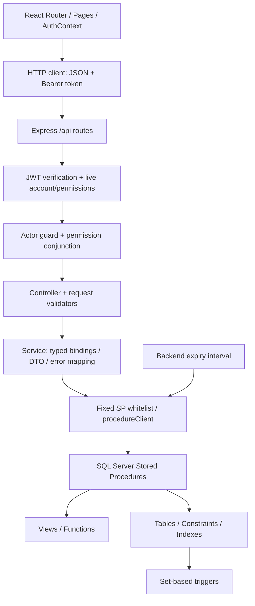

# FULL SYSTEM AUDIT

**Cập nhật Task 14 — R4.6 / I-20 (08/10/2026): DONE.** SP Profile đọc và khóa role/status hiện tại từ Database; Customer cập nhật/tạo hồ sơ hợp lệ, Staff chỉ cập nhật tên/điện thoại, không ghi hồ sơ dù hồ sơ bất thường đã tồn tại. Field Customer non-NULL của Staff bị từ chối bằng50301/FORBIDDEN hiện hữu; signature năm tham số, Backend/Auth/JWT/RBAC/rate limiter giữ nguyên. Form Profile chỉ hiển thị/gửi field Customer khi role Customer sau khi tái hiện lỗi payload cũ bằng HTTP/SQL thật.41 SQL/HTTP cases38 requests,4 races thật,16 Chrome checks,Backend184 qua clean/repeat/reverse,50 auth-focused,Frontend62/lint/build,Auth14 cases52 requests và lịch sử108 cases PASS. Backup COPY_ONLY/CHECKSUM/VERIFYONLY rồi chỉ thay sp_User_UpdateProfile trên main;27 bảng/data/schema/grants/signatures và158 module khác giữ nguyên;159 module parity và read-only bốn role PASS.1526 file có sẵn ngoài ba file Task14 giữ nguyên. Chỉ I-20 resolved,45 UC grades và finding khác giữ nguyên; không cleanup profile cũ, không triển khai R4.7/R5–R9. Xem [báo cáo R4.6](evidence/R4_ROLE_AWARE_PROFILE_UPDATE.md), [contract](contracts/ROLE_AWARE_PROFILE_UPDATE.md), [audit hiện hành](evidence/r46/current-audit-status.json).

**Cập nhật Task 13 — R4.5 / I-18 (08/10/2026): DONE trong phạm vi rate policy của roadmap.** Chỉ POST Login/Register có limiter in-memory riêng mỗi app:20/10 requests mỗi60 giây theo IP/endpoint, IPv4-mapped normalize và IPv6 /64, state tối đa10000 buckets; count trước JSON parsing, không đổi trust proxy=false. Vượt ngưỡng trả429 RATE_LIMIT_EXCEEDED/Retry-After và không gọi Auth Service/SQL.18 focused limiter tests,42 auth-focused tests, Backend176 qua ba lượt clean/repeat/reverse, Frontend58/lint/build,14 SQL/HTTP cases52 requests,8 auth browser checks và regression Task10–12/No-SQL/contracts/DB verify PASS. Main27 bảng/data/metadata,159 modules và các source/evidence Task9–12 giữ nguyên. JWT/password/RBAC/session không đổi; server logout revocation vẫn không có và ngoài R4.5.45 UC grades giữ nguyên. Xem [báo cáo R4.5](evidence/R4_AUTH_RATE_LIMITING.md), [contract](contracts/AUTH_RATE_LIMITING.md), [audit hiện hành](evidence/r45/current-audit-status.json). Dừng tại R4.5; không triển khai Task14/R4.6.

**Cập nhật Task 12 — R4.4 / I-17 (08/10/2026): DONE.** Ownership contract xác nhận Database quyết định giới hạn và tiền chính thức; UX/HTTP validation trùng 10/10/99 được giữ nguyên. Đã tái hiện HTTP preview từ chối subtotal `0.10+0.10+0.10` do binary noise, sửa riêng subtotal preview về scale 2 trước typed binding. 37 SQL/HTTP cases, 61 requests, 8 browser checks thật, Backend158 qua ba lượt clean/repeat/reverse, Frontend56/lint/build và regression booking/promotion/concurrency/pricing/history/report/No-SQL/full DB verification PASS. Không sửa SQL, schema hoặc Frontend production; main 27 bảng/data và toàn bộ metadata,159 modules giữ nguyên. Các thay đổi chưa commit Task 9–11 và evidence trước được bảo toàn; chỉ I-17 resolved,45 UC grades giữ nguyên. Xem [báo cáo R4.4](evidence/R4_BUSINESS_RULE_OWNERSHIP.md), [ownership contract](contracts/BUSINESS_RULE_OWNERSHIP.md), [audit hiện hành](evidence/r44/current-audit-status.json). Dừng tại R4.4; không triển khai Task 13/R4.5.

**Cập nhật Task 11 — R4.3 / I-14 (08/10/2026): DONE.** Admin Pricing Update hỗ trợ đủ dimensions/date/surcharge/status qua SP/validator/typed service/form hiện hữu, giữ payload cũ và contract nhóm điều kiện như Manager. SQL/API/browser thật, overlap/atomicity/paid historical money, full clean-source regression và safe main deployment/reverify PASS; dữ liệu/schema/module ngoài scope được bảo toàn. Chỉ I-14 resolved; mọi finding khác và 45 UC grades giữ nguyên. ADM-13 full acceptance vẫn PARTIAL, pricing contract PASS có evidence riêng tại [R4_ADMIN_PRICING_UPDATE.md](evidence/R4_ADMIN_PRICING_UPDATE.md) và [current-audit-status.json](evidence/r43/current-audit-status.json). Phần audit lịch sử bên dưới giữ nguyên; dừng tại R4.3.

**Cập nhật Task 10 / R4.2 — 08/10/2026:** I-13 RESOLVED trong phạm vi SP/Backend Admin Revenue: một SP hiện hữu trả Summary/Cinema/Movie/Date từ cùng successful-payment snapshot cohort, giữ công thức cash/date/cancellation/compensation; service map bốn sets và giữ aliases cũ. 22 SQL cases,32 API cases/37 requests,139 Backend tests qua ba lượt clean/repeat/reverse, No-SQL/contracts/full Database + accepted R1–R3.3 SQL regression PASS. Main backup COPY_ONLY/CHECKSUM/VERIFYONLY rồi chỉ thay report SP;27 tables/data/schema và158 module khác bảo toàn, real GET report read-only PASS. Frontend/Manager API không sửa; ADM-16 full UC vẫn PARTIAL vì UI/broader acceptance. Xem [báo cáo R4.2](evidence/R4_ADMIN_REVENUE_REPORT.md), [contract](contracts/ADMIN_REVENUE.md), [audit hiện hành](evidence/r42/current-audit-status.json). **Dừng tại R4.2, không triển khai R4.3–R4.7 hoặc R5.**

**Cập nhật Task 9 / R4.1 — 08/10/2026:** I-12 hoàn tất nghiệm thu reproducibility. Hai dependency `known-contract-gaps.json` đã bỏ tại R0 được giữ nguyên; 131/131 Backend tests PASS trong working tree và sáu lượt trên hai clone độc lập sau `npm ci`, không `.env`/audit/evidence, gồm chạy lại và đảo thứ tự file. Input versioned giữ nguyên byte trước/sau; không đổi test assertions, Backend runtime, SQL/schema/API hoặc Frontend. Setup Node24/npm được tài liệu hóa. Xem [báo cáo R4.1](evidence/R4_BACKEND_TEST_REPRODUCIBILITY.md), [evidence clean checkout](evidence/r41/clean-check.json), [audit hiện hành](evidence/r41/current-audit-status.json). **Dừng tại R4.1, không triển khai R4.2.** Các cập nhật trước bên dưới giữ nguyên lịch sử nghiệm thu.

**Cập nhật Task 8 / R3.3 — 08/10/2026:** I-16 RESOLVED: trigger AFTER INSERT hiện hữu khóa các complaint bị ảnh hưởng, rồi dùng ROW_NUMBER/PARTITION BY KhieuNaiID/ORDER BY XuLyID DESC trên history liên quan, chỉ rn=1 cập nhật parent. 29 SQL cases, 6 rollback cases, 158 API requests/45 cases và 12 real SQL races PASS. Race canonical identity nhỏ hoàn tất sau identity lớn đã tái hiện lỗi trước sửa và PASS sau sửa. Full R1/R2/R3.1/R3.2 replay, backend131/frontend49 không skip, no-SQL/contracts/lint/build/parity PASS. Main backup COPY_ONLY/CHECKSUM/VERIFYONLY rồi chỉ thay một trigger; data27/schema/grants/signatures và 158 module khác giữ nguyên, không mass correction history. Backend/frontend không sửa. Các UC complaint liên quan vẫn PARTIAL. Xem [báo cáo 29 phần](evidence/R3_COMPLAINT_TRIGGER_DETERMINISM.md), [audit hiện hành](evidence/r33/current-audit-status.json). **Dừng tại R3.3, không triển khai R4.**

**Cập nhật Task 7 / R3.2 — 08/10/2026:** I-09 RESOLVED theo policy giới hạn của roadmap: mọi order history khóa phim/thời gian/định dạng/giá cơ bản của suất; chuyển phòng không thuộc update contract; mọi ticket history khóa loại ghế. State transitions, canonical Cancel và future-ticket guard giữ nguyên. Monetary snapshots giữ nguyên khi cập nhật pricing/product; tên catalog vẫn là mô tả hiện tại. 108 SQL cases, 240 API requests/82 cases, 20 booking/update races, 8 caller transaction cases và 24 browser checks PASS. Full accepted R1/R2/R3.1 replay, 131 backend tests, 49 frontend tests, no-SQL/contracts/lint/build/parity PASS; không skip. Main đã backup COPY_ONLY/CHECKSUM và RESTORE VERIFYONLY, chỉ thay bốn procedure; dữ liệu 27 bảng, schema/grants/signatures và 155 module còn lại giữ nguyên. Các UC liên quan vẫn PARTIAL. Xem [báo cáo 28 phần](evidence/R3_HISTORICAL_METADATA.md), [trạng thái hiện hành](evidence/r32/current-audit-status.json). **Dừng tại R3.2; chưa triển khai R3.3.** Các đoạn/bảng audit cũ bên dưới là lịch sử đối chiếu.

**C?p nh?t Task 6 / R3.1 ? 08/10/2026:** I-08 RESOLVED: to?n b? JSON/duplicates/actor references ???c validate tr??c DELETE; replacement v? Actor Delete kh?a resource hi?n h?u; rollback gi? nguy?n cast c?.9 SQL positive +30 negative,59 API requests,10 real two-session races,8 browser checks PASS. Full R1/R2 regression,129 backend tests,49 frontend tests v? no-SQL/source parity PASS, kh?ng skip. Main ?? backup CHECKSUM/RESTORE VERIFYONLY r?i ch? c?p nh?t hai procedure;27 b?ng/d? li?u/schema v? c?c module R1/R2 gi? nguy?n. ADM-09 hi?n PARTIAL, kh?ng c?n BROKEN v? I-08; I-09 v? broader acceptance ch?a x? l?. Xem [b?o c?o28 ph?n](evidence/R3_MOVIE_ACTOR_ATOMICITY.md), [tr?ng th?i hi?n h?nh](evidence/r31/current-audit-status.json). D?ng tr??c R3.2.

**Cập nhật Task 5 / R2.2 — 08/10/2026:** I-07 đã xử lý: preview chỉ đọc; booking khóa code-index và clustered promotion row trước validation/consume, mã đã yêu cầu invalid trả409 PROMOTION_NOT_AVAILABLE, không fallback nguyên giá.28 SQL cases +6 constraint cases,54 API requests,2 last-quota SQL races,12 Admin races,2 HTTP quota races và rollback sau consume PASS. R0/R1/R2.1 giữ nguyên; full accepted regression PASS. Xem [báo cáo32 phần R2.2](evidence/R2_PROMOTION_ATOMICITY.md), [trạng thái hiện hành](evidence/r22/current-audit-status.json). Dừng trước R3; không tuyên bố R6 hoàn tất.

**Cập nhật Task 4 / R2.1 —08/10/2026:** I-06 booking/public-read parent-status defect đã xử lý. SQL authoritative bookability, release window theo ngày Việt Nam, phim Sắp chiếu hợp lệ, stale selection reject;30 SQL cases,107 API requests,14 parent races PASS. R0/R1.1/R1.2 giữ nguyên và full regression PASS. KH-05/KH-06/KH-07 không còn known parent-status defect, vẫn PARTIAL vì acceptance ngoài scope. Xem [báo cáo R2.1](evidence/R2_BOOKING_BOOKABILITY.md), [trạng thái hiện hành](evidence/r21/current-audit-status.json). Dừng trước R2.2.

**Trạng thái tại nghiệm thu Task 3 / R1.2:** I-03 đã được xử lý; overlap safety qua SQL gateway PASS với26 scenario cases,125 race và overlap count0. QLR-04/QLR-05/ADM-14 không còn BROKEN vì I-03, hiện PARTIAL; các policy khác vẫn chưa nghiệm thu. R1.1 giữ nguyên và regression PASS. Xem [báo cáo R1.2](evidence/R1_SHOWTIME_CONCURRENCY.md), [matrix tại R1.2](evidence/r12/current-audit-status.json). R2 chưa triển khai tại thời điểm nghiệm thu R1.2.

**Cập nhật sau nghiệm thu R0 — Task 2 / R1.1:** I-02 đã được xử lý và kiểm chứng SQL/REST/concurrency thật. QLR-02 hiện **PARTIAL**, không còn BROKEN vì room-delete atomicity; chưa nghiệm thu toàn bộ Room CRUD. Các bảng dưới đây giữ baseline R0 để đối chiếu lịch sử. Trạng thái tại nghiệm thu R1.1 và bằng chứng: [báo cáo R1.1](evidence/R1_ROOM_DELETE.md), [matrix cập nhật riêng R1.1](evidence/r11/current-audit-status.json). R1.2/I-03 chưa triển khai tại thời điểm R1.1.

Ngày audit: **07/10/2026 (Asia/Saigon)**. Repository: `D:\DBMS_DO_AN`. Đối tượng: working tree hiện tại, **bao gồm các thay đổi frontend chưa commit của người dùng**, và SQL Server thực tế `localhost:1433 / CinemaBookingDB`.

Phạm vi thực hiện: đọc source, đối chiếu thiết kế, SELECT metadata/dữ liệu, gọi API đọc và login chỉ đọc, chạy test hiện có, build/lint frontend. Không chạy migration/reset/seed/job hết hạn, không gọi API ghi nghiệp vụ, không chạy SQL test dù có ROLLBACK, không sửa production. Các file mới chỉ là báo cáo/evidence trong `docs/`. SQL dùng trong helper audit là công cụ kiểm tra độc lập, không thuộc backend và không được import vào runtime.


**Chuẩn hóa Phase R0 theo roadmap:** phạm vi hiện hành 45 UC; I-01 accepted; pricing chỉ có ba loại ngày. Phần probe/dataset và raw evidence dưới đây ghi nhận audit gốc trước R0. Kết quả triển khai/test R0 nằm trong [báo cáo R0](R0_TASK_1_REPORT.md) và [evidence mới](r0-20261007/README.md). Các grade ngoài R0 giữ nguyên.

## 1. Executive Summary

**Hệ thống có nền tảng DBMS-first và chuỗi SP gateway đầy đủ, nhưng chưa đủ bằng chứng để nghiệm thu toàn bộ 45 use case.** Rủi ro transaction/concurrency ngoài R0 vẫn còn. I-01 là ACCEPTED PROJECT CONSTRAINT; không phát hiện backend dùng SQL nghiệp vụ trực tiếp.

| Chỉ tiêu | Kết quả |
| --- | --- |
| Database | 72.2% |
| Backend | 96.7% |
| Frontend | 57.8% |
| Integration | 52.2% |
| Use Case | 7/45 PASS; 33 PARTIAL; 0 MISSING; 5 BROKEN |
| Architecture compliance | PARTIAL: các boundary ngoài R0 chưa xác minh |
| No-SQL Backend | PASS |
| Findings đang mở | 2 CRITICAL / 6 HIGH / 11 MEDIUM / 4 LOW |
| I-01 | ACCEPTED PROJECT CONSTRAINT |


Các tỷ lệ trên là **chỉ số đáp ứng theo 45 UC**, có chấm điểm PARTIAL; không phải code coverage, xác suất an toàn hoặc tỷ lệ E2E thành công. Cách tính và toàn bộ điểm gốc ở mục 17. PASS chỉ áp dụng cho chuỗi có source/contract hợp lý và bằng chứng đọc/login hiện tại; thao tác ghi chưa chạy không được tự nâng thành PASS.

SQL Server thực tế: version `17.0.1000.7`, compatibility `170`, collation `Vietnamese_CI_AS`, `READ_COMMITTED_SNAPSHOT=ON`. Có **27 tables, 125 SP, 21 functions, 6 views, 7 triggers, 63 indexes**. Toàn bộ 159 module có definition trùng source chuẩn sau normalization; cột, parameters, keys, FK, CHECK, indexes, trigger metadata trùng baseline-manifest. Đây là bằng chứng parity, không chứng minh mọi thuật toán đúng.

Bằng chứng của lần audit gốc: backend 107/109 (2 lỗi artifact), frontend 45/45; 64 probe đọc/login đúng kỳ vọng. Evidence gốc được giữ nguyên. **R0 hiện tại: backend 122/122, frontend 49/49, 0 skip; no-SQL/lint/build/SQL regression/verify PASS; 47 request pricing HTTP và migration được kiểm chứng.** Xem [checks mới](r0-20261007/checks.json); không dùng kết quả cũ làm chứng nhận mới.

Giới hạn quan trọng: tất cả bảng order/ticket/food-detail/payment/review/complaint/processing/compensation đều có **0 dòng**. Chỉ có 5 suất chiếu, 4 suất còn “Mở bán” nhưng đã kết thúc; **không có suất tương lai mở bán**. Chưa chạy positive ownership đối với một đơn có thật, thanh toán nhiều lần, concurrency ghi, rollback hoặc browser E2E hiện tại. Headless Chrome đã thử nhưng CDP timeout ở `Page.enable`; không tính là test frontend thành công hay lỗi ứng dụng.

Nguồn kiểm tra chính: [schema và definitions thực tế](audit-20261007/metadata.json), [parity schema](audit-20261007/schema-parity.json), [parity module](audit-20261007/module-parity.json), [data scans](audit-20261007/data-scans.json), [API probes](audit-20261007/api-probes.json), [test backend](audit-20261007/backend-tests.txt), [test frontend](audit-20261007/frontend-tests.txt), [No-SQL](audit-20261007/no-sql.txt), [build](audit-20261007/frontend-build.txt), [lint](audit-20261007/frontend-lint.txt), [browser attempt](audit-20261007/browser-probes.json).

## 2. Current Architecture



Luồng thực tế khớp REST → Express → `.execute(SP)` → DB. JWT mang identity; middleware nạp lại trạng thái account, role, permissions và assignment từ DB. Manager scope được xác định từ tài nguyên thật trong SP, không tin `RapID` tùy ý của frontend. Authorization có cả lớp HTTP và SQL.

Các khác biệt kiến trúc: preview promotion cộng tiền trong backend; business limits được lặp trong validator/frontend/function; 5 route complaint của Admin làm nhiệm vụ controller ngay trong route. DB role execute-only đã có nhưng runtime hiện dùng `sa`. Vì vậy **Architecture compliance = PARTIAL**; **No-SQL Backend = PASS** là hai kết luận khác nhau.

Điều phối auth/hash/JWT và validation HTTP là cơ chế biên cần thiết; không coi chúng là SQL nghiệp vụ. Tiền chốt, discount chốt, snapshots, giữ ghế, payment/order state và compensation được quyết định trong DB. Tuy nhiên ràng buộc “Backend chỉ pool/typed execute/map” nghiêm ngặt hơn implementation preview hiện tại (I-17).

## 3. Repository Structure

```text
database/
  00_database/ 01_schema/ 02_tables/ 03_constraints/ 04_indexes/
  05_functions/ 06_views/ 07_triggers/
  08_procedures/{auth,public,booking,payment,customer,manager,support,admin,system}/
  09_security/ 10_seed/ 11_tests/ 12_verify/ 13_migrations/
  baseline-manifest.json; build-objects.sql; run-all.sql; README.md
  constraints/ indexes/          # scripts bổ sung còn nằm ngoài cây đánh số
backend/src/
  app.js; server.js; config/; db/{pool,procedures,procedureClient}.js
  routes/; middleware/; controllers/; services/; validators/; utils/; jobs/
backend/tests/                   # 25 file .test.js
frontend/src/
  main.jsx; App.jsx; routes/{index,RequireAuth,RequireRole}.jsx
  layouts/AreaLayout.jsx; context/AuthContext.jsx; services/authSession.js
  api/; pages/{public,customer/auth,ManagerPortal,SupportPortal,AdminPortal}
  components/; components/primitives/; constants/; utils/; index.css
frontend/tests/                  # 13 file .test.js + 4 browser fixture JSX
shared/{dateTimeContract,resourceContract}.mjs
scripts/
  audit-no-sql.mjs; db/; reset-db.ps1
  r1/..r8/; r2fix/; audit-full-20261003/; uiux/
docs/UIUX_MASTER_ROADMAP.md
Phân Tích _ Thiết Kế.md
KeHoach_PhatTrien_DuAn_DatVeXemPhim_DBMS_First_v2 (1).md
```

Root package chỉ điều phối hai package độc lập; không có npm workspaces. Backend dùng Express, mssql và bcryptjs; frontend dùng React, React Router, Temporal, Vite, oxlint. Không có ORM/query builder trong dependencies backend. README ở root trống. Nhiều script R1–R8 tham chiếu evidence/report lịch sử không còn trong checkout; sự tồn tại của script không chứng minh chúng đã chạy thành công trên phiên bản hiện tại (I-12/I-23).

Snapshot 603 file đầu phiên ở [source-snapshot.json](audit-20261007/source-snapshot.json); trạng thái git ban đầu ở [git-before.txt](audit-20261007/git-before.txt). Không tính node_modules, build output, .git hoặc nội dung .env vào snapshot source.

## 4. Database Audit

### 4.1 Schema, constraints, indexes và quan hệ

**MATCH/PASS về hiện diện:** toàn bộ 25 bảng user yêu cầu đều tồn tại. **EXTRA có giải thích:** `HINHANH_RAPCHIEUPHIM` phục vụ gallery/cover (đã xuất hiện trong thiết kế hiện tại ADM-07); `BOITHUONG_HUYSUAT` lưu event compensation khi hủy suất (tài liệu DB/migration). Tổng hiện tại là 27. Tài liệu thiết kế vẫn có con số 25 ở phần tổng quan, 26 ở ERD; cần đồng bộ với 27, không coi hai bảng thêm là schema lỗi.

174 cột; 27 PK, 11 UNIQUE, 31 FK, 56 CHECK, 36 DEFAULT = **161 constraints**. 63 index gồm index PK/UQ và index lookup bổ sung; metadata index có 109 dòng do mỗi cột index một dòng. Các FK/CHECK được kiểm tra không disabled, không untrusted. Quan hệ danh mục phim nhiều-nhiều dùng PK ghép; user-role-permission qua FK; manager assignment qua user+cinema; cinema→room→seat/showtime; order→ticket/food/payment; complaint→optional order→processing; compensation có UNIQUE order ngăn cộng lại event.

Các UQ trọng tâm: email, role/permission code, promotion code, vị trí ghế theo phòng, mã vé, tên phòng trong rạp, review theo user+movie, một compensation/order. CHECK có enum trạng thái, tiền/số lượng/range ngày; FK thường `NO ACTION` bảo vệ lịch sử, hai bảng nối phim có CASCADE như inventory. Không có exclusion constraint cho khoảng thời gian suất; trigger là biện pháp BR01. Không có UNIQUE toàn cục `(showtime,seat)` vì quan hệ ở hai bảng và ghế hết hạn/hủy cần tái sử dụng; correctness phụ thuộc SP locks + trigger, không thể suy ra chỉ từ UQ.

Không phân tích execution plan/load production vì dataset rất nhỏ. Các index theo FK/showtime/customer/status/pricing lookup có ích về cấu trúc; chưa có chứng cứ p95 hoặc giới hạn tải. Danh mục đầy đủ bên dưới ghi **từng cột NULL/NOT NULL, DEFAULT, PK/UQ/FK/CHECK và từng index/key/include/filter**, lấy từ DB thực tế, không suy đoán theo tên file.


#### BANGGIA — 7 dòng; PASS về hiện diện schema

| Cột | Kiểu | NULL | Identity/computed/default |
| --- | --- | --- | --- |
| GiaID | int | NO | IDENTITY(1,1) |
| RapID | int | NO |  |
| LoaiGhe | nvarchar(50) | NO |  |
| LoaiNgay | nvarchar(50) | NO |  |
| DinhDang | nvarchar(50) | NO |  |
| PhuThu | decimal(18,2) | NO | DF_BANGGIA_PhuThu = ((0)) |
| NgayBatDau | date | NO |  |
| NgayKetThuc | date | YES |  |
| TrangThai | nvarchar(50) | NO | DF_BANGGIA_TrangThai = (N'Áp dụng') |

| Ràng buộc | Định nghĩa / quan hệ |
| --- | --- |
| PK PK_BANGGIA | GiaID |
| FK FK_BANGGIA_Rap | RapID → RAPCHIEUPHIM.RapID; DELETE NO_ACTION; UPDATE NO_ACTION; trusted=true, enabled=true |
| CHECK CK_BANGGIA_DinhDang | ([DinhDang]=N'Tất cả' OR [DinhDang]=N'ScreenX' OR [DinhDang]=N'4DX' OR [DinhDang]=N'IMAX' OR [DinhDang]=N'3D' OR [DinhDang]=N'2D'); trusted=true, enabled=true |
| CHECK CK_BANGGIA_LoaiGhe | ([LoaiGhe]=N'Tất cả' OR [LoaiGhe]=N'Đôi' OR [LoaiGhe]=N'Sweetbox' OR [LoaiGhe]=N'VIP' OR [LoaiGhe]=N'Thường'); trusted=true, enabled=true |
| CHECK CK_BANGGIA_LoaiNgay | ([LoaiNgay]=N'Tất cả' OR [LoaiNgay]=N'Cuối tuần' OR [LoaiNgay]=N'Ngày thường'); trusted=true, enabled=true; R0 main evidence |
| CHECK CK_BANGGIA_PhuThu | ([PhuThu]>=(0)); trusted=true, enabled=true |
| CHECK CK_BANGGIA_ThoiGian | ([NgayKetThuc] IS NULL OR [NgayKetThuc]>=[NgayBatDau]); trusted=true, enabled=true |
| CHECK CK_BANGGIA_TrangThai | ([TrangThai]=N'Tạm dừng' OR [TrangThai]=N'Hết hạn' OR [TrangThai]=N'Áp dụng'); trusted=true, enabled=true |

| Index | Unique / loại | Keys | INCLUDE / filter |
| --- | --- | --- | --- |
| IX_BANGGIA_Lookup | false; NONCLUSTERED | RapID ASC, LoaiGhe ASC, LoaiNgay ASC, DinhDang ASC, TrangThai ASC, NgayBatDau ASC, NgayKetThuc ASC |  |
| PK_BANGGIA | true; CLUSTERED | GiaID ASC |  |

#### BOITHUONG_HUYSUAT — 0 dòng; EXTRA (có tài liệu migration)

| Cột | Kiểu | NULL | Identity/computed/default |
| --- | --- | --- | --- |
| BoiThuongID | int | NO | IDENTITY(1,1) |
| DonDatVeID | int | NO |  |
| DiemBoiThuong | int | NO |  |
| NgayBoiThuong | datetime2 | NO |  |
| GhiChu | nvarchar(255) | YES |  |

| Ràng buộc | Định nghĩa / quan hệ |
| --- | --- |
| PK PK_BOITHUONG_HUYSUAT | BoiThuongID |
| UQ UQ_BOITHUONG_HUYSUAT_Don | DonDatVeID |
| FK FK_BOITHUONG_HUYSUAT_Don | DonDatVeID → DONDATVE.DonDatVeID; DELETE NO_ACTION; UPDATE NO_ACTION; trusted=true, enabled=true |
| CHECK CK_BOITHUONG_HUYSUAT_Diem | ([DiemBoiThuong]>=(0)); trusted=true, enabled=true |

| Index | Unique / loại | Keys | INCLUDE / filter |
| --- | --- | --- | --- |
| PK_BOITHUONG_HUYSUAT | true; CLUSTERED | BoiThuongID ASC |  |
| UQ_BOITHUONG_HUYSUAT_Don | true; NONCLUSTERED | DonDatVeID ASC |  |

#### CHITIETDOAN — 0 dòng; PASS về hiện diện schema

| Cột | Kiểu | NULL | Identity/computed/default |
| --- | --- | --- | --- |
| ChiTietDoAnID | int | NO | IDENTITY(1,1) |
| DonDatVeID | int | NO |  |
| SanPhamID | int | NO |  |
| SoLuong | int | NO |  |
| DonGia | decimal(18,2) | NO |  |

| Ràng buộc | Định nghĩa / quan hệ |
| --- | --- |
| PK PK_CHITIETDOAN | ChiTietDoAnID |
| UQ UQ_CHITIETDOAN_Don_SanPham | DonDatVeID, SanPhamID |
| FK FK_CHITIETDOAN_DonDatVe | DonDatVeID → DONDATVE.DonDatVeID; DELETE CASCADE; UPDATE NO_ACTION; trusted=true, enabled=true |
| FK FK_CHITIETDOAN_SanPham | SanPhamID → SANPHAM.SanPhamID; DELETE NO_ACTION; UPDATE NO_ACTION; trusted=true, enabled=true |
| CHECK CK_CHITIETDOAN_DonGia | ([DonGia]>=(0)); trusted=true, enabled=true |
| CHECK CK_CHITIETDOAN_SoLuong | ([SoLuong]>(0)); trusted=true, enabled=true |

| Index | Unique / loại | Keys | INCLUDE / filter |
| --- | --- | --- | --- |
| PK_CHITIETDOAN | true; CLUSTERED | ChiTietDoAnID ASC |  |
| UQ_CHITIETDOAN_Don_SanPham | true; NONCLUSTERED | DonDatVeID ASC, SanPhamID ASC |  |

#### CHITIETVE — 0 dòng; PASS về hiện diện schema

| Cột | Kiểu | NULL | Identity/computed/default |
| --- | --- | --- | --- |
| VeID | int | NO | IDENTITY(1,1) |
| DonDatVeID | int | NO |  |
| GheID | int | NO |  |
| GiaVe | decimal(18,2) | NO |  |
| MaVe | varchar(100) | NO |  |
| TrangThai | nvarchar(50) | NO | DF_CHITIETVE_TrangThai = (N'Đã đặt') |

| Ràng buộc | Định nghĩa / quan hệ |
| --- | --- |
| PK PK_CHITIETVE | VeID |
| UQ UQ_CHITIETVE_MaVe | MaVe |
| FK FK_CHITIETVE_DonDatVe | DonDatVeID → DONDATVE.DonDatVeID; DELETE CASCADE; UPDATE NO_ACTION; trusted=true, enabled=true |
| FK FK_CHITIETVE_Ghe | GheID → GHE.GheID; DELETE NO_ACTION; UPDATE NO_ACTION; trusted=true, enabled=true |
| CHECK CK_CHITIETVE_GiaVe | ([GiaVe]>=(0)); trusted=true, enabled=true |
| CHECK CK_CHITIETVE_TrangThai | ([TrangThai]=N'Đã hủy' OR [TrangThai]=N'Đã sử dụng' OR [TrangThai]=N'Đã đặt'); trusted=true, enabled=true |

| Index | Unique / loại | Keys | INCLUDE / filter |
| --- | --- | --- | --- |
| IX_CHITIETVE_DonDatVe | false; NONCLUSTERED | DonDatVeID ASC | GheID, TrangThai, GiaVe |
| IX_CHITIETVE_GheID | false; NONCLUSTERED | GheID ASC, TrangThai ASC |  |
| PK_CHITIETVE | true; CLUSTERED | VeID ASC |  |
| UQ_CHITIETVE_MaVe | true; NONCLUSTERED | MaVe ASC |  |

#### DANHGIAPHIM — 0 dòng; PASS về hiện diện schema

| Cột | Kiểu | NULL | Identity/computed/default |
| --- | --- | --- | --- |
| DanhGiaID | int | NO | IDENTITY(1,1) |
| PhimID | int | NO |  |
| NguoiDungID | int | NO |  |
| SoSao | int | NO |  |
| NoiDung | nvarchar(1000) | YES |  |
| NgayDanhGia | datetime2 | NO | DF_DANHGIAPHIM_NgayDanhGia_ClockVN = ([dbo].[fn_BayGio]()) |

| Ràng buộc | Định nghĩa / quan hệ |
| --- | --- |
| PK PK_DANHGIAPHIM | DanhGiaID |
| UQ UQ_DANHGIAPHIM_Phim_User | PhimID, NguoiDungID |
| FK FK_DANHGIAPHIM_NguoiDung | NguoiDungID → NGUOIDUNG.NguoiDungID; DELETE NO_ACTION; UPDATE NO_ACTION; trusted=true, enabled=true |
| FK FK_DANHGIAPHIM_Phim | PhimID → PHIM.PhimID; DELETE NO_ACTION; UPDATE NO_ACTION; trusted=true, enabled=true |
| CHECK CK_DANHGIAPHIM_SoSao | ([SoSao]>=(1) AND [SoSao]<=(5)); trusted=true, enabled=true |

| Index | Unique / loại | Keys | INCLUDE / filter |
| --- | --- | --- | --- |
| PK_DANHGIAPHIM | true; CLUSTERED | DanhGiaID ASC |  |
| UQ_DANHGIAPHIM_Phim_User | true; NONCLUSTERED | PhimID ASC, NguoiDungID ASC |  |

#### DIENVIEN — 6 dòng; PASS về hiện diện schema

| Cột | Kiểu | NULL | Identity/computed/default |
| --- | --- | --- | --- |
| DienVienID | int | NO | IDENTITY(1,1) |
| HoTen | nvarchar(150) | NO |  |
| NgaySinh | date | YES |  |
| QuocTich | nvarchar(100) | YES |  |

| Ràng buộc | Định nghĩa / quan hệ |
| --- | --- |
| PK PK_DIENVIEN | DienVienID |

| Index | Unique / loại | Keys | INCLUDE / filter |
| --- | --- | --- | --- |
| PK_DIENVIEN | true; CLUSTERED | DienVienID ASC |  |

#### DONDATVE — 0 dòng; PASS về hiện diện schema

| Cột | Kiểu | NULL | Identity/computed/default |
| --- | --- | --- | --- |
| DonDatVeID | int | NO | IDENTITY(1,1) |
| NguoiDungID | int | NO |  |
| SuatChieuID | int | NO |  |
| KhuyenMaiID | int | YES |  |
| NgayDat | datetime2 | NO | DF_DONDATVE_NgayDat_ClockVN = ([dbo].[fn_BayGio]()) |
| TongTienVe | decimal(18,2) | NO | DF_DONDATVE_TongTienVe = ((0)) |
| TongTienDoAn | decimal(18,2) | NO | DF_DONDATVE_TongTienDoAn = ((0)) |
| TienGiamGia | decimal(18,2) | NO | DF_DONDATVE_TienGiamGia = ((0)) |
| TrangThai | nvarchar(50) | NO | DF_DONDATVE_TrangThai = (N'Chờ thanh toán') |
| HanGiuCho | datetime2 | YES |  |
| LyDoHuy | nvarchar(255) | YES |  |
| ThongBaoHuy | nvarchar(255) | YES |  |

| Ràng buộc | Định nghĩa / quan hệ |
| --- | --- |
| PK PK_DONDATVE | DonDatVeID |
| FK FK_DONDATVE_KhuyenMai | KhuyenMaiID → KHUYENMAI.KhuyenMaiID; DELETE NO_ACTION; UPDATE NO_ACTION; trusted=true, enabled=true |
| FK FK_DONDATVE_NguoiDung | NguoiDungID → NGUOIDUNG.NguoiDungID; DELETE NO_ACTION; UPDATE NO_ACTION; trusted=true, enabled=true |
| FK FK_DONDATVE_SuatChieu | SuatChieuID → SUATCHIEU.SuatChieuID; DELETE NO_ACTION; UPDATE NO_ACTION; trusted=true, enabled=true |
| CHECK CK_DONDATVE_HanGiuCho | ([TrangThai]<>N'Chờ thanh toán' OR [HanGiuCho] IS NOT NULL); trusted=true, enabled=true |
| CHECK CK_DONDATVE_TienGiamGia | ([TienGiamGia]>=(0)); trusted=true, enabled=true |
| CHECK CK_DONDATVE_TongTienDoAn | ([TongTienDoAn]>=(0)); trusted=true, enabled=true |
| CHECK CK_DONDATVE_TongTienVe | ([TongTienVe]>=(0)); trusted=true, enabled=true |
| CHECK CK_DONDATVE_TrangThai | ([TrangThai]=N'Hoàn thành' OR [TrangThai]=N'Hết hạn' OR [TrangThai]=N'Hoàn tiền' OR [TrangThai]=N'Đã hủy' OR [TrangThai]=N'Đã thanh toán' OR [TrangThai]=N'Chờ thanh toán'); trusted=true, enabled=true |

| Index | Unique / loại | Keys | INCLUDE / filter |
| --- | --- | --- | --- |
| IX_DONDATVE_HanGiuCho | false; NONCLUSTERED | HanGiuCho ASC | SuatChieuID; WHERE ([TrangThai]=N'Chờ thanh toán') |
| IX_DONDATVE_KhuyenMai | false; NONCLUSTERED | KhuyenMaiID ASC | ; WHERE ([KhuyenMaiID] IS NOT NULL) |
| IX_DONDATVE_NguoiDung | false; NONCLUSTERED | NguoiDungID ASC, NgayDat DESC |  |
| IX_DONDATVE_SuatChieu | false; NONCLUSTERED | SuatChieuID ASC, TrangThai ASC |  |
| PK_DONDATVE | true; CLUSTERED | DonDatVeID ASC |  |

#### GHE — 240 dòng; PASS về hiện diện schema

| Cột | Kiểu | NULL | Identity/computed/default |
| --- | --- | --- | --- |
| GheID | int | NO | IDENTITY(1,1) |
| PhongID | int | NO |  |
| HangGhe | varchar(10) | NO |  |
| SoGhe | int | NO |  |
| LoaiGhe | nvarchar(50) | NO | DF_GHE_LoaiGhe = (N'Thường') |
| TrangThai | nvarchar(50) | NO | DF_GHE_TrangThai = (N'Hoạt động') |

| Ràng buộc | Định nghĩa / quan hệ |
| --- | --- |
| PK PK_GHE | GheID |
| UQ UQ_GHE_ViTri | PhongID, HangGhe, SoGhe |
| FK FK_GHE_Phong | PhongID → PHONGCHIEU.PhongID; DELETE NO_ACTION; UPDATE NO_ACTION; trusted=true, enabled=true |
| CHECK CK_GHE_LoaiGhe | ([LoaiGhe]=N'Đôi' OR [LoaiGhe]=N'Sweetbox' OR [LoaiGhe]=N'VIP' OR [LoaiGhe]=N'Thường'); trusted=true, enabled=true |
| CHECK CK_GHE_SoGhe | ([SoGhe]>(0)); trusted=true, enabled=true |
| CHECK CK_GHE_TrangThai | ([TrangThai]=N'Bảo trì' OR [TrangThai]=N'Hỏng' OR [TrangThai]=N'Hoạt động'); trusted=true, enabled=true |

| Index | Unique / loại | Keys | INCLUDE / filter |
| --- | --- | --- | --- |
| IX_GHE_PhongID_LoaiGhe | false; NONCLUSTERED | PhongID ASC, LoaiGhe ASC, TrangThai ASC |  |
| PK_GHE | true; CLUSTERED | GheID ASC |  |
| UQ_GHE_ViTri | true; NONCLUSTERED | PhongID ASC, HangGhe ASC, SoGhe ASC |  |

#### HINHANH_RAPCHIEUPHIM — 3 dòng; EXTRA (có tài liệu migration)

| Cột | Kiểu | NULL | Identity/computed/default |
| --- | --- | --- | --- |
| HinhAnhRapID | int | NO | IDENTITY(1,1) |
| RapID | int | NO |  |
| URL | nvarchar(500) | NO |  |
| MoTa | nvarchar(255) | YES |  |
| LaAnhDaiDien | bit | NO | DF_HINHANH_RAPCHIEUPHIM_LaAnhDaiDien = ((0)) |
| ThuTuHienThi | int | NO | DF_HINHANH_RAPCHIEUPHIM_ThuTuHienThi = ((0)) |
| TrangThai | nvarchar(50) | NO | DF_HINHANH_RAPCHIEUPHIM_TrangThai = (N'Hoạt động') |
| NgayTao | datetime2 | NO | DF_HINHANH_RAPCHIEUPHIM_NgayTao_ClockVN = ([dbo].[fn_BayGio]()) |

| Ràng buộc | Định nghĩa / quan hệ |
| --- | --- |
| PK PK_HINHANH_RAPCHIEUPHIM | HinhAnhRapID |
| FK FK_HINHANH_RAPCHIEUPHIM_Rap | RapID → RAPCHIEUPHIM.RapID; DELETE NO_ACTION; UPDATE NO_ACTION; trusted=true, enabled=true |
| CHECK CK_HINHANH_RAPCHIEUPHIM_ThuTuHienThi | ([ThuTuHienThi]>=(0)); trusted=true, enabled=true |
| CHECK CK_HINHANH_RAPCHIEUPHIM_TrangThai | ([TrangThai]=N'Tạm ẩn' OR [TrangThai]=N'Hoạt động'); trusted=true, enabled=true |
| CHECK CK_HINHANH_RAPCHIEUPHIM_URL | (len(ltrim(rtrim([URL])))>(0)); trusted=true, enabled=true |

| Index | Unique / loại | Keys | INCLUDE / filter |
| --- | --- | --- | --- |
| IX_HINHANH_RAPCHIEUPHIM_Rap_TrangThai_ThuTu | false; NONCLUSTERED | RapID ASC, TrangThai ASC, ThuTuHienThi ASC, HinhAnhRapID ASC |  |
| PK_HINHANH_RAPCHIEUPHIM | true; CLUSTERED | HinhAnhRapID ASC |  |
| UX_HINHANH_RAPCHIEUPHIM_Rap_Cover | true; NONCLUSTERED | RapID ASC | ; WHERE ([LaAnhDaiDien]=(1)) |

#### HOSOKHACHHANG — 4 dòng; PASS về hiện diện schema

| Cột | Kiểu | NULL | Identity/computed/default |
| --- | --- | --- | --- |
| NguoiDungID | int | NO |  |
| NgaySinh | date | YES |  |
| GioiTinh | nvarchar(10) | YES |  |
| DiemTichLuy | int | NO | DF_HOSOKHACHHANG_DiemTichLuy = ((0)) |

| Ràng buộc | Định nghĩa / quan hệ |
| --- | --- |
| PK PK_HOSOKHACHHANG | NguoiDungID |
| FK FK_HOSOKHACHHANG_NguoiDung | NguoiDungID → NGUOIDUNG.NguoiDungID; DELETE CASCADE; UPDATE NO_ACTION; trusted=true, enabled=true |
| CHECK CK_HOSOKHACHHANG_DiemTichLuy | ([DiemTichLuy]>=(0)); trusted=true, enabled=true |
| CHECK CK_HOSOKHACHHANG_GioiTinh | ([GioiTinh] IS NULL OR ([GioiTinh]=N'Khác' OR [GioiTinh]=N'Nữ' OR [GioiTinh]=N'Nam')); trusted=true, enabled=true |

| Index | Unique / loại | Keys | INCLUDE / filter |
| --- | --- | --- | --- |
| PK_HOSOKHACHHANG | true; CLUSTERED | NguoiDungID ASC |  |

#### KHIEUNAI — 0 dòng; PASS về hiện diện schema

| Cột | Kiểu | NULL | Identity/computed/default |
| --- | --- | --- | --- |
| KhieuNaiID | int | NO | IDENTITY(1,1) |
| NguoiDungID | int | NO |  |
| DonDatVeID | int | YES |  |
| LoaiKhieuNai | nvarchar(100) | NO |  |
| TieuDe | nvarchar(200) | NO |  |
| NoiDung | nvarchar(MAX) | NO |  |
| MucDoUuTien | nvarchar(50) | NO | DF_KHIEUNAI_MucDoUuTien = (N'Trung bình') |
| NgayTao | datetime2 | NO | DF_KHIEUNAI_NgayTao_ClockVN = ([dbo].[fn_BayGio]()) |
| TrangThai | nvarchar(50) | NO | DF_KHIEUNAI_TrangThai = (N'Mới') |

| Ràng buộc | Định nghĩa / quan hệ |
| --- | --- |
| PK PK_KHIEUNAI | KhieuNaiID |
| FK FK_KHIEUNAI_DonDatVe | DonDatVeID → DONDATVE.DonDatVeID; DELETE NO_ACTION; UPDATE NO_ACTION; trusted=true, enabled=true |
| FK FK_KHIEUNAI_NguoiDung | NguoiDungID → NGUOIDUNG.NguoiDungID; DELETE NO_ACTION; UPDATE NO_ACTION; trusted=true, enabled=true |
| CHECK CK_KHIEUNAI_MucDoUuTien | ([MucDoUuTien]=N'Khẩn cấp' OR [MucDoUuTien]=N'Cao' OR [MucDoUuTien]=N'Trung bình' OR [MucDoUuTien]=N'Thấp'); trusted=true, enabled=true |
| CHECK CK_KHIEUNAI_TrangThai | ([TrangThai]=N'Từ chối' OR [TrangThai]=N'Đã đóng' OR [TrangThai]=N'Đã giải quyết' OR [TrangThai]=N'Đang xử lý' OR [TrangThai]=N'Mới'); trusted=true, enabled=true |

| Index | Unique / loại | Keys | INCLUDE / filter |
| --- | --- | --- | --- |
| IX_KHIEUNAI_DonDatVe | false; NONCLUSTERED | DonDatVeID ASC | ; WHERE ([DonDatVeID] IS NOT NULL) |
| IX_KHIEUNAI_NguoiDung | false; NONCLUSTERED | NguoiDungID ASC, TrangThai ASC |  |
| IX_KHIEUNAI_TrangThai | false; NONCLUSTERED | TrangThai ASC, MucDoUuTien ASC, NgayTao DESC |  |
| PK_KHIEUNAI | true; CLUSTERED | KhieuNaiID ASC |  |

#### KHUYENMAI — 3 dòng; PASS về hiện diện schema

| Cột | Kiểu | NULL | Identity/computed/default |
| --- | --- | --- | --- |
| KhuyenMaiID | int | NO | IDENTITY(1,1) |
| MaCode | varchar(50) | NO |  |
| MoTa | nvarchar(255) | YES |  |
| LoaiGiamGia | nvarchar(20) | NO |  |
| GiaTriGiam | decimal(18,2) | NO |  |
| DonHangToiThieu | decimal(18,2) | NO | DF_KHUYENMAI_DonHangToiThieu = ((0)) |
| GiamToiDa | decimal(18,2) | YES |  |
| NgayBatDau | datetime2 | NO |  |
| NgayKetThuc | datetime2 | NO |  |
| SoLuong | int | NO |  |
| SoLuongDaDung | int | NO | DF_KHUYENMAI_SoLuongDaDung = ((0)) |
| TrangThai | nvarchar(50) | NO | DF_KHUYENMAI_TrangThai = (N'Hoạt động') |

| Ràng buộc | Định nghĩa / quan hệ |
| --- | --- |
| PK PK_KHUYENMAI | KhuyenMaiID |
| UQ UQ_KHUYENMAI_MaCode | MaCode |
| CHECK CK_KHUYENMAI_DonHangToiThieu | ([DonHangToiThieu]>=(0)); trusted=true, enabled=true |
| CHECK CK_KHUYENMAI_GiamToiDa | ([GiamToiDa] IS NULL OR [GiamToiDa]>=(0)); trusted=true, enabled=true |
| CHECK CK_KHUYENMAI_GiaTriGiam | ([GiaTriGiam]>(0)); trusted=true, enabled=true |
| CHECK CK_KHUYENMAI_LoaiGiamGia | ([LoaiGiamGia]=N'FIXED' OR [LoaiGiamGia]=N'PERCENT' OR [LoaiGiamGia]=N'Số tiền' OR [LoaiGiamGia]=N'Phần trăm'); trusted=true, enabled=true |
| CHECK CK_KHUYENMAI_PhanTram99 | (NOT ([LoaiGiamGia]=N'PERCENT' OR [LoaiGiamGia]=N'Phần trăm') OR [GiaTriGiam]<=(99)); trusted=true, enabled=true |
| CHECK CK_KHUYENMAI_SoLuong | ([SoLuong]>=(0) AND [SoLuongDaDung]>=(0) AND [SoLuongDaDung]<=[SoLuong]); trusted=true, enabled=true |
| CHECK CK_KHUYENMAI_ThoiGian | ([NgayKetThuc]>=[NgayBatDau]); trusted=true, enabled=true |
| CHECK CK_KHUYENMAI_TrangThai | ([TrangThai]=N'Tạm dừng' OR [TrangThai]=N'Hết hạn' OR [TrangThai]=N'Hoạt động'); trusted=true, enabled=true |

| Index | Unique / loại | Keys | INCLUDE / filter |
| --- | --- | --- | --- |
| PK_KHUYENMAI | true; CLUSTERED | KhuyenMaiID ASC |  |
| UQ_KHUYENMAI_MaCode | true; NONCLUSTERED | MaCode ASC |  |

#### NGUOIDUNG — 8 dòng; PASS về hiện diện schema

| Cột | Kiểu | NULL | Identity/computed/default |
| --- | --- | --- | --- |
| NguoiDungID | int | NO | IDENTITY(1,1) |
| VaiTroID | int | NO |  |
| HoTen | nvarchar(100) | NO |  |
| Email | varchar(150) | NO |  |
| MatKhau | varchar(255) | NO |  |
| SoDienThoai | varchar(20) | YES |  |
| NgayTao | datetime2 | NO | DF_NGUOIDUNG_NgayTao_ClockVN = ([dbo].[fn_BayGio]()) |
| TrangThai | nvarchar(50) | NO | DF_NGUOIDUNG_TrangThai = (N'Hoạt động') |

| Ràng buộc | Định nghĩa / quan hệ |
| --- | --- |
| PK PK_NGUOIDUNG | NguoiDungID |
| UQ UQ_NGUOIDUNG_Email | Email |
| FK FK_NGUOIDUNG_VaiTro | VaiTroID → VAITRO.VaiTroID; DELETE NO_ACTION; UPDATE NO_ACTION; trusted=true, enabled=true |
| CHECK CK_NGUOIDUNG_TrangThai | ([TrangThai]=N'Chưa kích hoạt' OR [TrangThai]=N'Bị khóa' OR [TrangThai]=N'Hoạt động'); trusted=true, enabled=true |

| Index | Unique / loại | Keys | INCLUDE / filter |
| --- | --- | --- | --- |
| IX_NGUOIDUNG_TrangThai | false; NONCLUSTERED | TrangThai ASC | HoTen, Email |
| IX_NGUOIDUNG_VaiTroID | false; NONCLUSTERED | VaiTroID ASC |  |
| PK_NGUOIDUNG | true; CLUSTERED | NguoiDungID ASC |  |
| UQ_NGUOIDUNG_Email | true; NONCLUSTERED | Email ASC |  |
| UQ_NGUOIDUNG_SoDienThoai | true; NONCLUSTERED | SoDienThoai ASC | ; WHERE ([SoDienThoai] IS NOT NULL) |

#### PHANCONG_RAP — 2 dòng; PASS về hiện diện schema

| Cột | Kiểu | NULL | Identity/computed/default |
| --- | --- | --- | --- |
| PhanCongID | int | NO | IDENTITY(1,1) |
| NguoiDungID | int | NO |  |
| RapID | int | NO |  |
| NgayBatDau | date | NO |  |
| NgayKetThuc | date | YES |  |
| TrangThai | nvarchar(50) | NO | DF_PHANCONG_RAP_TrangThai = (N'Hiệu lực') |

| Ràng buộc | Định nghĩa / quan hệ |
| --- | --- |
| PK PK_PHANCONG_RAP | PhanCongID |
| FK FK_PHANCONG_RAP_NguoiDung | NguoiDungID → NGUOIDUNG.NguoiDungID; DELETE NO_ACTION; UPDATE NO_ACTION; trusted=true, enabled=true |
| FK FK_PHANCONG_RAP_Rap | RapID → RAPCHIEUPHIM.RapID; DELETE NO_ACTION; UPDATE NO_ACTION; trusted=true, enabled=true |
| CHECK CK_PHANCONG_RAP_ThoiGian | ([NgayKetThuc] IS NULL OR [NgayKetThuc]>=[NgayBatDau]); trusted=true, enabled=true |
| CHECK CK_PHANCONG_RAP_TrangThai | ([TrangThai]=N'Đã hủy' OR [TrangThai]=N'Hết hạn' OR [TrangThai]=N'Hiệu lực'); trusted=true, enabled=true |

| Index | Unique / loại | Keys | INCLUDE / filter |
| --- | --- | --- | --- |
| IX_PHANCONG_RAP_NguoiDung | false; NONCLUSTERED | NguoiDungID ASC, TrangThai ASC, NgayBatDau ASC, NgayKetThuc ASC |  |
| IX_PHANCONG_RAP_Rap | false; NONCLUSTERED | RapID ASC, TrangThai ASC |  |
| PK_PHANCONG_RAP | true; CLUSTERED | PhanCongID ASC |  |

#### PHIM — 4 dòng; PASS về hiện diện schema

| Cột | Kiểu | NULL | Identity/computed/default |
| --- | --- | --- | --- |
| PhimID | int | NO | IDENTITY(1,1) |
| TenPhim | nvarchar(255) | NO |  |
| ThoiLuong | int | NO |  |
| NgayKhoiChieu | date | NO |  |
| NgayKetThuc | date | YES |  |
| NgonNgu | nvarchar(100) | YES |  |
| PhuDe | nvarchar(100) | YES |  |
| DoTuoi | nvarchar(20) | YES |  |
| DaoDien | nvarchar(150) | YES |  |
| MoTa | nvarchar(MAX) | YES |  |
| PosterURL | nvarchar(500) | YES |  |
| TrailerURL | nvarchar(500) | YES |  |
| TrangThai | nvarchar(50) | NO | DF_PHIM_TrangThai = (N'Sắp chiếu') |

| Ràng buộc | Định nghĩa / quan hệ |
| --- | --- |
| PK PK_PHIM | PhimID |
| CHECK CK_PHIM_DoTuoi | ([DoTuoi] IS NULL OR ([DoTuoi]=N'C' OR [DoTuoi]=N'T18' OR [DoTuoi]=N'T16' OR [DoTuoi]=N'T13' OR [DoTuoi]=N'K' OR [DoTuoi]=N'P')); trusted=true, enabled=true |
| CHECK CK_PHIM_ThoiGian | ([NgayKetThuc] IS NULL OR [NgayKetThuc]>=[NgayKhoiChieu]); trusted=true, enabled=true |
| CHECK CK_PHIM_ThoiLuong | ([ThoiLuong]>(0)); trusted=true, enabled=true |
| CHECK CK_PHIM_TrangThai | ([TrangThai]=N'Ngừng chiếu' OR [TrangThai]=N'Đang chiếu' OR [TrangThai]=N'Sắp chiếu'); trusted=true, enabled=true |

| Index | Unique / loại | Keys | INCLUDE / filter |
| --- | --- | --- | --- |
| IX_PHIM_TrangThai | false; NONCLUSTERED | TrangThai ASC, NgayKhoiChieu ASC |  |
| PK_PHIM | true; CLUSTERED | PhimID ASC |  |

#### PHIM_DIENVIEN — 4 dòng; PASS về hiện diện schema

| Cột | Kiểu | NULL | Identity/computed/default |
| --- | --- | --- | --- |
| PhimID | int | NO |  |
| DienVienID | int | NO |  |
| VaiDien | nvarchar(150) | YES |  |

| Ràng buộc | Định nghĩa / quan hệ |
| --- | --- |
| PK PK_PHIM_DIENVIEN | PhimID, DienVienID |
| FK FK_PHIM_DIENVIEN_DienVien | DienVienID → DIENVIEN.DienVienID; DELETE CASCADE; UPDATE NO_ACTION; trusted=true, enabled=true |
| FK FK_PHIM_DIENVIEN_Phim | PhimID → PHIM.PhimID; DELETE CASCADE; UPDATE NO_ACTION; trusted=true, enabled=true |

| Index | Unique / loại | Keys | INCLUDE / filter |
| --- | --- | --- | --- |
| PK_PHIM_DIENVIEN | true; CLUSTERED | PhimID ASC, DienVienID ASC |  |

#### PHIM_THELOAI — 7 dòng; PASS về hiện diện schema

| Cột | Kiểu | NULL | Identity/computed/default |
| --- | --- | --- | --- |
| PhimID | int | NO |  |
| TheLoaiID | int | NO |  |

| Ràng buộc | Định nghĩa / quan hệ |
| --- | --- |
| PK PK_PHIM_THELOAI | PhimID, TheLoaiID |
| FK FK_PHIM_THELOAI_Phim | PhimID → PHIM.PhimID; DELETE CASCADE; UPDATE NO_ACTION; trusted=true, enabled=true |
| FK FK_PHIM_THELOAI_TheLoai | TheLoaiID → THELOAI.TheLoaiID; DELETE CASCADE; UPDATE NO_ACTION; trusted=true, enabled=true |

| Index | Unique / loại | Keys | INCLUDE / filter |
| --- | --- | --- | --- |
| PK_PHIM_THELOAI | true; CLUSTERED | PhimID ASC, TheLoaiID ASC |  |

#### PHONGCHIEU — 6 dòng; PASS về hiện diện schema

| Cột | Kiểu | NULL | Identity/computed/default |
| --- | --- | --- | --- |
| PhongID | int | NO | IDENTITY(1,1) |
| RapID | int | NO |  |
| TenPhong | nvarchar(100) | NO |  |
| LoaiPhong | nvarchar(50) | NO | DF_PHONGCHIEU_LoaiPhong = (N'2D') |
| TrangThai | nvarchar(50) | NO | DF_PHONGCHIEU_TrangThai = (N'Hoạt động') |

| Ràng buộc | Định nghĩa / quan hệ |
| --- | --- |
| PK PK_PHONGCHIEU | PhongID |
| UQ UQ_PHONGCHIEU_TenPhong | RapID, TenPhong |
| FK FK_PHONGCHIEU_Rap | RapID → RAPCHIEUPHIM.RapID; DELETE NO_ACTION; UPDATE NO_ACTION; trusted=true, enabled=true |
| CHECK CK_PHONGCHIEU_LoaiPhong | ([LoaiPhong]=N'ScreenX' OR [LoaiPhong]=N'4DX' OR [LoaiPhong]=N'IMAX' OR [LoaiPhong]=N'3D' OR [LoaiPhong]=N'2D'); trusted=true, enabled=true |
| CHECK CK_PHONGCHIEU_TrangThai | ([TrangThai]=N'Ngưng hoạt động' OR [TrangThai]=N'Bảo trì' OR [TrangThai]=N'Hoạt động'); trusted=true, enabled=true |

| Index | Unique / loại | Keys | INCLUDE / filter |
| --- | --- | --- | --- |
| IX_PHONGCHIEU_RapID | false; NONCLUSTERED | RapID ASC, TrangThai ASC |  |
| PK_PHONGCHIEU | true; CLUSTERED | PhongID ASC |  |
| UQ_PHONGCHIEU_TenPhong | true; NONCLUSTERED | RapID ASC, TenPhong ASC |  |

#### QUYEN — 23 dòng; PASS về hiện diện schema

| Cột | Kiểu | NULL | Identity/computed/default |
| --- | --- | --- | --- |
| QuyenID | int | NO | IDENTITY(1,1) |
| MaQuyen | varchar(50) | NO |  |
| TenQuyen | nvarchar(100) | NO |  |
| MoTa | nvarchar(255) | YES |  |

| Ràng buộc | Định nghĩa / quan hệ |
| --- | --- |
| PK PK_QUYEN | QuyenID |
| UQ UQ_QUYEN_MaQuyen | MaQuyen |

| Index | Unique / loại | Keys | INCLUDE / filter |
| --- | --- | --- | --- |
| PK_QUYEN | true; CLUSTERED | QuyenID ASC |  |
| UQ_QUYEN_MaQuyen | true; NONCLUSTERED | MaQuyen ASC |  |

#### RAPCHIEUPHIM — 3 dòng; PASS về hiện diện schema

| Cột | Kiểu | NULL | Identity/computed/default |
| --- | --- | --- | --- |
| RapID | int | NO | IDENTITY(1,1) |
| TenRap | nvarchar(150) | NO |  |
| DiaChi | nvarchar(255) | NO |  |
| ThanhPho | nvarchar(100) | NO |  |
| SoDienThoai | varchar(20) | YES |  |
| MoTa | nvarchar(500) | YES |  |
| NgayHoatDong | date | YES |  |
| TrangThai | nvarchar(50) | NO | DF_RAPCHIEUPHIM_TrangThai = (N'Hoạt động') |

| Ràng buộc | Định nghĩa / quan hệ |
| --- | --- |
| PK PK_RAPCHIEUPHIM | RapID |
| CHECK CK_RAPCHIEUPHIM_TrangThai | ([TrangThai]=N'Tạm đóng' OR [TrangThai]=N'Bảo trì' OR [TrangThai]=N'Hoạt động'); trusted=true, enabled=true |

| Index | Unique / loại | Keys | INCLUDE / filter |
| --- | --- | --- | --- |
| PK_RAPCHIEUPHIM | true; CLUSTERED | RapID ASC |  |

#### SANPHAM — 5 dòng; PASS về hiện diện schema

| Cột | Kiểu | NULL | Identity/computed/default |
| --- | --- | --- | --- |
| SanPhamID | int | NO | IDENTITY(1,1) |
| TenSanPham | nvarchar(150) | NO |  |
| LoaiSanPham | nvarchar(50) | NO |  |
| Gia | decimal(18,2) | NO |  |
| MoTa | nvarchar(255) | YES |  |
| HinhAnh | nvarchar(500) | YES |  |
| TrangThai | nvarchar(50) | NO | DF_SANPHAM_TrangThai = (N'Đang bán') |

| Ràng buộc | Định nghĩa / quan hệ |
| --- | --- |
| PK PK_SANPHAM | SanPhamID |
| CHECK CK_SANPHAM_Gia | ([Gia]>=(0)); trusted=true, enabled=true |
| CHECK CK_SANPHAM_LoaiSanPham | ([LoaiSanPham]=N'Khác' OR [LoaiSanPham]=N'Snack' OR [LoaiSanPham]=N'Combo' OR [LoaiSanPham]=N'Nước ngọt' OR [LoaiSanPham]=N'Bắp rang'); trusted=true, enabled=true |
| CHECK CK_SANPHAM_TrangThai | ([TrangThai]=N'Ngừng bán' OR [TrangThai]=N'Hết hàng' OR [TrangThai]=N'Đang bán'); trusted=true, enabled=true |

| Index | Unique / loại | Keys | INCLUDE / filter |
| --- | --- | --- | --- |
| PK_SANPHAM | true; CLUSTERED | SanPhamID ASC |  |

#### SUATCHIEU — 5 dòng; PASS về hiện diện schema

| Cột | Kiểu | NULL | Identity/computed/default |
| --- | --- | --- | --- |
| SuatChieuID | int | NO | IDENTITY(1,1) |
| PhimID | int | NO |  |
| PhongID | int | NO |  |
| ThoiGianBatDau | datetime2 | NO |  |
| ThoiGianKetThuc | datetime2 | NO |  |
| DinhDang | nvarchar(50) | NO | DF_SUATCHIEU_DinhDang = (N'2D') |
| GiaVeCoBan | decimal(18,2) | NO |  |
| TrangThai | nvarchar(50) | NO | DF_SUATCHIEU_TrangThai = (N'Mở bán') |

| Ràng buộc | Định nghĩa / quan hệ |
| --- | --- |
| PK PK_SUATCHIEU | SuatChieuID |
| FK FK_SUATCHIEU_Phim | PhimID → PHIM.PhimID; DELETE NO_ACTION; UPDATE NO_ACTION; trusted=true, enabled=true |
| FK FK_SUATCHIEU_Phong | PhongID → PHONGCHIEU.PhongID; DELETE NO_ACTION; UPDATE NO_ACTION; trusted=true, enabled=true |
| CHECK CK_SUATCHIEU_DinhDang | ([DinhDang]=N'ScreenX' OR [DinhDang]=N'4DX' OR [DinhDang]=N'IMAX' OR [DinhDang]=N'3D' OR [DinhDang]=N'2D'); trusted=true, enabled=true |
| CHECK CK_SUATCHIEU_GiaVeCoBan | ([GiaVeCoBan]>=(0)); trusted=true, enabled=true |
| CHECK CK_SUATCHIEU_ThoiGian | ([ThoiGianKetThuc]>[ThoiGianBatDau]); trusted=true, enabled=true |
| CHECK CK_SUATCHIEU_TrangThai | ([TrangThai]=N'Hoàn thành' OR [TrangThai]=N'Đã hủy' OR [TrangThai]=N'Đóng bán' OR [TrangThai]=N'Mở bán'); trusted=true, enabled=true |

| Index | Unique / loại | Keys | INCLUDE / filter |
| --- | --- | --- | --- |
| IX_SUATCHIEU_Phim_ThoiGian | false; NONCLUSTERED | PhimID ASC, ThoiGianBatDau ASC, TrangThai ASC |  |
| IX_SUATCHIEU_Phong_ThoiGian | false; NONCLUSTERED | PhongID ASC, ThoiGianBatDau ASC, ThoiGianKetThuc ASC |  |
| PK_SUATCHIEU | true; CLUSTERED | SuatChieuID ASC |  |

#### THANHTOAN — 0 dòng; PASS về hiện diện schema

| Cột | Kiểu | NULL | Identity/computed/default |
| --- | --- | --- | --- |
| ThanhToanID | int | NO | IDENTITY(1,1) |
| DonDatVeID | int | NO |  |
| PhuongThuc | nvarchar(50) | NO |  |
| SoTien | decimal(18,2) | NO |  |
| NgayTao | datetime2 | NO | DF_THANHTOAN_NgayTao_ClockVN = ([dbo].[fn_BayGio]()) |
| NgayThanhToan | datetime2 | YES |  |
| MaGiaoDich | varchar(100) | YES |  |
| TrangThai | nvarchar(50) | NO | DF_THANHTOAN_TrangThai = (N'Đang xử lý') |
| GhiChu | nvarchar(255) | YES |  |

| Ràng buộc | Định nghĩa / quan hệ |
| --- | --- |
| PK PK_THANHTOAN | ThanhToanID |
| FK FK_THANHTOAN_DonDatVe | DonDatVeID → DONDATVE.DonDatVeID; DELETE NO_ACTION; UPDATE NO_ACTION; trusted=true, enabled=true |
| CHECK CK_THANHTOAN_PhuongThuc | ([PhuongThuc]=N'TIEN_MAT' OR [PhuongThuc]=N'THE_QUOC_TE' OR [PhuongThuc]=N'THE_NOI_DIA' OR [PhuongThuc]=N'ZALOPAY' OR [PhuongThuc]=N'MOMO' OR [PhuongThuc]=N'VNPAY'); trusted=true, enabled=true |
| CHECK CK_THANHTOAN_SoTien | ([SoTien]>=(0)); trusted=true, enabled=true |
| CHECK CK_THANHTOAN_TrangThai | ([TrangThai]=N'Đã hoàn tiền' OR [TrangThai]=N'Thất bại' OR [TrangThai]=N'Thành công' OR [TrangThai]=N'Đang xử lý'); trusted=true, enabled=true |

| Index | Unique / loại | Keys | INCLUDE / filter |
| --- | --- | --- | --- |
| IX_THANHTOAN_DonDatVe | false; NONCLUSTERED | DonDatVeID ASC, TrangThai ASC | SoTien, NgayThanhToan, NgayTao |
| PK_THANHTOAN | true; CLUSTERED | ThanhToanID ASC |  |
| UQ_THANHTOAN_MaGiaoDich | true; NONCLUSTERED | MaGiaoDich ASC | ; WHERE ([MaGiaoDich] IS NOT NULL) |

#### THELOAI — 7 dòng; PASS về hiện diện schema

| Cột | Kiểu | NULL | Identity/computed/default |
| --- | --- | --- | --- |
| TheLoaiID | int | NO | IDENTITY(1,1) |
| TenTheLoai | nvarchar(100) | NO |  |

| Ràng buộc | Định nghĩa / quan hệ |
| --- | --- |
| PK PK_THELOAI | TheLoaiID |
| UQ UQ_THELOAI_TenTheLoai | TenTheLoai |

| Index | Unique / loại | Keys | INCLUDE / filter |
| --- | --- | --- | --- |
| PK_THELOAI | true; CLUSTERED | TheLoaiID ASC |  |
| UQ_THELOAI_TenTheLoai | true; NONCLUSTERED | TenTheLoai ASC |  |

#### VAITRO — 4 dòng; PASS về hiện diện schema

| Cột | Kiểu | NULL | Identity/computed/default |
| --- | --- | --- | --- |
| VaiTroID | int | NO | IDENTITY(1,1) |
| MaVaiTro | varchar(50) | NO |  |
| TenVaiTro | nvarchar(100) | NO |  |
| MoTa | nvarchar(255) | YES |  |

| Ràng buộc | Định nghĩa / quan hệ |
| --- | --- |
| PK PK_VAITRO | VaiTroID |
| UQ UQ_VAITRO_MaVaiTro | MaVaiTro |

| Index | Unique / loại | Keys | INCLUDE / filter |
| --- | --- | --- | --- |
| PK_VAITRO | true; CLUSTERED | VaiTroID ASC |  |
| UQ_VAITRO_MaVaiTro | true; NONCLUSTERED | MaVaiTro ASC |  |

#### VAITRO_QUYEN — 40 dòng; PASS về hiện diện schema

| Cột | Kiểu | NULL | Identity/computed/default |
| --- | --- | --- | --- |
| VaiTroID | int | NO |  |
| QuyenID | int | NO |  |
| NgayGan | datetime2 | NO | DF_VAITRO_QUYEN_NgayGan_ClockVN = ([dbo].[fn_BayGio]()) |

| Ràng buộc | Định nghĩa / quan hệ |
| --- | --- |
| PK PK_VAITRO_QUYEN | VaiTroID, QuyenID |
| FK FK_VAITRO_QUYEN_Quyen | QuyenID → QUYEN.QuyenID; DELETE CASCADE; UPDATE NO_ACTION; trusted=true, enabled=true |
| FK FK_VAITRO_QUYEN_VaiTro | VaiTroID → VAITRO.VaiTroID; DELETE CASCADE; UPDATE NO_ACTION; trusted=true, enabled=true |

| Index | Unique / loại | Keys | INCLUDE / filter |
| --- | --- | --- | --- |
| PK_VAITRO_QUYEN | true; CLUSTERED | VaiTroID ASC, QuyenID ASC |  |

#### XULY_KHIEUNAI — 0 dòng; PASS về hiện diện schema

| Cột | Kiểu | NULL | Identity/computed/default |
| --- | --- | --- | --- |
| XuLyID | int | NO | IDENTITY(1,1) |
| KhieuNaiID | int | NO |  |
| NguoiXuLyID | int | NO |  |
| NoiDungXuLy | nvarchar(MAX) | NO |  |
| NgayXuLy | datetime2 | NO | DF_XULY_KHIEUNAI_NgayXuLy_ClockVN = ([dbo].[fn_BayGio]()) |
| TrangThaiSauXuLy | nvarchar(50) | NO |  |

| Ràng buộc | Định nghĩa / quan hệ |
| --- | --- |
| PK PK_XULY_KHIEUNAI | XuLyID |
| FK FK_XULY_KHIEUNAI_KhieuNai | KhieuNaiID → KHIEUNAI.KhieuNaiID; DELETE CASCADE; UPDATE NO_ACTION; trusted=true, enabled=true |
| FK FK_XULY_KHIEUNAI_NguoiXuLy | NguoiXuLyID → NGUOIDUNG.NguoiDungID; DELETE NO_ACTION; UPDATE NO_ACTION; trusted=true, enabled=true |
| CHECK CK_XULY_KHIEUNAI_TrangThaiSauXuLy | ([TrangThaiSauXuLy]=N'Từ chối' OR [TrangThaiSauXuLy]=N'Đã đóng' OR [TrangThaiSauXuLy]=N'Đã giải quyết' OR [TrangThaiSauXuLy]=N'Đang xử lý'); trusted=true, enabled=true |

| Index | Unique / loại | Keys | INCLUDE / filter |
| --- | --- | --- | --- |
| IX_XULY_KHIEUNAI_KhieuNai | false; NONCLUSTERED | KhieuNaiID ASC, NgayXuLy DESC |  |
| PK_XULY_KHIEUNAI | true; CLUSTERED | XuLyID ASC |  |


### 4.2 Views

| Object / source | Vai trò thực tế | SQL module callers / trạng thái |
| --- | --- | --- |
| [vw_ChiTietDonDatVe](../database/06_views/vw_ChiTietDonDatVe.sql) | Order summary snapshots/current descriptors; Order_GetDetailByCustomer and support order reference | sp_Order_GetDetailByCustomer, sp_Support_Complaint_GetOrderReference |
| [vw_DanhSachKhieuNai](../database/06_views/vw_DanhSachKhieuNai.sql) | Complaint/sender/order metadata; Support_List/GetDetail | sp_Support_Complaint_List |
| [vw_DoanhThuTheoRap](../database/06_views/vw_DoanhThuTheoRap.sql) | Revenue aggregation cinema; no runtime SQL module caller currently | Không SQL module caller; external tooling chưa loại trừ |
| [vw_LichChieuChiTiet](../database/06_views/vw_LichChieuChiTiet.sql) | Show/movie/cinema/room metadata, seat capacity/booked count, business date/time; Movie_Showtime/Showtime_GetDetail SP | sp_Showtime_GetDetail, sp_Showtime_ListByMovie |
| [vw_LichSuDatVe](../database/06_views/vw_LichSuDatVe.sql) | Owned order history: monetary snapshots, state/deadline, current movie/cinema, latest payment status; Order_ListByCustomer | sp_Order_ListByCustomer |
| [vw_ThongKePhim](../database/06_views/vw_ThongKePhim.sql) | Movie review average/count and show count; no ticket-food join multiplication | sp_Movie_GetDetail, sp_Movie_List |


Views đi qua SP; backend không SELECT trực tiếp. `vw_DoanhThuTheoRap` hiện không có module runtime tham chiếu; báo cáo dùng các aggregation riêng trong SP. View lịch sử/chi tiết giữ **số tiền snapshot**, nhưng nhiều metadata như tên phim/ghế/sản phẩm vẫn JOIN trạng thái danh mục hiện tại (I-09). View không tự materialize hoặc đảm bảo historical metadata bất biến.

### 4.3 Functions

| Object / source | Vai trò thực tế | SQL module callers / trạng thái |
| --- | --- | --- |
| [fn_BayGio](../database/05_functions/fn_BayGio.sql) | UTC current instant | DF_DANHGIAPHIM_NgayDanhGia_ClockVN, DF_DONDATVE_NgayDat_ClockVN, DF_HINHANH_RAPCHIEUPHIM_NgayTao_ClockVN, DF_KHIEUNAI_NgayTao_ClockVN, DF_NGUOIDUNG_NgayTao_ClockVN, DF_THANHTOAN_NgayTao_ClockVN, DF_VAITRO_QUYEN_NgayGan_ClockVN, DF_XULY_KHIEUNAI_NgayXuLy_ClockVN (+27; full metadata) |
| [fn_DonDangGiuGhe](../database/05_functions/fn_DonDangGiuGhe.sql) | Whether order keeps seat by state/hold deadline | fn_DanhSachGheSuatChieu, fn_GheCoVeHieuLucSuatTuongLai, sp_Booking_Create, TRG_ChiTietVe_KiemTraTrungGhe, vw_LichChieuChiTiet |
| [fn_GheCoVeHieuLucSuatTuongLai](../database/05_functions/fn_GheCoVeHieuLucSuatTuongLai.sql) | Future effective ticket guard for seat update | sp_Manager_Seat_Update, usp_Admin_Seat_Update |
| [fn_GioiHanDonDangGiu](../database/05_functions/fn_GioiHanDonDangGiu.sql) | Max active unpaid held orders/customer | sp_Booking_Create |
| [fn_GioiHanGheMoiDon](../database/05_functions/fn_GioiHanGheMoiDon.sql) | Max seats/order10 | sp_Booking_Create |
| [fn_GioiHanGiamGiaPhanTram](../database/05_functions/fn_GioiHanGiamGiaPhanTram.sql) | Discount cap99% | sp_Booking_Create, sp_Promotion_Validate |
| [fn_GioiHanSoLuongSanPham](../database/05_functions/fn_GioiHanSoLuongSanPham.sql) | Max product quantity10 | sp_Booking_Create |
| [fn_GioRap](../database/05_functions/fn_GioRap.sql) | UTC → local cinema time (+07) | fn_NgayKinhDoanh, vw_LichChieuChiTiet |
| [fn_HomNay](../database/05_functions/fn_HomNay.sql) | Current business DATE | fn_KiemTraQuanLyRapScope, sp_Admin_Actor_Create, sp_Admin_Actor_Update, sp_Admin_Dashboard, sp_Auth_Login, sp_Auth_RegisterCustomer, sp_Manager_Dashboard, sp_Manager_ListAssignedCinemas (+2; full metadata) |
| [fn_KiemTraQuanLyRapScope](../database/05_functions/fn_KiemTraQuanLyRapScope.sql) | Active Manager assigned cinema, effective business-date period/status | sp_Manager_Dashboard, sp_Manager_Pricing_Create, sp_Manager_Pricing_List, sp_Manager_Pricing_Update, sp_Manager_Revenue, sp_Manager_Room_Create, sp_Manager_Room_Delete, sp_Manager_Room_List (+10; full metadata) |
| [fn_KiemTraQuyenNguoiDung](../database/05_functions/fn_KiemTraQuyenNguoiDung.sql) | Current role permission lookup | sp_Admin_Actor_Create, sp_Admin_Actor_Delete, sp_Admin_Actor_List, sp_Admin_Actor_Update, sp_Admin_Assignment_Create, sp_Admin_Assignment_List, sp_Admin_Cinema_Create, sp_Admin_Cinema_Delete (+85; full metadata) |
| [fn_NgayKinhDoanh](../database/05_functions/fn_NgayKinhDoanh.sql) | Local DATE from UTC | fn_HomNay, fn_TinhGiaVe, sp_Admin_Dashboard, sp_Admin_Report_Revenue, sp_Manager_Dashboard, sp_Manager_Revenue, sp_Manager_Showtime_List, usp_Admin_Showtime_List (+1; full metadata) |
| [fn_TinhGiaVe](../database/05_functions/fn_TinhGiaVe.sql) | Base + matching surcharges; 3 loại ngày chính thức, R0 SQL tests PASS | fn_DanhSachGheSuatChieu, sp_Booking_Create |
| [fn_TinhTongTienDoAn](../database/05_functions/fn_TinhTongTienDoAn.sql) | SUM quantity × saved unit price | Không SQL module caller; external tooling chưa loại trừ |
| [fn_TinhTongTienDon](../database/05_functions/fn_TinhTongTienDon.sql) | Saved order totals minus saved discount | Không SQL module caller; external tooling chưa loại trừ |
| [fn_TinhTongTienVe](../database/05_functions/fn_TinhTongTienVe.sql) | SUM saved ticket snapshots | Không SQL module caller; external tooling chưa loại trừ |
| [fn_ThoiGianGiaHanThanhToanPhut](../database/05_functions/fn_ThoiGianGiaHanThanhToanPhut.sql) | Payment hold extension configuration utility | Không SQL module caller; external tooling chưa loại trừ |
| [fn_ThoiGianGiuChoPhut](../database/05_functions/fn_ThoiGianGiuChoPhut.sql) | Initial hold minutes5 | sp_Booking_Create |
| [fn_UtcTuGioRap](../database/05_functions/fn_UtcTuGioRap.sql) | Local cinema time → UTC, tooling/seed utility | Không SQL module caller; external tooling chưa loại trừ |
| [fn_DanhSachGheSuatChieu](../database/05_functions/fn_DanhSachGheSuatChieu.sql) | Inline seat status/price from physical seat + effective holds/tickets | sp_Seat_ListByShowtime |
| [fn_TinhBoiThuongVe](../database/05_functions/fn_TinhBoiThuongVe.sql) | Inline exact decimal cents/FLOOR loyalty compensation from ticket proportion | sp_Showtime_CancelCascade |


`fn_TinhGiaVe` lấy base price, seat type và business date, cộng **tất cả** surcharge matching. Contract chỉ có Ngày thường / Cuối tuần / Tất cả; thứ Bảy và Chủ nhật dùng Cuối tuần, độc lập DATEFIRST. R0 SQL tests kiểm cả local midnight, range/status/seat/format và giá additive. Các hàm `fn_TinhTongTien*` chưa có caller SQL module là duplication DB ngoài R0; không phải backend raw SQL.

Time contract nhất quán theo source: instant UTC trong SQL/API, business date/hiển thị Asia/Ho_Chi_Minh, DATE_ONLY không đổi ngày qua timezone. Các kiểm thử timezone ở BE/FE đạt; không chạy mutation fixtures timezone trong DB.

### 4.4 Triggers

| Trigger | Event / bảng | Nghiệp vụ, multi-row, error | Đánh giá |
| --- | --- | --- | --- |
| TRG_SuatChieu_KiemTraTrungLich | INSERT/UPDATE SUATCHIEU | So với bảng và giữa INSERTED; THROW 50001 | Set-based đúng trong một statement; **BROKEN về bảo vệ concurrency theo phòng**, I-03 |
| TRG_ChiTietVe_KiemTraGheDungPhong | INSERT/UPDATE CHITIETVE | Mọi inserted seat phải thuộc room của order.showtime; 50002 | Hợp lý, có test multi-row source; chưa chạy DB test |
| TRG_ChiTietVe_KiemTraTrungGhe | INSERT/UPDATE CHITIETVE | So với vé khác và inserted; trạng thái/hold qua fn_DonDangGiuGhe; 50003 | SP booking locks là lớp concurrency chính; direct DML bằng sa không có đảm bảo tương đương |
| TRG_DanhGia_KiemTraDaXemPhim | INSERT DANHGIAPHIM | Từng user có paid/completed order cho phim, suất đã bắt đầu; 50004 | MATCH cách hiểu “suất đã diễn ra” trong source; không chứng minh check-in hoặc xem hết phim |
| TRG_XuLyKhieuNai_KiemTraVaiTro | INSERT/UPDATE XULY_KHIEUNAI | Mọi processor phải CSKH/Admin; 50005 | Role guard set-based; SP bổ sung active/permissions; raw table access sa vẫn rộng |
| TRG_XuLyKhieuNai_CapNhatTrangThaiKhieuNai | INSERT XULY_KHIEUNAI | UPDATE complaint từ INSERTED; không phát recordset | Một processing/complaint hợp lý; nhiều processing cùng complaint trong lô có kết quả trạng thái không xác định, I-16 |
| TRG_BangGia_KiemTraChongLan | INSERT/UPDATE BANGGIA | Khóa cinema UPDLOCK/HOLDLOCK; cùng tuple điều kiện, inclusive date ranges; 50215 | Có khóa chung cho writers và kiểm tra trong INSERTED; stress chưa chạy |

7 trigger đều enabled, là AFTER trigger; không xác định trigger nào obsolete. Trigger xử lý khiếu nại có side effect cập nhật `KHIEUNAI.TrangThai` theo thiết kế; không phát DTO rác. Hủy suất có compensation riêng trong SP, không qua trigger tự tính lại giá.

### 4.5 Stored Procedure inventory — toàn bộ 125 SP

Input/output types lấy từ `sys.parameters`; default parameter chính xác và projection đầy đủ xem source link của mỗi SP (metadata T-SQL không luôn thể hiện default). Cột tables/view/function gồm dependency gián tiếp để trace sâu; trigger liệt kê theo bảng bị DML trong SP/callers. Cột transaction mô tả **transaction trực tiếp của SP đó**; delegate có contract riêng. Cột endpoint là caller service trực tiếp; guard auth chung ở mục 5, các SP nội bộ/alias/tooling được phân biệt ở mục 14. Projection rút gọn của SP CRUD không thay thế source contract; các SP quan trọng đa-recordset/OUTPUT được mô tả riêng.

Module được phủ: Auth, User/Profile, RBAC, Movie, Cinema, Showtime, Seat, Product, Promotion, Booking, Payment, Order, Review, Complaint, Manager, CSKH, Admin, Report, System. Cấu hình hệ thống không nằm trong baseline.


#### Stored Procedures — admin

| SP / chức năng / source | Input | Output / recordset | Tables (bao gồm dependency gián tiếp) | View / Function | Trigger có thể phát sinh | Transaction | Error handling | Endpoint trực tiếp |
| --- | --- | --- | --- | --- | --- | --- | --- | --- |
| [sp_Admin_Actor_Create](../database/08_procedures/admin/sp_Admin_Actor_Create.sql) — Admin Actor Create | @ActorID int; @HoTen nvarchar(150); @NgaySinh date; @QuocTich nvarchar(100) | DienVienID, HoTen, NgaySinh, QuocTich | DIENVIEN, NGUOIDUNG, QUYEN, VAITRO_QUYEN, VAITRO | fn_HomNay, fn_BayGio, fn_NgayKinhDoanh, fn_GioRap, fn_KiemTraQuyenNguoiDung |  | Không TX trực tiếp | 50300, 50301, 50302, 50400 | POST /api/admin/actors |
| [sp_Admin_Actor_Delete](../database/08_procedures/admin/sp_Admin_Actor_Delete.sql) — Admin Actor Delete | @ActorID int; @DienVienID int | N'Đã xóa diễn viên.' AS [Message] | DIENVIEN, NGUOIDUNG, QUYEN, VAITRO_QUYEN, PHIM_DIENVIEN, VAITRO | fn_KiemTraQuyenNguoiDung |  | Không TX trực tiếp | 50300, 50301, 50302, 50100, 50101 | DELETE /api/admin/actors/:actorId |
| [sp_Admin_Actor_List](../database/08_procedures/admin/sp_Admin_Actor_List.sql) — Admin Actor List | @ActorID int | DienVienID, HoTen, NgaySinh, QuocTich | DIENVIEN, NGUOIDUNG, QUYEN, VAITRO_QUYEN, VAITRO | fn_KiemTraQuyenNguoiDung |  | Không TX trực tiếp | 50300, 50301, 50302 | GET /api/admin/actors |
| [sp_Admin_Actor_Update](../database/08_procedures/admin/sp_Admin_Actor_Update.sql) — Admin Actor Update | @ActorID int; @DienVienID int; @HoTen nvarchar(150); @NgaySinh date; @QuocTich nvarchar(100) | DienVienID, HoTen, NgaySinh, QuocTich | DIENVIEN, NGUOIDUNG, QUYEN, VAITRO_QUYEN, VAITRO | fn_HomNay, fn_BayGio, fn_NgayKinhDoanh, fn_GioRap, fn_KiemTraQuyenNguoiDung |  | Không TX trực tiếp | 50300, 50301, 50302, 50100, 50400 | PUT /api/admin/actors/:actorId |
| [sp_Admin_Assignment_Create](../database/08_procedures/admin/sp_Admin_Assignment_Create.sql) — Admin Assignment Create | @ActorID int; @NguoiDungID int; @RapID int; @NgayBatDau date; @NgayKetThuc date | pcr.PhanCongID, pcr.NguoiDungID, nd.HoTen, pcr.RapID, r.TenRap, pcr.NgayBatDau, pcr.NgayKetThuc, pcr.TrangThai | NGUOIDUNG, QUYEN, VAITRO_QUYEN, PHANCONG_RAP, RAPCHIEUPHIM, VAITRO | fn_KiemTraQuyenNguoiDung |  | TX + savepoint | TRY/CATCH rollback/rethrow; 50300, 50301, 50302, 50071, 50213, 50401 | POST /api/admin/assignments |
| [sp_Admin_Assignment_List](../database/08_procedures/admin/sp_Admin_Assignment_List.sql) — Admin Assignment List | @ActorID int; @RapID int; @NguoiDungID int | pcr.PhanCongID, pcr.NguoiDungID, nd.HoTen AS TenQuanLy, nd.Email, pcr.RapID, r.TenRap, r.ThanhPho, pcr.NgayBatDau, pcr.NgayKetThuc, pcr.TrangThai | NGUOIDUNG, QUYEN, VAITRO_QUYEN, PHANCONG_RAP, RAPCHIEUPHIM, VAITRO | fn_KiemTraQuyenNguoiDung |  | Không TX trực tiếp | 50300, 50301, 50302 | GET /api/admin/assignments |
| [sp_Admin_Cinema_Create](../database/08_procedures/admin/sp_Admin_Cinema_Create.sql) — Admin Cinema Create | @ActorID int; @TenRap nvarchar(150); @DiaChi nvarchar(255); @ThanhPho nvarchar(100); @SoDienThoai varchar(20); @MoTa nvarchar(500); @NgayHoatDong date | RapID, TenRap, DiaChi, ThanhPho, SoDienThoai, MoTa, NgayHoatDong, TrangThai | NGUOIDUNG, QUYEN, VAITRO_QUYEN, RAPCHIEUPHIM, VAITRO | fn_KiemTraQuyenNguoiDung |  | Không TX trực tiếp | 50300, 50301, 50302 | POST /api/admin/cinemas |
| [sp_Admin_Cinema_Delete](../database/08_procedures/admin/sp_Admin_Cinema_Delete.sql) — Admin Cinema Delete | @ActorID int; @RapID int | N'Đã xóa rạp.' AS [Message] | BANGGIA, NGUOIDUNG, QUYEN, VAITRO_QUYEN, HINHANH_RAPCHIEUPHIM, PHANCONG_RAP, PHONGCHIEU, RAPCHIEUPHIM, VAITRO | fn_KiemTraQuyenNguoiDung |  | Không TX trực tiếp | 50300, 50301, 50302, 50095, 50096 | DELETE /api/admin/cinemas/:cinemaId |
| [sp_Admin_Cinema_Update](../database/08_procedures/admin/sp_Admin_Cinema_Update.sql) — Admin Cinema Update | @ActorID int; @RapID int; @TenRap nvarchar(150); @DiaChi nvarchar(255); @ThanhPho nvarchar(100); @SoDienThoai varchar(20); @MoTa nvarchar(500); @TrangThai nvarchar(50) | RapID, TenRap, DiaChi, ThanhPho, SoDienThoai, MoTa, TrangThai | NGUOIDUNG, QUYEN, VAITRO_QUYEN, RAPCHIEUPHIM, VAITRO | fn_KiemTraQuyenNguoiDung |  | Không TX trực tiếp | 50300, 50301, 50302, 50095 | PUT /api/admin/cinemas/:cinemaId |
| [sp_Admin_Dashboard](../database/08_procedures/admin/sp_Admin_Dashboard.sql) — Admin Dashboard | @ActorID int | (SELECT COUNT(*) | DONDATVE, NGUOIDUNG, QUYEN, VAITRO_QUYEN, KHIEUNAI, PHIM, PHONGCHIEU, RAPCHIEUPHIM, SUATCHIEU, THANHTOAN, VAITRO | fn_HomNay, fn_BayGio, fn_NgayKinhDoanh, fn_GioRap, fn_KiemTraQuyenNguoiDung |  | Không TX trực tiếp | 50300, 50301, 50302 | GET /api/admin/dashboard |
| [sp_Admin_Genre_Create](../database/08_procedures/admin/sp_Admin_Genre_Create.sql) — Admin Genre Create | @ActorID int; @TenTheLoai nvarchar(100) | TheLoaiID, TenTheLoai | NGUOIDUNG, QUYEN, VAITRO_QUYEN, THELOAI, VAITRO | fn_KiemTraQuyenNguoiDung |  | Không TX trực tiếp | 50300, 50301, 50302, 50097 | POST /api/admin/genres |
| [sp_Admin_Genre_Delete](../database/08_procedures/admin/sp_Admin_Genre_Delete.sql) — Admin Genre Delete | @ActorID int; @TheLoaiID int | N'Đã xóa thể loại.' AS [Message] | NGUOIDUNG, QUYEN, VAITRO_QUYEN, PHIM_THELOAI, THELOAI, VAITRO | fn_KiemTraQuyenNguoiDung |  | Không TX trực tiếp | 50300, 50301, 50302, 50098, 50099 | DELETE /api/admin/genres/:genreId |
| [sp_Admin_Genre_List](../database/08_procedures/admin/sp_Admin_Genre_List.sql) — Admin Genre List | @ActorID int | Không recordset trực tiếp; EXEC → sp_Genre_List | NGUOIDUNG, QUYEN, VAITRO_QUYEN, THELOAI, VAITRO | fn_KiemTraQuyenNguoiDung |  | Không TX trực tiếp; TX của delegate xem source | 50300, 50301, 50302 | GET /api/admin/genres |
| [sp_Admin_Genre_Update](../database/08_procedures/admin/sp_Admin_Genre_Update.sql) — Admin Genre Update | @ActorID int; @TheLoaiID int; @TenTheLoai nvarchar(100) | TheLoaiID, TenTheLoai | NGUOIDUNG, QUYEN, VAITRO_QUYEN, THELOAI, VAITRO | fn_KiemTraQuyenNguoiDung |  | Không TX trực tiếp | 50300, 50301, 50302, 50098, 50097 | PUT /api/admin/genres/:genreId |
| [sp_Admin_Movie_Create](../database/08_procedures/admin/sp_Admin_Movie_Create.sql) — Admin Movie Create | @ActorID int; @TenPhim nvarchar(255); @ThoiLuong int; @NgayKhoiChieu date; @NgayKetThuc date; @NgonNgu nvarchar(100); @PhuDe nvarchar(100); @DoTuoi nvarchar(20); @DaoDien nvarchar(150); @MoTa nvarchar(MAX); @PosterURL nvarchar(500); @TrailerURL nvarchar(500); @TheLoaiIdList varchar(MAX); OUTPUT @NewPhimID int | DISTINCT @NewPhimID, CAST(value AS INT); EXEC → sp_Movie_GetDetail | NGUOIDUNG, QUYEN, VAITRO_QUYEN, PHIM, PHIM_THELOAI, DANHGIAPHIM, DIENVIEN, PHIM_DIENVIEN, THELOAI, SUATCHIEU, VAITRO | fn_KiemTraQuyenNguoiDung, vw_ThongKePhim |  | TX; TX của delegate xem source | TRY/CATCH rollback/rethrow; 50300, 50301, 50302 | POST /api/admin/movies |
| [sp_Admin_Movie_Delete](../database/08_procedures/admin/sp_Admin_Movie_Delete.sql) — Admin Movie Delete | @ActorID int; @PhimID int | N'Đã xóa phim.' AS [Message] | DANHGIAPHIM, NGUOIDUNG, QUYEN, VAITRO_QUYEN, PHIM, SUATCHIEU, VAITRO | fn_KiemTraQuyenNguoiDung |  | Không TX trực tiếp | 50300, 50301, 50302, 50102, 50104 | DELETE /api/admin/movies/:movieId |
| [sp_Admin_Movie_Update](../database/08_procedures/admin/sp_Admin_Movie_Update.sql) — Admin Movie Update | @ActorID int; @PhimID int; @TenPhim nvarchar(255); @ThoiLuong int; @NgayKhoiChieu date; @NgayKetThuc date; @NgonNgu nvarchar(100); @PhuDe nvarchar(100); @DoTuoi nvarchar(20); @DaoDien nvarchar(150); @MoTa nvarchar(MAX); @PosterURL nvarchar(500); @TrailerURL nvarchar(500); @TrangThai nvarchar(50); @TheLoaiIdList varchar(MAX) | DISTINCT @PhimID, CAST(value AS INT); EXEC → sp_Movie_GetDetail | NGUOIDUNG, QUYEN, VAITRO_QUYEN, PHIM, PHIM_THELOAI, DANHGIAPHIM, DIENVIEN, PHIM_DIENVIEN, THELOAI, SUATCHIEU, VAITRO | fn_KiemTraQuyenNguoiDung, vw_ThongKePhim |  | TX; TX của delegate xem source | TRY/CATCH rollback/rethrow; 50300, 50301, 50302, 50102 | PUT /api/admin/movies/:movieId |
| [sp_Admin_MovieActor_Set](../database/08_procedures/admin/sp_Admin_MovieActor_Set.sql) — Admin MovieActor Set | @ActorID int; @PhimID int; @DanhSachJson nvarchar(MAX) | pd.PhimID, dv.DienVienID, dv.HoTen, pd.VaiDien | DIENVIEN, NGUOIDUNG, QUYEN, VAITRO_QUYEN, PHIM, PHIM_DIENVIEN, VAITRO | fn_KiemTraQuyenNguoiDung |  | TX; XACT_ABORT ON | TRY/CATCH rollback/rethrow; 50300, 50301, 50302, 50102, 50103 | PUT /api/admin/movies/:movieId/actors |
| [sp_Admin_Permission_Create](../database/08_procedures/admin/sp_Admin_Permission_Create.sql) — Admin Permission Create | @ActorID int; @MaQuyen varchar(50); @TenQuyen nvarchar(100); @MoTa nvarchar(255) | QuyenID, MaQuyen, TenQuyen, MoTa | NGUOIDUNG, QUYEN, VAITRO_QUYEN, VAITRO | fn_KiemTraQuyenNguoiDung |  | Không TX trực tiếp | 50300, 50301, 50302, 50092 | POST /api/admin/permissions |
| [sp_Admin_Permission_Delete](../database/08_procedures/admin/sp_Admin_Permission_Delete.sql) — Admin Permission Delete | @ActorID int; @QuyenID int | N'Đã xóa quyền.' AS [Message] | NGUOIDUNG, QUYEN, VAITRO_QUYEN, VAITRO | fn_KiemTraQuyenNguoiDung |  | Không TX trực tiếp | 50300, 50301, 50302, 50093, 50094 | DELETE /api/admin/permissions/:permissionId |
| [sp_Admin_Permission_List](../database/08_procedures/admin/sp_Admin_Permission_List.sql) — Admin Permission List | @ActorID int | QuyenID, MaQuyen, TenQuyen, MoTa | NGUOIDUNG, QUYEN, VAITRO_QUYEN, VAITRO | fn_KiemTraQuyenNguoiDung |  | Không TX trực tiếp | 50300, 50301, 50302 | GET /api/admin/permissions |
| [sp_Admin_Permission_Update](../database/08_procedures/admin/sp_Admin_Permission_Update.sql) — Admin Permission Update | @ActorID int; @QuyenID int; @TenQuyen nvarchar(100); @MoTa nvarchar(255) | QuyenID, MaQuyen, TenQuyen, MoTa | NGUOIDUNG, QUYEN, VAITRO_QUYEN, VAITRO | fn_KiemTraQuyenNguoiDung |  | Không TX trực tiếp | 50300, 50301, 50302, 50093 | PUT /api/admin/permissions/:permissionId |
| [sp_Admin_Product_Create](../database/08_procedures/admin/sp_Admin_Product_Create.sql) — Admin Product Create | @ActorID int; @TenSanPham nvarchar(150); @LoaiSanPham nvarchar(50); @Gia decimal(18,2); @MoTa nvarchar(255); @HinhAnh nvarchar(500) | SanPhamID, TenSanPham, LoaiSanPham, Gia, MoTa, HinhAnh, TrangThai | NGUOIDUNG, QUYEN, VAITRO_QUYEN, SANPHAM, VAITRO | fn_KiemTraQuyenNguoiDung |  | Không TX trực tiếp | 50300, 50301, 50302 | POST /api/admin/products |
| [sp_Admin_Product_Delete](../database/08_procedures/admin/sp_Admin_Product_Delete.sql) — Admin Product Delete | @ActorID int; @SanPhamID int | N'Đã xóa sản phẩm.' AS [Message] | CHITIETDOAN, NGUOIDUNG, QUYEN, VAITRO_QUYEN, SANPHAM, VAITRO | fn_KiemTraQuyenNguoiDung |  | Không TX trực tiếp | 50300, 50301, 50302, 50105, 50106 | DELETE /api/admin/products/:productId |
| [sp_Admin_Product_Update](../database/08_procedures/admin/sp_Admin_Product_Update.sql) — Admin Product Update | @ActorID int; @SanPhamID int; @TenSanPham nvarchar(150); @LoaiSanPham nvarchar(50); @Gia decimal(18,2); @MoTa nvarchar(255); @HinhAnh nvarchar(500); @TrangThai nvarchar(50) | SanPhamID, TenSanPham, LoaiSanPham, Gia, MoTa, HinhAnh, TrangThai | NGUOIDUNG, QUYEN, VAITRO_QUYEN, SANPHAM, VAITRO | fn_KiemTraQuyenNguoiDung |  | Không TX trực tiếp | 50300, 50301, 50302, 50105 | PUT /api/admin/products/:productId |
| [sp_Admin_Promotion_Create](../database/08_procedures/admin/sp_Admin_Promotion_Create.sql) — Admin Promotion Create | @ActorID int; @MaCode varchar(50); @MoTa nvarchar(255); @LoaiGiamGia nvarchar(20); @GiaTriGiam decimal(18,2); @DonHangToiThieu decimal(18,2); @GiamToiDa decimal(18,2); @NgayBatDau datetime2; @NgayKetThuc datetime2; @SoLuong int | [KhuyenMaiID], [MaCode], [MoTa], [LoaiGiamGia], [GiaTriGiam], [DonHangToiThieu], [GiamToiDa], [NgayBatDau], [NgayKetThuc], [SoLuong], [SoLuongDaDung], [TrangThai] | NGUOIDUNG, QUYEN, VAITRO_QUYEN, KHUYENMAI, VAITRO | fn_KiemTraQuyenNguoiDung |  | Không TX trực tiếp | 50300, 50301, 50302, 50072 | POST /api/admin/promotions |
| [sp_Admin_Promotion_Delete](../database/08_procedures/admin/sp_Admin_Promotion_Delete.sql) — Admin Promotion Delete | @ActorID int; @KhuyenMaiID int | N'Đã xóa khuyến mãi.' AS [Message] | DONDATVE, NGUOIDUNG, QUYEN, VAITRO_QUYEN, KHUYENMAI, VAITRO | fn_KiemTraQuyenNguoiDung |  | Không TX trực tiếp | 50300, 50301, 50302, 50107, 50108 | DELETE /api/admin/promotions/:promotionId |
| [sp_Admin_Promotion_List](../database/08_procedures/admin/sp_Admin_Promotion_List.sql) — Admin Promotion List | @ActorID int | KhuyenMaiID, MaCode, MoTa, LoaiGiamGia, GiaTriGiam, DonHangToiThieu, GiamToiDa, NgayBatDau, NgayKetThuc, SoLuong, SoLuongDaDung, TrangThai | NGUOIDUNG, QUYEN, VAITRO_QUYEN, KHUYENMAI, VAITRO | fn_KiemTraQuyenNguoiDung |  | Không TX trực tiếp | 50300, 50301, 50302 | GET /api/admin/promotions |
| [sp_Admin_Promotion_Update](../database/08_procedures/admin/sp_Admin_Promotion_Update.sql) — Admin Promotion Update | @ActorID int; @KhuyenMaiID int; @MoTa nvarchar(255); @LoaiGiamGia nvarchar(20); @GiaTriGiam decimal(18,2); @DonHangToiThieu decimal(18,2); @GiamToiDa decimal(18,2); @NgayBatDau datetime2; @NgayKetThuc datetime2; @SoLuong int; @TrangThai nvarchar(50) | KhuyenMaiID, MaCode, MoTa, LoaiGiamGia, GiaTriGiam, DonHangToiThieu, GiamToiDa, NgayBatDau, NgayKetThuc, SoLuong, SoLuongDaDung, TrangThai | NGUOIDUNG, QUYEN, VAITRO_QUYEN, KHUYENMAI, VAITRO | fn_KiemTraQuyenNguoiDung |  | Không TX trực tiếp | 50300, 50301, 50302, 50107 | PUT /api/admin/promotions/:promotionId |
| [sp_Admin_Report_Revenue](../database/08_procedures/admin/sp_Admin_Report_Revenue.sql) — Admin Report Revenue | @ActorID int; @TuNgay date; @DenNgay date; @RapID int | 2 recordsets: revenue theo rạp; tổng kỳ báo cáo | CHITIETVE, DONDATVE, NGUOIDUNG, QUYEN, VAITRO_QUYEN, PHONGCHIEU, RAPCHIEUPHIM, SUATCHIEU, THANHTOAN, VAITRO | fn_KiemTraQuyenNguoiDung, fn_NgayKinhDoanh, fn_GioRap |  | Không TX trực tiếp | 50300, 50301, 50302 | GET /api/admin/reports/revenue |
| [sp_Admin_Role_Create](../database/08_procedures/admin/sp_Admin_Role_Create.sql) — Admin Role Create | @ActorID int; @MaVaiTro varchar(50); @TenVaiTro nvarchar(100); @MoTa nvarchar(255) | VaiTroID, MaVaiTro, TenVaiTro, MoTa | NGUOIDUNG, QUYEN, VAITRO_QUYEN, VAITRO | fn_KiemTraQuyenNguoiDung |  | Không TX trực tiếp | 50300, 50301, 50302 | POST /api/admin/roles |
| [sp_Admin_Role_Delete](../database/08_procedures/admin/sp_Admin_Role_Delete.sql) — Admin Role Delete | @ActorID int; @VaiTroID int | N'Đã xóa vai trò.' AS [Message] | NGUOIDUNG, QUYEN, VAITRO_QUYEN, VAITRO | fn_KiemTraQuyenNguoiDung |  | Không TX trực tiếp | 50300, 50301, 50302, 50090, 50091 | DELETE /api/admin/roles/:roleId |
| [sp_Admin_Role_List](../database/08_procedures/admin/sp_Admin_Role_List.sql) — Admin Role List | @ActorID int | VaiTroID, MaVaiTro, TenVaiTro, MoTa | NGUOIDUNG, QUYEN, VAITRO_QUYEN, VAITRO | fn_KiemTraQuyenNguoiDung |  | Không TX trực tiếp | 50300, 50301, 50302 | GET /api/admin/roles |
| [sp_Admin_Role_Update](../database/08_procedures/admin/sp_Admin_Role_Update.sql) — Admin Role Update | @ActorID int; @VaiTroID int; @TenVaiTro nvarchar(100); @MoTa nvarchar(255) | VaiTroID, MaVaiTro, TenVaiTro, MoTa | NGUOIDUNG, QUYEN, VAITRO_QUYEN, VAITRO | fn_KiemTraQuyenNguoiDung |  | Không TX trực tiếp | 50300, 50301, 50302, 50090 | PUT /api/admin/roles/:roleId |
| [sp_Admin_RolePermission_Set](../database/08_procedures/admin/sp_Admin_RolePermission_Set.sql) — Admin RolePermission Set | @ActorID int; @VaiTroID int; @QuyenIdList varchar(MAX) | vq.VaiTroID, q.QuyenID, q.MaQuyen, q.TenQuyen | NGUOIDUNG, QUYEN, VAITRO_QUYEN, VAITRO | fn_BayGio, fn_KiemTraQuyenNguoiDung |  | TX | TRY/CATCH rollback/rethrow; 50300, 50301, 50302 | PUT /api/admin/roles/:roleId/permissions |
| [sp_Admin_User_Create](../database/08_procedures/admin/sp_Admin_User_Create.sql) — Admin User Create | @ActorID int; @HoTen nvarchar(100); @Email varchar(150); @MatKhauHash varchar(255); @SoDienThoai varchar(20); @VaiTroID int | nd.NguoiDungID, nd.HoTen, nd.Email, nd.SoDienThoai, vt.MaVaiTro, vt.TenVaiTro, nd.TrangThai | NGUOIDUNG, QUYEN, VAITRO_QUYEN, HOSOKHACHHANG, VAITRO | fn_BayGio, fn_KiemTraQuyenNguoiDung |  | TX + savepoint | TRY/CATCH rollback/rethrow; 50300, 50301, 50302, 50070 | POST /api/admin/users |
| [sp_Admin_User_List](../database/08_procedures/admin/sp_Admin_User_List.sql) — Admin User List | @ActorID int; @VaiTroID int; @TrangThai nvarchar(50); @SearchTerm nvarchar(100) | nd.NguoiDungID, nd.HoTen, nd.Email, nd.SoDienThoai, nd.NgayTao, nd.TrangThai, vt.VaiTroID, vt.MaVaiTro, vt.TenVaiTro, hk.DiemTichLuy | NGUOIDUNG, QUYEN, VAITRO_QUYEN, HOSOKHACHHANG, VAITRO | fn_KiemTraQuyenNguoiDung |  | Không TX trực tiếp | 50300, 50301, 50302 | GET /api/admin/users |
| [sp_Admin_User_UpdateStatus](../database/08_procedures/admin/sp_Admin_User_UpdateStatus.sql) — Admin User UpdateStatus | @ActorID int; @NguoiDungID int; @TrangThai nvarchar(50) | NguoiDungID, HoTen, Email, TrangThai | NGUOIDUNG, QUYEN, VAITRO_QUYEN, VAITRO | fn_KiemTraQuyenNguoiDung |  | Không TX trực tiếp | 50300, 50301, 50302, 50403 | PUT /api/admin/users/:userId/status |
| [usp_Admin_Assignment_Update](../database/08_procedures/admin/usp_Admin_Assignment_Update.sql) — Admin Assignment Update | @ActorID int; @PhanCongID int; @NguoiDungID int; @RapID int; @NgayBatDau date; @NgayKetThuc date; @TrangThai nvarchar(50) | p.PhanCongID, p.NguoiDungID, nd.HoTen AS TenQuanLy, nd.Email, p.RapID, r.TenRap, p.NgayBatDau, p.NgayKetThuc, p.TrangThai | NGUOIDUNG, QUYEN, VAITRO_QUYEN, PHANCONG_RAP, RAPCHIEUPHIM, VAITRO | fn_KiemTraQuyenNguoiDung |  | TX + savepoint | TRY/CATCH rollback/rethrow; 50300, 50301, 50302, 50212, 50071, 50213, 50401 | PUT /api/admin/assignments/:assignmentId |
| [usp_Admin_Cinema_List](../database/08_procedures/admin/usp_Admin_Cinema_List.sql) — Admin Cinema List | @ActorID int | RapID, TenRap, DiaChi, ThanhPho, SoDienThoai, MoTa, NgayHoatDong, TrangThai | NGUOIDUNG, QUYEN, VAITRO_QUYEN, RAPCHIEUPHIM, VAITRO | fn_KiemTraQuyenNguoiDung |  | Không TX trực tiếp | 50300, 50301, 50302 | GET /api/admin/cinemas |
| [usp_Admin_CinemaImage_Create](../database/08_procedures/admin/usp_Admin_CinemaImage_Create.sql) — Admin CinemaImage Create | @ActorID int; @RapID int; @URL nvarchar(500); @MoTa nvarchar(255); @LaAnhDaiDien bit; @ThuTuHienThi int; @TrangThai nvarchar(50) | HinhAnhRapID, RapID, URL, MoTa, LaAnhDaiDien, ThuTuHienThi, TrangThai, NgayTao | NGUOIDUNG, QUYEN, VAITRO_QUYEN, HINHANH_RAPCHIEUPHIM, RAPCHIEUPHIM, VAITRO | fn_KiemTraQuyenNguoiDung |  | TX + savepoint | TRY/CATCH rollback/rethrow; 50300, 50301, 50302, 50220, 50221, 50200 | POST /api/admin/cinemas/:cinemaId/images |
| [usp_Admin_CinemaImage_Delete](../database/08_procedures/admin/usp_Admin_CinemaImage_Delete.sql) — Admin CinemaImage Delete | @ActorID int; @RapID int; @HinhAnhRapID int | N'Đã xóa ảnh rạp.' AS [Message] | NGUOIDUNG, QUYEN, VAITRO_QUYEN, HINHANH_RAPCHIEUPHIM, VAITRO | fn_KiemTraQuyenNguoiDung |  | Không TX trực tiếp | 50300, 50301, 50302, 50230 | DELETE /api/admin/cinemas/:cinemaId/images/:imageId |
| [usp_Admin_CinemaImage_List](../database/08_procedures/admin/usp_Admin_CinemaImage_List.sql) — Admin CinemaImage List | @ActorID int; @RapID int | HinhAnhRapID, RapID, URL, MoTa, LaAnhDaiDien, ThuTuHienThi, TrangThai, NgayTao | NGUOIDUNG, QUYEN, VAITRO_QUYEN, HINHANH_RAPCHIEUPHIM, RAPCHIEUPHIM, VAITRO | fn_KiemTraQuyenNguoiDung |  | Không TX trực tiếp | 50300, 50301, 50302, 50200 | GET /api/admin/cinemas/:cinemaId/images |
| [usp_Admin_CinemaImage_SetCover](../database/08_procedures/admin/usp_Admin_CinemaImage_SetCover.sql) — Admin CinemaImage SetCover | @ActorID int; @RapID int; @HinhAnhRapID int | HinhAnhRapID, RapID, URL, MoTa, LaAnhDaiDien, ThuTuHienThi, TrangThai, NgayTao | NGUOIDUNG, QUYEN, VAITRO_QUYEN, HINHANH_RAPCHIEUPHIM, VAITRO | fn_KiemTraQuyenNguoiDung |  | TX + savepoint | TRY/CATCH rollback/rethrow; 50300, 50301, 50302, 50230, 50232 | PATCH /api/admin/cinemas/:cinemaId/images/:imageId/cover |
| [usp_Admin_CinemaImage_Update](../database/08_procedures/admin/usp_Admin_CinemaImage_Update.sql) — Admin CinemaImage Update | @ActorID int; @RapID int; @HinhAnhRapID int; @URL nvarchar(500); @MoTa nvarchar(255); @ThuTuHienThi int; @TrangThai nvarchar(50) | HinhAnhRapID, RapID, URL, MoTa, LaAnhDaiDien, ThuTuHienThi, TrangThai, NgayTao | NGUOIDUNG, QUYEN, VAITRO_QUYEN, HINHANH_RAPCHIEUPHIM, VAITRO | fn_KiemTraQuyenNguoiDung |  | TX + savepoint | TRY/CATCH rollback/rethrow; 50300, 50301, 50302, 50220, 50221, 50230 | PUT /api/admin/cinemas/:cinemaId/images/:imageId |
| [usp_Admin_Movie_List](../database/08_procedures/admin/usp_Admin_Movie_List.sql) — Admin Movie List | @ActorID int; @TrangThai nvarchar(50); @TheLoaiID int; @SearchTerm nvarchar(100) | DISTINCT p.PhimID, p.TenPhim, p.ThoiLuong, p.NgayKhoiChieu, p.NgayKetThuc, p.NgonNgu, p.PhuDe, p.DoTuoi, p.DaoDien, p.MoTa, p.PosterURL, p.TrailerURL, p.TrangThai, STUFF((SELECT ',' + CAST(pt.TheLoaiID AS VARCHAR(12)) | NGUOIDUNG, QUYEN, VAITRO_QUYEN, PHIM, PHIM_DIENVIEN, PHIM_THELOAI, VAITRO | fn_KiemTraQuyenNguoiDung |  | Không TX trực tiếp | 50300, 50301, 50302 | GET /api/admin/movies |
| [usp_Admin_Pricing_Create](../database/08_procedures/admin/usp_Admin_Pricing_Create.sql) — Admin Pricing Create | @ActorID int; @RapID int; @LoaiGhe nvarchar(50); @LoaiNgay nvarchar(50); @DinhDang nvarchar(50); @PhuThu decimal(18,2); @NgayBatDau date; @NgayKetThuc date | GiaID, RapID, LoaiGhe, LoaiNgay, DinhDang, PhuThu, NgayBatDau, NgayKetThuc, TrangThai | BANGGIA, NGUOIDUNG, QUYEN, VAITRO_QUYEN, RAPCHIEUPHIM, VAITRO | fn_KiemTraQuyenNguoiDung | TRG_BangGia_KiemTraChongLan | Không TX trực tiếp | 50300, 50301, 50302, 50208, 50209 | POST /api/admin/pricing |
| [usp_Admin_Pricing_List](../database/08_procedures/admin/usp_Admin_Pricing_List.sql) — Admin Pricing List | @ActorID int; @RapID int | bg.GiaID, bg.RapID, r.TenRap, bg.LoaiGhe, bg.LoaiNgay, bg.DinhDang, bg.PhuThu, bg.NgayBatDau, bg.NgayKetThuc, bg.TrangThai | BANGGIA, NGUOIDUNG, QUYEN, VAITRO_QUYEN, RAPCHIEUPHIM, VAITRO | fn_KiemTraQuyenNguoiDung |  | Không TX trực tiếp | 50300, 50301, 50302 | GET /api/admin/pricing |
| [usp_Admin_Pricing_Update](../database/08_procedures/admin/usp_Admin_Pricing_Update.sql) — Admin Pricing Update | @ActorID int; @GiaID int; @PhuThu decimal(18,2); @TrangThai nvarchar(50) | GiaID, RapID, LoaiGhe, LoaiNgay, DinhDang, PhuThu, NgayBatDau, NgayKetThuc, TrangThai | BANGGIA, NGUOIDUNG, QUYEN, VAITRO_QUYEN, VAITRO | fn_KiemTraQuyenNguoiDung | TRG_BangGia_KiemTraChongLan | Không TX trực tiếp | 50300, 50301, 50302, 50210, 50209 | PUT /api/admin/pricing/:pricingId |
| [usp_Admin_Product_List](../database/08_procedures/admin/usp_Admin_Product_List.sql) — Admin Product List | @ActorID int | SanPhamID, TenSanPham, LoaiSanPham, Gia, MoTa, HinhAnh, TrangThai | NGUOIDUNG, QUYEN, VAITRO_QUYEN, SANPHAM, VAITRO | fn_KiemTraQuyenNguoiDung |  | Không TX trực tiếp | 50300, 50301, 50302 | GET /api/admin/products |
| [usp_Admin_RolePermission_List](../database/08_procedures/admin/usp_Admin_RolePermission_List.sql) — Admin RolePermission List | @ActorID int; @VaiTroID int | vq.VaiTroID, q.QuyenID, q.MaQuyen, q.TenQuyen | NGUOIDUNG, QUYEN, VAITRO_QUYEN, VAITRO | fn_KiemTraQuyenNguoiDung |  | Không TX trực tiếp | 50300, 50301, 50302, 50214 | GET /api/admin/roles/:roleId/permissions |
| [usp_Admin_Room_Create](../database/08_procedures/admin/usp_Admin_Room_Create.sql) — Admin Room Create | @ActorID int; @RapID int; @TenPhong nvarchar(100); @LoaiPhong nvarchar(50) | PhongID, RapID, TenPhong, LoaiPhong, TrangThai | NGUOIDUNG, QUYEN, VAITRO_QUYEN, PHONGCHIEU, RAPCHIEUPHIM, VAITRO | fn_KiemTraQuyenNguoiDung |  | Không TX trực tiếp | 50300, 50301, 50302, 50200, 50201 | POST /api/admin/rooms |
| [usp_Admin_Room_Delete](../database/08_procedures/admin/usp_Admin_Room_Delete.sql) — Admin Room Delete | @ActorID int; @PhongID int | N'Đã xóa phòng.' AS [Message] | NGUOIDUNG, QUYEN, VAITRO_QUYEN, GHE, PHONGCHIEU, SUATCHIEU, VAITRO | fn_KiemTraQuyenNguoiDung |  | TX | TRY/CATCH rollback/rethrow; 50300, 50301, 50302, 50202, 50203 | DELETE /api/admin/rooms/:roomId |
| [usp_Admin_Room_List](../database/08_procedures/admin/usp_Admin_Room_List.sql) — Admin Room List | @ActorID int; @RapID int | pc.PhongID, pc.RapID, r.TenRap, pc.TenPhong, pc.LoaiPhong, pc.TrangThai, (SELECT COUNT(*) | NGUOIDUNG, QUYEN, VAITRO_QUYEN, GHE, PHONGCHIEU, RAPCHIEUPHIM, VAITRO | fn_KiemTraQuyenNguoiDung |  | Không TX trực tiếp | 50300, 50301, 50302 | GET /api/admin/rooms |
| [usp_Admin_Room_Update](../database/08_procedures/admin/usp_Admin_Room_Update.sql) — Admin Room Update | @ActorID int; @PhongID int; @TenPhong nvarchar(100); @LoaiPhong nvarchar(50); @TrangThai nvarchar(50) | PhongID, RapID, TenPhong, LoaiPhong, TrangThai | NGUOIDUNG, QUYEN, VAITRO_QUYEN, PHONGCHIEU, VAITRO | fn_KiemTraQuyenNguoiDung |  | Không TX trực tiếp | 50300, 50301, 50302, 50202, 50201 | PUT /api/admin/rooms/:roomId |
| [usp_Admin_Seat_Create](../database/08_procedures/admin/usp_Admin_Seat_Create.sql) — Admin Seat Create | @ActorID int; @PhongID int; @HangGhe varchar(10); @SoGhe int; @LoaiGhe nvarchar(50) | GheID, PhongID, HangGhe, SoGhe, LoaiGhe, TrangThai | NGUOIDUNG, QUYEN, VAITRO_QUYEN, GHE, PHONGCHIEU, VAITRO | fn_KiemTraQuyenNguoiDung |  | Không TX trực tiếp | 50300, 50301, 50302, 50204, 50205 | POST /api/admin/seats |
| [usp_Admin_Seat_Delete](../database/08_procedures/admin/usp_Admin_Seat_Delete.sql) — Admin Seat Delete | @ActorID int; @GheID int | N'Đã xóa ghế.' AS [Message] | CHITIETVE, NGUOIDUNG, QUYEN, VAITRO_QUYEN, GHE, VAITRO | fn_KiemTraQuyenNguoiDung |  | TX | TRY/CATCH rollback/rethrow; 50300, 50301, 50302, 50206, 50207 | DELETE /api/admin/seats/:seatId |
| [usp_Admin_Seat_List](../database/08_procedures/admin/usp_Admin_Seat_List.sql) — Admin Seat List | @ActorID int; @PhongID int | g.GheID, g.PhongID, pc.RapID, r.TenRap, g.HangGhe, g.SoGhe, g.HangGhe + CAST(g.SoGhe AS VARCHAR(10)) AS TenGhe, g.LoaiGhe, g.TrangThai | NGUOIDUNG, QUYEN, VAITRO_QUYEN, GHE, PHONGCHIEU, RAPCHIEUPHIM, VAITRO | fn_KiemTraQuyenNguoiDung |  | Không TX trực tiếp | 50300, 50301, 50302 | GET /api/admin/seats |
| [usp_Admin_Seat_Update](../database/08_procedures/admin/usp_Admin_Seat_Update.sql) — Admin Seat Update | @ActorID int; @GheID int; @LoaiGhe nvarchar(50); @TrangThai nvarchar(50) | GheID,PhongID,HangGhe,SoGhe,LoaiGhe,TrangThai | CHITIETVE, DONDATVE, SUATCHIEU, NGUOIDUNG, QUYEN, VAITRO_QUYEN, GHE, VAITRO | fn_GheCoVeHieuLucSuatTuongLai, fn_BayGio, fn_DonDangGiuGhe, fn_KiemTraQuyenNguoiDung |  | TX + savepoint | TRY/CATCH rollback/rethrow; 50300, 50301, 50302, 50206, 50207 | PUT /api/admin/seats/:seatId |
| [usp_Admin_Showtime_Cancel](../database/08_procedures/admin/usp_Admin_Showtime_Cancel.sql) — Admin Showtime Cancel | @ActorID int; @SuatChieuID int | Không recordset trực tiếp; EXEC → sp_Showtime_CancelCascade | NGUOIDUNG, QUYEN, VAITRO_QUYEN, BOITHUONG_HUYSUAT, CHITIETVE, DONDATVE, PHANCONG_RAP, VAITRO, HOSOKHACHHANG, KHUYENMAI, PHONGCHIEU, SUATCHIEU, THANHTOAN | fn_KiemTraQuyenNguoiDung, fn_BayGio, fn_KiemTraQuanLyRapScope, fn_HomNay, fn_NgayKinhDoanh, fn_GioRap, fn_TinhBoiThuongVe | TRG_ChiTietVe_KiemTraGheDungPhong, TRG_ChiTietVe_KiemTraTrungGhe, TRG_SuatChieu_KiemTraTrungLich | Không TX trực tiếp; TX của delegate xem source | 50300, 50301, 50302 | POST /api/admin/showtimes/:showtimeId/cancel |
| [usp_Admin_Showtime_Create](../database/08_procedures/admin/usp_Admin_Showtime_Create.sql) — Admin Showtime Create | @ActorID int; @PhimID int; @PhongID int; @ThoiGianBatDau datetime2; @ThoiGianKetThuc datetime2; @DinhDang nvarchar(50); @GiaVeCoBan decimal(18,2) | Không recordset trực tiếp; EXEC → sp_Showtime_ValidateTimes, sp_Showtime_GetDetail | NGUOIDUNG, QUYEN, VAITRO_QUYEN, PHONGCHIEU, CHITIETVE, DONDATVE, GHE, PHIM, RAPCHIEUPHIM, SUATCHIEU, VAITRO | fn_KiemTraQuyenNguoiDung, vw_LichChieuChiTiet, fn_BayGio, fn_DonDangGiuGhe, fn_GioRap, fn_NgayKinhDoanh | TRG_SuatChieu_KiemTraTrungLich | Không TX trực tiếp; TX của delegate xem source | 50300, 50301, 50302, 50211, 50056 | POST /api/admin/showtimes |
| [usp_Admin_Showtime_List](../database/08_procedures/admin/usp_Admin_Showtime_List.sql) — Admin Showtime List | @ActorID int; @RapID int; @TuNgay date; @DenNgay date | sc.SuatChieuID, sc.PhimID, p.TenPhim, sc.PhongID, pc.TenPhong, pc.RapID, r.TenRap, sc.ThoiGianBatDau, sc.ThoiGianKetThuc, sc.DinhDang, sc.GiaVeCoBan, sc.TrangThai | NGUOIDUNG, QUYEN, VAITRO_QUYEN, PHIM, PHONGCHIEU, RAPCHIEUPHIM, SUATCHIEU, VAITRO | fn_KiemTraQuyenNguoiDung, fn_NgayKinhDoanh, fn_GioRap |  | Không TX trực tiếp | 50300, 50301, 50302 | GET /api/admin/showtimes |
| [usp_Admin_Showtime_Update](../database/08_procedures/admin/usp_Admin_Showtime_Update.sql) — Admin Showtime Update | @ActorID int; @SuatChieuID int; @PhimID int; @ThoiGianBatDau datetime2; @ThoiGianKetThuc datetime2; @DinhDang nvarchar(50); @GiaVeCoBan decimal(18,2); @TrangThai nvarchar(50) | Không recordset trực tiếp; EXEC → sp_Showtime_ValidateTimes, sp_Showtime_GetDetail | DONDATVE, NGUOIDUNG, QUYEN, VAITRO_QUYEN, CHITIETVE, GHE, PHIM, PHONGCHIEU, RAPCHIEUPHIM, SUATCHIEU, VAITRO | fn_BayGio, fn_KiemTraQuyenNguoiDung, vw_LichChieuChiTiet, fn_DonDangGiuGhe, fn_GioRap, fn_NgayKinhDoanh | TRG_SuatChieu_KiemTraTrungLich | TX + savepoint; TX của delegate xem source | TRY/CATCH rollback/rethrow; 50300, 50301, 50302, 50058, 50123, 50120, 50211 | PUT /api/admin/showtimes/:showtimeId |

#### Stored Procedures — auth

| SP / chức năng / source | Input | Output / recordset | Tables (bao gồm dependency gián tiếp) | View / Function | Trigger có thể phát sinh | Transaction | Error handling | Endpoint trực tiếp |
| --- | --- | --- | --- | --- | --- | --- | --- | --- |
| [sp_Auth_Login](../database/08_procedures/auth/sp_Auth_Login.sql) — Auth Login | @Email varchar(150) | 3 recordsets: account/role+bcrypt hash (chỉ BE); permissions; assigned cinemas nếu manager | HOSOKHACHHANG, NGUOIDUNG, PHANCONG_RAP, QUYEN, RAPCHIEUPHIM, VAITRO, VAITRO_QUYEN | fn_HomNay, fn_BayGio, fn_NgayKinhDoanh, fn_GioRap |  | Không TX trực tiếp | native constraints/delegate | POST /api/auth/login |
| [sp_Auth_RegisterCustomer](../database/08_procedures/auth/sp_Auth_RegisterCustomer.sql) — Auth RegisterCustomer | @HoTen nvarchar(100); @Email varchar(150); @MatKhauHash varchar(255); @SoDienThoai varchar(20); @NgaySinh date; @GioiTinh nvarchar(10); OUTPUT @NewUserId int | nd.NguoiDungID, nd.HoTen, nd.Email, nd.SoDienThoai, vt.MaVaiTro, vt.TenVaiTro, nd.TrangThai, hk.DiemTichLuy | HOSOKHACHHANG, NGUOIDUNG, VAITRO | fn_BayGio, fn_HomNay, fn_NgayKinhDoanh, fn_GioRap |  | TX + savepoint | TRY/CATCH rollback/rethrow; 50400, 50010, 50011, 50012 | POST /api/auth/register |
| [sp_RBAC_GetPermissionsByUser](../database/08_procedures/auth/sp_RBAC_GetPermissionsByUser.sql) — RBAC GetPermissionsByUser | @NguoiDungID int | DISTINCT q.QuyenID, q.MaQuyen, q.TenQuyen, q.MoTa | NGUOIDUNG, QUYEN, VAITRO_QUYEN |  |  | Không TX trực tiếp | native constraints/delegate | GET /api/auth/me<br>GET /api/auth/permissions |
| [sp_User_ChangePassword](../database/08_procedures/auth/sp_User_ChangePassword.sql) — User ChangePassword | @NguoiDungID int; @NewPasswordHash varchar(255) | N'Đổi mật khẩu thành công.' AS [Message] | NGUOIDUNG |  |  | Không TX trực tiếp | 50016 | Không HTTP trực tiếp; xem callers/legacy mục 14 |
| [sp_User_GetCurrent](../database/08_procedures/auth/sp_User_GetCurrent.sql) — User GetCurrent | @NguoiDungID int | 1 recordset: account/role/profile | HOSOKHACHHANG, NGUOIDUNG, VAITRO |  |  | Không TX trực tiếp | native constraints/delegate | GET /api/auth/me<br>GET /api/auth/permissions |
| [sp_User_GetPasswordHash](../database/08_procedures/auth/sp_User_GetPasswordHash.sql) — User GetPasswordHash | @NguoiDungID int | NguoiDungID, MatKhau AS MatKhauHash | NGUOIDUNG |  |  | Không TX trực tiếp | native constraints/delegate | Không HTTP trực tiếp; xem callers/legacy mục 14 |
| [sp_User_UpdateProfile](../database/08_procedures/auth/sp_User_UpdateProfile.sql) — User UpdateProfile | @NguoiDungID int; @HoTen nvarchar(100); @SoDienThoai varchar(20); @NgaySinh date; @GioiTinh nvarchar(10) | Không recordset trực tiếp; EXEC → sp_User_GetCurrent | HOSOKHACHHANG, NGUOIDUNG, VAITRO | fn_HomNay, fn_BayGio, fn_NgayKinhDoanh, fn_GioRap |  | TX; TX của delegate xem source | TRY/CATCH rollback/rethrow; 50400, 50015 | PUT /api/auth/me |

#### Stored Procedures — booking

| SP / chức năng / source | Input | Output / recordset | Tables (bao gồm dependency gián tiếp) | View / Function | Trigger có thể phát sinh | Transaction | Error handling | Endpoint trực tiếp |
| --- | --- | --- | --- | --- | --- | --- | --- | --- |
| [sp_Booking_Create](../database/08_procedures/booking/sp_Booking_Create.sql) — Booking Create | @NguoiDungID int; @SuatChieuID int; @MaKhuyenMai varchar(50); @DanhSachGheId varchar(MAX); @DanhSachDoAnJson nvarchar(MAX); OUTPUT @NewDonDatVeID int | OUTPUT NewDonDatVeID + 1 recordset: order snapshots, total, hold deadline, ticket count | CHITIETDOAN, CHITIETVE, DONDATVE, NGUOIDUNG, QUYEN, VAITRO_QUYEN, BANGGIA, GHE, PHONGCHIEU, SUATCHIEU, KHUYENMAI, SANPHAM, VAITRO | fn_BayGio, fn_DonDangGiuGhe, fn_GioiHanDonDangGiu, fn_GioiHanGheMoiDon, fn_GioiHanGiamGiaPhanTram, fn_GioiHanSoLuongSanPham, fn_KiemTraQuyenNguoiDung, fn_TinhGiaVe, fn_NgayKinhDoanh, fn_GioRap, fn_ThoiGianGiuChoPhut | TRG_ChiTietVe_KiemTraGheDungPhong, TRG_ChiTietVe_KiemTraTrungGhe | TX + savepoint; TX của delegate xem source | TRY/CATCH rollback/rethrow; 50300, 50301, 50302, 50020, 50028, 50021, 50022, 50023, 50026, 50024, 50025, 50402, 50027 | POST /api/bookings |
| [sp_DatVe](../database/08_procedures/booking/sp_DatVe.sql) — DatVe | @NguoiDungID int; @SuatChieuID int; @MaKhuyenMai varchar(50); @DanhSachGheId varchar(MAX); @DanhSachDoAnJson nvarchar(MAX); OUTPUT @NewDonDatVeID int | Không recordset trực tiếp; EXEC → sp_Booking_Create | CHITIETDOAN, CHITIETVE, DONDATVE, NGUOIDUNG, QUYEN, VAITRO_QUYEN, BANGGIA, GHE, PHONGCHIEU, SUATCHIEU, KHUYENMAI, SANPHAM, VAITRO | fn_BayGio, fn_DonDangGiuGhe, fn_GioiHanDonDangGiu, fn_GioiHanGheMoiDon, fn_GioiHanGiamGiaPhanTram, fn_GioiHanSoLuongSanPham, fn_KiemTraQuyenNguoiDung, fn_TinhGiaVe, fn_NgayKinhDoanh, fn_GioRap, fn_ThoiGianGiuChoPhut | TRG_ChiTietVe_KiemTraGheDungPhong, TRG_ChiTietVe_KiemTraTrungGhe | Không TX trực tiếp; TX của delegate xem source | native constraints/delegate | Không HTTP trực tiếp; xem callers/legacy mục 14 |

#### Stored Procedures — public

| SP / chức năng / source | Input | Output / recordset | Tables (bao gồm dependency gián tiếp) | View / Function | Trigger có thể phát sinh | Transaction | Error handling | Endpoint trực tiếp |
| --- | --- | --- | --- | --- | --- | --- | --- | --- |
| [sp_Cinema_GetImages](../database/08_procedures/public/sp_Cinema_GetImages.sql) — Cinema GetImages | @RapID int | i.HinhAnhRapID, i.RapID, i.URL, i.MoTa, i.LaAnhDaiDien, i.ThuTuHienThi, i.TrangThai, i.NgayTao | HINHANH_RAPCHIEUPHIM, RAPCHIEUPHIM |  |  | Không TX trực tiếp | native constraints/delegate | GET /api/cinemas/:cinemaId/images |
| [sp_Cinema_List](../database/08_procedures/public/sp_Cinema_List.sql) — Cinema List | @ThanhPho nvarchar(100) | TOP (1) i.URL | HINHANH_RAPCHIEUPHIM, RAPCHIEUPHIM |  |  | Không TX trực tiếp | native constraints/delegate | GET /api/cinemas |
| [sp_Genre_List](../database/08_procedures/public/sp_Genre_List.sql) — Genre List | — | TheLoaiID, TenTheLoai | THELOAI |  |  | Không TX trực tiếp | native constraints/delegate | GET /api/genres |
| [sp_Movie_GetDetail](../database/08_procedures/public/sp_Movie_GetDetail.sql) — Movie GetDetail | @PhimID int | 4 recordsets: movie aggregate; genres; actors; recent reviews | DANHGIAPHIM, DIENVIEN, NGUOIDUNG, PHIM, PHIM_DIENVIEN, PHIM_THELOAI, THELOAI, SUATCHIEU | vw_ThongKePhim |  | Không TX trực tiếp | native constraints/delegate | GET /api/movies/:movieId |
| [sp_Movie_List](../database/08_procedures/public/sp_Movie_List.sql) — Movie List | @TrangThai nvarchar(50); @TheLoaiID int; @SearchTerm nvarchar(100) | DISTINCT p.PhimID, p.TenPhim, p.ThoiLuong, p.NgayKhoiChieu, p.NgayKetThuc, p.NgonNgu, p.PhuDe, p.DoTuoi, p.DaoDien, p.PosterURL, p.TrailerURL, p.TrangThai, tp.DiemDanhGiaTrungBinh, tp.SoLuotDanhGia, STUFF(( SELECT ', ' + | PHIM, PHIM_THELOAI, THELOAI, DANHGIAPHIM, SUATCHIEU | vw_ThongKePhim |  | Không TX trực tiếp | native constraints/delegate | GET /api/movies |
| [sp_Product_ListActive](../database/08_procedures/public/sp_Product_ListActive.sql) — Product ListActive | — | SanPhamID, TenSanPham, LoaiSanPham, Gia, MoTa, HinhAnh, TrangThai | SANPHAM |  |  | Không TX trực tiếp | native constraints/delegate | GET /api/products<br>POST /api/promotions/validate |
| [sp_Promotion_Validate](../database/08_procedures/public/sp_Promotion_Validate.sql) — Promotion Validate | @NguoiDungID int; @MaCode varchar(50); @TongTienDon decimal(18,2); OUTPUT @KhuyenMaiID int; @LoaiGiamGia nvarchar(20); @GiaTriGiam decimal(18,2); @TienGiam decimal(18,2); @IsValid bit; @Message nvarchar(255) | OUTPUT: coupon/type/value/discount/isValid/message; valid branch có SELECT, invalid branch RETURN (BE đọc OUTPUT) | NGUOIDUNG, QUYEN, VAITRO_QUYEN, KHUYENMAI, VAITRO | fn_BayGio, fn_GioiHanGiamGiaPhanTram, fn_KiemTraQuyenNguoiDung |  | Không TX trực tiếp | 50300, 50301, 50302 | POST /api/promotions/validate |
| [sp_Seat_ListByShowtime](../database/08_procedures/public/sp_Seat_ListByShowtime.sql) — Seat ListByShowtime | @SuatChieuID int | GheID, PhongID, HangGhe, SoGhe, TenGhe, LoaiGhe, GiaVe, TrangThaiGhe | CHITIETVE, DONDATVE, BANGGIA, GHE, PHONGCHIEU, SUATCHIEU | fn_DanhSachGheSuatChieu, fn_BayGio, fn_DonDangGiuGhe, fn_TinhGiaVe, fn_NgayKinhDoanh, fn_GioRap |  | Không TX trực tiếp | native constraints/delegate | GET /api/showtimes/:showtimeId/seats<br>POST /api/promotions/validate |
| [sp_Showtime_GetDetail](../database/08_procedures/public/sp_Showtime_GetDetail.sql) — Showtime GetDetail | @SuatChieuID int | SuatChieuID, PhimID, TenPhim, PosterURL, ThoiLuong, DoTuoi, RapID, TenRap, DiaChiRap, ThanhPho, PhongID, TenPhong, LoaiPhong, ThoiGianBatDau, ThoiGianKetThuc, NgayChieu, GioBatDau, GioKetThuc, DinhDang, GiaVeCoBan, Trang | CHITIETVE, DONDATVE, GHE, PHIM, PHONGCHIEU, RAPCHIEUPHIM, SUATCHIEU | vw_LichChieuChiTiet, fn_BayGio, fn_DonDangGiuGhe, fn_GioRap, fn_NgayKinhDoanh |  | Không TX trực tiếp | native constraints/delegate | GET /api/showtimes/:showtimeId |
| [sp_Showtime_ListByMovie](../database/08_procedures/public/sp_Showtime_ListByMovie.sql) — Showtime ListByMovie | @PhimID int; @RapID int; @NgayChieu date | SuatChieuID, PhimID, TenPhim, PosterURL, ThoiLuong, DoTuoi, RapID, TenRap, DiaChiRap, ThanhPho, PhongID, TenPhong, LoaiPhong, ThoiGianBatDau, ThoiGianKetThuc, NgayChieu, GioBatDau, GioKetThuc, DinhDang, GiaVeCoBan, Trang | CHITIETVE, DONDATVE, GHE, PHIM, PHONGCHIEU, RAPCHIEUPHIM, SUATCHIEU | fn_BayGio, vw_LichChieuChiTiet, fn_DonDangGiuGhe, fn_GioRap, fn_NgayKinhDoanh |  | Không TX trực tiếp | native constraints/delegate | GET /api/movies/:movieId/showtimes |

#### Stored Procedures — system

| SP / chức năng / source | Input | Output / recordset | Tables (bao gồm dependency gián tiếp) | View / Function | Trigger có thể phát sinh | Transaction | Error handling | Endpoint trực tiếp |
| --- | --- | --- | --- | --- | --- | --- | --- | --- |
| [sp_Clock_GetNow](../database/08_procedures/system/sp_Clock_GetNow.sql) — Clock GetNow | @PhimID int | dbo.fn_BayGio() AS BayGio,(SELECT ThoiLuong | PHIM | fn_BayGio |  | Không TX trực tiếp | native constraints/delegate | Không HTTP trực tiếp; xem callers/legacy mục 14 |
| [sp_PhanCongQuanLyRap](../database/08_procedures/system/sp_PhanCongQuanLyRap.sql) — PhanCongQuanLyRap | @ActorID int; @NguoiDungID int; @RapID int; @NgayBatDau date; @NgayKetThuc date | Không recordset trực tiếp; EXEC → sp_Admin_Assignment_Create | NGUOIDUNG, QUYEN, VAITRO_QUYEN, PHANCONG_RAP, RAPCHIEUPHIM, VAITRO | fn_KiemTraQuyenNguoiDung |  | Không TX trực tiếp; TX của delegate xem source | native constraints/delegate | Không HTTP trực tiếp; xem callers/legacy mục 14 |
| [sp_Showtime_CancelCascade](../database/08_procedures/system/sp_Showtime_CancelCascade.sql) — Showtime CancelCascade | @SuatChieuID int; @NguoiDungID int; @LyDo nvarchar(255) | message + cancelled count/compensation results; bảo toàn snapshots | BOITHUONG_HUYSUAT, CHITIETVE, DONDATVE, NGUOIDUNG, PHANCONG_RAP, VAITRO, QUYEN, VAITRO_QUYEN, HOSOKHACHHANG, KHUYENMAI, PHONGCHIEU, SUATCHIEU, THANHTOAN | fn_BayGio, fn_KiemTraQuanLyRapScope, fn_HomNay, fn_NgayKinhDoanh, fn_GioRap, fn_KiemTraQuyenNguoiDung, fn_TinhBoiThuongVe | TRG_ChiTietVe_KiemTraGheDungPhong, TRG_ChiTietVe_KiemTraTrungGhe, TRG_SuatChieu_KiemTraTrungLich | TX + savepoint; XACT_ABORT ON; TX của delegate xem source | TRY/CATCH rollback/rethrow; 50300, 50301, 50302, 50116, 50050, 50119, 50118 | Không HTTP trực tiếp; xem callers/legacy mục 14 |
| [sp_Showtime_ValidateTimes](../database/08_procedures/system/sp_Showtime_ValidateTimes.sql) — Showtime ValidateTimes | @PhimID int; @ThoiGianBatDau datetime2; @ThoiGianKetThuc datetime2 | Không recordset trực tiếp | PHIM | fn_BayGio |  | Không TX trực tiếp | 50216 | Không HTTP trực tiếp; xem callers/legacy mục 14 |
| [sp_System_HealthCheck](../database/08_procedures/system/sp_System_HealthCheck.sql) — System HealthCheck | — | 'Healthy' AS [Status], dbo.fn_BayGio() AS [ServerTime], DB_NAME() AS [DatabaseName], @@VERSION AS [SQLVersion] |  | fn_BayGio |  | Không TX trực tiếp | native constraints/delegate | GET /api/health/db |
| [sp_ThemSuatChieu](../database/08_procedures/system/sp_ThemSuatChieu.sql) — ThemSuatChieu | @NguoiDungID int; @PhimID int; @PhongID int; @ThoiGianBatDau datetime2; @ThoiGianKetThuc datetime2; @DinhDang nvarchar(50); @GiaVeCoBan decimal(18,2) | Không recordset trực tiếp; EXEC → sp_Manager_Showtime_Create | NGUOIDUNG, PHANCONG_RAP, VAITRO, QUYEN, VAITRO_QUYEN, PHONGCHIEU, CHITIETVE, DONDATVE, GHE, PHIM, RAPCHIEUPHIM, SUATCHIEU | fn_KiemTraQuanLyRapScope, fn_HomNay, fn_BayGio, fn_NgayKinhDoanh, fn_GioRap, fn_KiemTraQuyenNguoiDung, vw_LichChieuChiTiet, fn_DonDangGiuGhe | TRG_SuatChieu_KiemTraTrungLich | Không TX trực tiếp; TX của delegate xem source | native constraints/delegate | Không HTTP trực tiếp; xem callers/legacy mục 14 |

#### Stored Procedures — customer

| SP / chức năng / source | Input | Output / recordset | Tables (bao gồm dependency gián tiếp) | View / Function | Trigger có thể phát sinh | Transaction | Error handling | Endpoint trực tiếp |
| --- | --- | --- | --- | --- | --- | --- | --- | --- |
| [sp_Complaint_Create](../database/08_procedures/customer/sp_Complaint_Create.sql) — Complaint Create | @NguoiDungID int; @DonDatVeID int; @LoaiKhieuNai nvarchar(100); @TieuDe nvarchar(200); @NoiDung nvarchar(MAX); @MucDoUuTien nvarchar(50) | KhieuNaiID, NguoiDungID, DonDatVeID, LoaiKhieuNai, TieuDe, NoiDung, MucDoUuTien, NgayTao, TrangThai | DONDATVE, NGUOIDUNG, QUYEN, VAITRO_QUYEN, KHIEUNAI, VAITRO | fn_BayGio, fn_KiemTraQuyenNguoiDung |  | Không TX trực tiếp | 50300, 50301, 50302, 50041 | POST /api/complaints |
| [sp_Complaint_GetByCustomer](../database/08_procedures/customer/sp_Complaint_GetByCustomer.sql) — Complaint GetByCustomer | @NguoiDungID int; @KhieuNaiID int | 2 recordsets: owned complaint; processing timeline | KHIEUNAI, NGUOIDUNG, VAITRO, XULY_KHIEUNAI |  |  | Không TX trực tiếp | 50300, 50301, 50042 | GET /api/complaints/:complaintId |
| [sp_Complaint_ListByCustomer](../database/08_procedures/customer/sp_Complaint_ListByCustomer.sql) — Complaint ListByCustomer | @NguoiDungID int | KhieuNaiID, NguoiDungID, DonDatVeID, LoaiKhieuNai, TieuDe, NoiDung, MucDoUuTien, NgayTao, TrangThai | KHIEUNAI, NGUOIDUNG, VAITRO |  |  | Không TX trực tiếp | 50300, 50301 | GET /api/complaints |
| [sp_Order_Cancel](../database/08_procedures/customer/sp_Order_Cancel.sql) — Order Cancel | @NguoiDungID int; @DonDatVeID int | N'Hủy đơn đặt vé thành công.' AS [Message] | CHITIETVE, DONDATVE, KHUYENMAI |  | TRG_ChiTietVe_KiemTraGheDungPhong, TRG_ChiTietVe_KiemTraTrungGhe | TX | TRY/CATCH rollback/rethrow; 50034, 50035 | Không HTTP trực tiếp; xem callers/legacy mục 14 |
| [sp_Order_ExpirePending](../database/08_procedures/customer/sp_Order_ExpirePending.sql) — Order ExpirePending | @SuatChieuID int; @TraVeKetQua bit | Tuỳ TraVeKetQua; expire summary; caller có thể suppression | CHITIETVE, DONDATVE, KHUYENMAI | fn_BayGio | TRG_ChiTietVe_KiemTraGheDungPhong, TRG_ChiTietVe_KiemTraTrungGhe | TX + savepoint | TRY/CATCH rollback/rethrow; native constraints/delegate | Không HTTP trực tiếp; xem callers/legacy mục 14 |
| [sp_Order_GetDetailByCustomer](../database/08_procedures/customer/sp_Order_GetDetailByCustomer.sql) — Order GetDetailByCustomer | @NguoiDungID int; @DonDatVeID int | 4 recordsets: order summary+compensation; tickets; food; all payment attempts | BOITHUONG_HUYSUAT, CHITIETDOAN, CHITIETVE, DONDATVE, GHE, NGUOIDUNG, SANPHAM, KHUYENMAI, THANHTOAN, VAITRO, PHIM, PHONGCHIEU, RAPCHIEUPHIM, SUATCHIEU | fn_BayGio, vw_ChiTietDonDatVe | TRG_ChiTietVe_KiemTraGheDungPhong, TRG_ChiTietVe_KiemTraTrungGhe | Không TX trực tiếp; TX của delegate xem source | 50300, 50301, 50033 | GET /api/orders/:orderId |
| [sp_Order_ListByCustomer](../database/08_procedures/customer/sp_Order_ListByCustomer.sql) — Order ListByCustomer | @NguoiDungID int | v.[DonDatVeID], v.[NguoiDungID], v.[HoTenKhachHang], v.[Email], v.[SoDienThoai], v.[SuatChieuID], v.[PhimID], v.[TenPhim], v.[PosterURL], v.[RapID], v.[TenRap], v.[TenPhong], v.[ThoiGianBatDau], v.[ThoiGianKetThuc], v.[D | DONDATVE, NGUOIDUNG, VAITRO, CHITIETVE, KHUYENMAI, PHIM, PHONGCHIEU, RAPCHIEUPHIM, SUATCHIEU, THANHTOAN | vw_LichSuDatVe, fn_BayGio |  | Không TX trực tiếp | 50300, 50301 | GET /api/orders |
| [sp_Review_Create](../database/08_procedures/customer/sp_Review_Create.sql) — Review Create | @NguoiDungID int; @PhimID int; @SoSao int; @NoiDung nvarchar(1000) | DanhGiaID, PhimID, NguoiDungID, SoSao, NoiDung, NgayDanhGia | DANHGIAPHIM, NGUOIDUNG, QUYEN, VAITRO_QUYEN, VAITRO | fn_BayGio, fn_KiemTraQuyenNguoiDung | TRG_DanhGia_KiemTraDaXemPhim | Không TX trực tiếp | 50300, 50301, 50302, 50040 | POST /api/movies/:movieId/reviews |
| [sp_Review_ListByMovie](../database/08_procedures/customer/sp_Review_ListByMovie.sql) — Review ListByMovie | @PhimID int | dg.DanhGiaID, dg.PhimID, dg.NguoiDungID, nd.HoTen AS NguoiDanhGia, dg.SoSao, dg.NoiDung, dg.NgayDanhGia | DANHGIAPHIM, NGUOIDUNG |  |  | Không TX trực tiếp | native constraints/delegate | GET /api/movies/:movieId/reviews |

#### Stored Procedures — manager

| SP / chức năng / source | Input | Output / recordset | Tables (bao gồm dependency gián tiếp) | View / Function | Trigger có thể phát sinh | Transaction | Error handling | Endpoint trực tiếp |
| --- | --- | --- | --- | --- | --- | --- | --- | --- |
| [sp_Manager_Dashboard](../database/08_procedures/manager/sp_Manager_Dashboard.sql) — Manager Dashboard | @NguoiDungID int; @RapID int | r.RapID, r.TenRap, r.ThanhPho, (SELECT COUNT(*) | DONDATVE, NGUOIDUNG, PHANCONG_RAP, VAITRO, QUYEN, VAITRO_QUYEN, GHE, PHONGCHIEU, RAPCHIEUPHIM, SUATCHIEU, THANHTOAN | fn_HomNay, fn_BayGio, fn_NgayKinhDoanh, fn_GioRap, fn_KiemTraQuanLyRapScope, fn_KiemTraQuyenNguoiDung |  | Không TX trực tiếp | 50300, 50301, 50302, 50050 | GET /api/manager/cinemas/:cinemaId/dashboard |
| [sp_Manager_ListAssignedCinemas](../database/08_procedures/manager/sp_Manager_ListAssignedCinemas.sql) — Manager ListAssignedCinemas | @NguoiDungID int | pcr.PhanCongID, pcr.RapID, r.TenRap, r.DiaChi, r.ThanhPho, r.SoDienThoai, pcr.NgayBatDau, pcr.NgayKetThuc, pcr.TrangThai AS TrangThaiPhanCong | NGUOIDUNG, PHANCONG_RAP, RAPCHIEUPHIM, VAITRO | fn_HomNay, fn_BayGio, fn_NgayKinhDoanh, fn_GioRap |  | Không TX trực tiếp | 50300, 50301 | GET /api/auth/me<br>GET /api/auth/permissions<br>GET /api/manager/cinemas |
| [sp_Manager_Pricing_Create](../database/08_procedures/manager/sp_Manager_Pricing_Create.sql) — Manager Pricing Create | @NguoiDungID int; @RapID int; @LoaiGhe nvarchar(50); @LoaiNgay nvarchar(50); @DinhDang nvarchar(50); @PhuThu decimal(18,2); @NgayBatDau date; @NgayKetThuc date | GiaID, RapID, LoaiGhe, LoaiNgay, DinhDang, PhuThu, NgayBatDau, NgayKetThuc, TrangThai | BANGGIA, NGUOIDUNG, PHANCONG_RAP, VAITRO, QUYEN, VAITRO_QUYEN | fn_KiemTraQuanLyRapScope, fn_HomNay, fn_BayGio, fn_NgayKinhDoanh, fn_GioRap, fn_KiemTraQuyenNguoiDung | TRG_BangGia_KiemTraChongLan | Không TX trực tiếp | 50300, 50301, 50302, 50050 | POST /api/manager/cinemas/:cinemaId/pricing |
| [sp_Manager_Pricing_List](../database/08_procedures/manager/sp_Manager_Pricing_List.sql) — Manager Pricing List | @NguoiDungID int; @RapID int | GiaID, RapID, LoaiGhe, LoaiNgay, DinhDang, PhuThu, NgayBatDau, NgayKetThuc, TrangThai | BANGGIA, NGUOIDUNG, PHANCONG_RAP, VAITRO, QUYEN, VAITRO_QUYEN | fn_KiemTraQuanLyRapScope, fn_HomNay, fn_BayGio, fn_NgayKinhDoanh, fn_GioRap, fn_KiemTraQuyenNguoiDung |  | Không TX trực tiếp | 50300, 50301, 50302, 50050 | GET /api/manager/cinemas/:cinemaId/pricing |
| [sp_Manager_Pricing_Update](../database/08_procedures/manager/sp_Manager_Pricing_Update.sql) — Manager Pricing Update | @NguoiDungID int; @GiaID int; @PhuThu decimal(18,2); @TrangThai nvarchar(50); @LoaiGhe nvarchar(50); @LoaiNgay nvarchar(50); @DinhDang nvarchar(50); @NgayBatDau date; @NgayKetThuc date; @CapNhatDieuKien bit | GiaID, RapID, LoaiGhe, LoaiNgay, DinhDang, PhuThu, NgayBatDau, NgayKetThuc, TrangThai | BANGGIA, NGUOIDUNG, PHANCONG_RAP, VAITRO, QUYEN, VAITRO_QUYEN | fn_KiemTraQuanLyRapScope, fn_HomNay, fn_BayGio, fn_NgayKinhDoanh, fn_GioRap, fn_KiemTraQuyenNguoiDung | TRG_BangGia_KiemTraChongLan | TX + savepoint | TRY/CATCH rollback/rethrow; 50300, 50301, 50302, 50116, 50050, 50209 | PUT /api/manager/pricing/:pricingId |
| [sp_Manager_Revenue](../database/08_procedures/manager/sp_Manager_Revenue.sql) — Manager Revenue | @NguoiDungID int; @RapID int; @TuNgay date; @DenNgay date | 1 recordset: revenue theo ngày/rạp được phân công | CHITIETVE, DONDATVE, NGUOIDUNG, PHANCONG_RAP, VAITRO, QUYEN, VAITRO_QUYEN, PHONGCHIEU, SUATCHIEU, THANHTOAN | fn_HomNay, fn_BayGio, fn_NgayKinhDoanh, fn_GioRap, fn_KiemTraQuanLyRapScope, fn_KiemTraQuyenNguoiDung |  | Không TX trực tiếp | 50300, 50301, 50302, 50050 | GET /api/manager/cinemas/:cinemaId/revenue |
| [sp_Manager_Room_Create](../database/08_procedures/manager/sp_Manager_Room_Create.sql) — Manager Room Create | @NguoiDungID int; @RapID int; @TenPhong nvarchar(100); @LoaiPhong nvarchar(50) | PhongID, RapID, TenPhong, LoaiPhong, TrangThai | NGUOIDUNG, PHANCONG_RAP, VAITRO, QUYEN, VAITRO_QUYEN, PHONGCHIEU | fn_KiemTraQuanLyRapScope, fn_HomNay, fn_BayGio, fn_NgayKinhDoanh, fn_GioRap, fn_KiemTraQuyenNguoiDung |  | Không TX trực tiếp | 50300, 50301, 50302, 50050, 50051 | POST /api/manager/cinemas/:cinemaId/rooms |
| [sp_Manager_Room_Delete](../database/08_procedures/manager/sp_Manager_Room_Delete.sql) — Manager Room Delete | @NguoiDungID int; @PhongID int | N'Xóa phòng chiếu thành công.' AS [Message] | NGUOIDUNG, PHANCONG_RAP, VAITRO, QUYEN, VAITRO_QUYEN, GHE, PHONGCHIEU, SUATCHIEU | fn_KiemTraQuanLyRapScope, fn_HomNay, fn_BayGio, fn_NgayKinhDoanh, fn_GioRap, fn_KiemTraQuyenNguoiDung |  | Không TX trực tiếp | 50300, 50301, 50302, 50050, 50053 | DELETE /api/manager/rooms/:roomId |
| [sp_Manager_Room_List](../database/08_procedures/manager/sp_Manager_Room_List.sql) — Manager Room List | @NguoiDungID int; @RapID int | pc.PhongID, pc.RapID, r.TenRap, pc.TenPhong, pc.LoaiPhong, pc.TrangThai, (SELECT COUNT(*) | NGUOIDUNG, PHANCONG_RAP, VAITRO, QUYEN, VAITRO_QUYEN, GHE, PHONGCHIEU, RAPCHIEUPHIM | fn_KiemTraQuanLyRapScope, fn_HomNay, fn_BayGio, fn_NgayKinhDoanh, fn_GioRap, fn_KiemTraQuyenNguoiDung |  | Không TX trực tiếp | 50300, 50301, 50302, 50050 | GET /api/manager/cinemas/:cinemaId/rooms |
| [sp_Manager_Room_Update](../database/08_procedures/manager/sp_Manager_Room_Update.sql) — Manager Room Update | @NguoiDungID int; @PhongID int; @TenPhong nvarchar(100); @LoaiPhong nvarchar(50); @TrangThai nvarchar(50) | PhongID, RapID, TenPhong, LoaiPhong, TrangThai | NGUOIDUNG, PHANCONG_RAP, VAITRO, QUYEN, VAITRO_QUYEN, PHONGCHIEU | fn_KiemTraQuanLyRapScope, fn_HomNay, fn_BayGio, fn_NgayKinhDoanh, fn_GioRap, fn_KiemTraQuyenNguoiDung |  | Không TX trực tiếp | 50300, 50301, 50302, 50052, 50050, 50051 | PUT /api/manager/rooms/:roomId |
| [sp_Manager_Seat_BatchCreate](../database/08_procedures/manager/sp_Manager_Seat_BatchCreate.sql) — Manager Seat BatchCreate | @NguoiDungID int; @PhongID int; @NumRows int; @SeatsPerRow int; @VipRows int | COUNT(*) AS TongSoGheTao, @PhongID AS PhongID | CHITIETVE, NGUOIDUNG, PHANCONG_RAP, VAITRO, QUYEN, VAITRO_QUYEN, GHE, PHONGCHIEU | fn_KiemTraQuanLyRapScope, fn_HomNay, fn_BayGio, fn_NgayKinhDoanh, fn_GioRap, fn_KiemTraQuyenNguoiDung |  | TX | TRY/CATCH rollback/rethrow; 50300, 50301, 50302, 50050, 50055 | Không HTTP trực tiếp; xem callers/legacy mục 14 |
| [sp_Manager_Seat_Create](../database/08_procedures/manager/sp_Manager_Seat_Create.sql) — Manager Seat Create | @NguoiDungID int; @PhongID int; @HangGhe varchar(10); @SoGhe int; @LoaiGhe nvarchar(50) | GheID, PhongID, HangGhe, SoGhe, LoaiGhe, TrangThai | NGUOIDUNG, PHANCONG_RAP, VAITRO, QUYEN, VAITRO_QUYEN, GHE, PHONGCHIEU | fn_KiemTraQuanLyRapScope, fn_HomNay, fn_BayGio, fn_NgayKinhDoanh, fn_GioRap, fn_KiemTraQuyenNguoiDung |  | Không TX trực tiếp | 50300, 50301, 50302, 50050, 50054 | POST /api/manager/rooms/:roomId/seats |
| [sp_Manager_Seat_Delete](../database/08_procedures/manager/sp_Manager_Seat_Delete.sql) — Manager Seat Delete | @NguoiDungID int; @GheID int | N'Đã xóa ghế.' AS [Message] | CHITIETVE, NGUOIDUNG, PHANCONG_RAP, VAITRO, QUYEN, VAITRO_QUYEN, GHE, PHONGCHIEU | fn_KiemTraQuanLyRapScope, fn_HomNay, fn_BayGio, fn_NgayKinhDoanh, fn_GioRap, fn_KiemTraQuyenNguoiDung |  | Không TX trực tiếp | 50300, 50301, 50302, 50109, 50050, 50110 | DELETE /api/manager/seats/:seatId |
| [sp_Manager_Seat_ListByRoom](../database/08_procedures/manager/sp_Manager_Seat_ListByRoom.sql) — Manager Seat ListByRoom | @NguoiDungID int; @PhongID int | GheID, PhongID, HangGhe, SoGhe, (HangGhe + CAST(SoGhe AS VARCHAR(10))) AS TenGhe, LoaiGhe, TrangThai | NGUOIDUNG, PHANCONG_RAP, VAITRO, QUYEN, VAITRO_QUYEN, GHE, PHONGCHIEU | fn_KiemTraQuanLyRapScope, fn_HomNay, fn_BayGio, fn_NgayKinhDoanh, fn_GioRap, fn_KiemTraQuyenNguoiDung |  | Không TX trực tiếp | 50300, 50301, 50302, 50050 | GET /api/manager/rooms/:roomId/seats |
| [sp_Manager_Seat_Update](../database/08_procedures/manager/sp_Manager_Seat_Update.sql) — Manager Seat Update | @NguoiDungID int; @GheID int; @LoaiGhe nvarchar(50); @TrangThai nvarchar(50) | GheID,PhongID,HangGhe,SoGhe,LoaiGhe,TrangThai | CHITIETVE, DONDATVE, SUATCHIEU, NGUOIDUNG, PHANCONG_RAP, VAITRO, QUYEN, VAITRO_QUYEN, GHE, PHONGCHIEU | fn_GheCoVeHieuLucSuatTuongLai, fn_BayGio, fn_DonDangGiuGhe, fn_KiemTraQuanLyRapScope, fn_HomNay, fn_NgayKinhDoanh, fn_GioRap, fn_KiemTraQuyenNguoiDung |  | TX + savepoint | TRY/CATCH rollback/rethrow; 50300, 50301, 50302, 50109, 50050, 50207 | PUT /api/manager/seats/:seatId |
| [sp_Manager_Showtime_Cancel](../database/08_procedures/manager/sp_Manager_Showtime_Cancel.sql) — Manager Showtime Cancel | @NguoiDungID int; @SuatChieuID int; @LyDo nvarchar(255) | Không recordset trực tiếp; EXEC → sp_Showtime_CancelCascade | NGUOIDUNG, QUYEN, VAITRO_QUYEN, BOITHUONG_HUYSUAT, CHITIETVE, DONDATVE, PHANCONG_RAP, VAITRO, HOSOKHACHHANG, KHUYENMAI, PHONGCHIEU, SUATCHIEU, THANHTOAN | fn_KiemTraQuyenNguoiDung, fn_BayGio, fn_KiemTraQuanLyRapScope, fn_HomNay, fn_NgayKinhDoanh, fn_GioRap, fn_TinhBoiThuongVe | TRG_ChiTietVe_KiemTraGheDungPhong, TRG_ChiTietVe_KiemTraTrungGhe, TRG_SuatChieu_KiemTraTrungLich | Không TX trực tiếp; TX của delegate xem source | 50300, 50301, 50302 | POST /api/manager/showtimes/:showtimeId/cancel |
| [sp_Manager_Showtime_Create](../database/08_procedures/manager/sp_Manager_Showtime_Create.sql) — Manager Showtime Create | @NguoiDungID int; @PhimID int; @PhongID int; @ThoiGianBatDau datetime2; @ThoiGianKetThuc datetime2; @DinhDang nvarchar(50); @GiaVeCoBan decimal(18,2) | Không recordset trực tiếp; EXEC → sp_Showtime_ValidateTimes, sp_Showtime_GetDetail | NGUOIDUNG, PHANCONG_RAP, VAITRO, QUYEN, VAITRO_QUYEN, PHONGCHIEU, CHITIETVE, DONDATVE, GHE, PHIM, RAPCHIEUPHIM, SUATCHIEU | fn_KiemTraQuanLyRapScope, fn_HomNay, fn_BayGio, fn_NgayKinhDoanh, fn_GioRap, fn_KiemTraQuyenNguoiDung, vw_LichChieuChiTiet, fn_DonDangGiuGhe | TRG_SuatChieu_KiemTraTrungLich | Không TX trực tiếp; TX của delegate xem source | 50300, 50301, 50302, 50056, 50050, 50057 | POST /api/manager/showtimes |
| [sp_Manager_Showtime_List](../database/08_procedures/manager/sp_Manager_Showtime_List.sql) — Manager Showtime List | @NguoiDungID int; @RapID int; @TuNgay date; @DenNgay date | sc.SuatChieuID, sc.PhimID, p.TenPhim, sc.PhongID, pc.TenPhong, pc.RapID, r.TenRap, sc.ThoiGianBatDau, sc.ThoiGianKetThuc, sc.DinhDang, sc.GiaVeCoBan, sc.TrangThai | NGUOIDUNG, PHANCONG_RAP, VAITRO, QUYEN, VAITRO_QUYEN, PHIM, PHONGCHIEU, RAPCHIEUPHIM, SUATCHIEU | fn_KiemTraQuanLyRapScope, fn_HomNay, fn_BayGio, fn_NgayKinhDoanh, fn_GioRap, fn_KiemTraQuyenNguoiDung |  | Không TX trực tiếp | 50300, 50301, 50302, 50050 | GET /api/manager/cinemas/:cinemaId/showtimes |
| [sp_Manager_Showtime_Update](../database/08_procedures/manager/sp_Manager_Showtime_Update.sql) — Manager Showtime Update | @NguoiDungID int; @SuatChieuID int; @PhimID int; @ThoiGianBatDau datetime2; @ThoiGianKetThuc datetime2; @DinhDang nvarchar(50); @GiaVeCoBan decimal(18,2); @TrangThai nvarchar(50) | Không recordset trực tiếp; EXEC → sp_Showtime_ValidateTimes, sp_Showtime_GetDetail | DONDATVE, NGUOIDUNG, PHANCONG_RAP, VAITRO, QUYEN, VAITRO_QUYEN, PHONGCHIEU, CHITIETVE, GHE, PHIM, RAPCHIEUPHIM, SUATCHIEU | fn_BayGio, fn_KiemTraQuanLyRapScope, fn_HomNay, fn_NgayKinhDoanh, fn_GioRap, fn_KiemTraQuyenNguoiDung, vw_LichChieuChiTiet, fn_DonDangGiuGhe | TRG_SuatChieu_KiemTraTrungLich | TX + savepoint; TX của delegate xem source | TRY/CATCH rollback/rethrow; 50300, 50301, 50302, 50058, 50050, 50123, 50120, 50057 | PUT /api/manager/showtimes/:showtimeId |

#### Stored Procedures — payment

| SP / chức năng / source | Input | Output / recordset | Tables (bao gồm dependency gián tiếp) | View / Function | Trigger có thể phát sinh | Transaction | Error handling | Endpoint trực tiếp |
| --- | --- | --- | --- | --- | --- | --- | --- | --- |
| [sp_Payment_CreateAttempt](../database/08_procedures/payment/sp_Payment_CreateAttempt.sql) — Payment CreateAttempt | @NguoiDungID int; @DonDatVeID int; @PhuongThuc nvarchar(50); OUTPUT @ThanhToanID int; @MaGiaoDich varchar(100) | OUTPUT ThanhToanID + MaGiaoDich; 1 recordset: attempt snapshot/deadline | DONDATVE, NGUOIDUNG, QUYEN, VAITRO_QUYEN, CHITIETVE, KHUYENMAI, SUATCHIEU, THANHTOAN, VAITRO | fn_BayGio, fn_KiemTraQuyenNguoiDung | TRG_ChiTietVe_KiemTraGheDungPhong, TRG_ChiTietVe_KiemTraTrungGhe | TX + savepoint; TX của delegate xem source | TRY/CATCH rollback/rethrow; 50300, 50301, 50302, 50030, 50033, 50111, 50031, 50121 | POST /api/orders/:orderId/payments |
| [sp_Payment_UpdateResult](../database/08_procedures/payment/sp_Payment_UpdateResult.sql) — Payment UpdateResult | @NguoiDungID int; @ThanhToanID int; @TrangThaiThanhToan nvarchar(50); @MaGiaoDichNgoai varchar(100); @GhiChu nvarchar(255) | 1 recordset: order/payment states; replay same terminal state idempotent | DONDATVE, NGUOIDUNG, QUYEN, VAITRO_QUYEN, HOSOKHACHHANG, CHITIETVE, KHUYENMAI, SUATCHIEU, THANHTOAN, VAITRO | fn_BayGio, fn_KiemTraQuyenNguoiDung | TRG_ChiTietVe_KiemTraGheDungPhong, TRG_ChiTietVe_KiemTraTrungGhe | TX + savepoint; TX của delegate xem source | TRY/CATCH rollback/rethrow; 50300, 50301, 50302, 50114, 50032, 50033, 50115, 50111, 50113, 50121 | POST /api/orders/:orderId/payments/:paymentId/result |
| [sp_XuLyThanhToan](../database/08_procedures/payment/sp_XuLyThanhToan.sql) — XuLyThanhToan | @NguoiDungID int; @ThanhToanID int; @TrangThaiThanhToan nvarchar(50); @MaGiaoDichNgoai varchar(100); @GhiChu nvarchar(255) | Không recordset trực tiếp; EXEC → sp_Payment_UpdateResult | DONDATVE, NGUOIDUNG, QUYEN, VAITRO_QUYEN, HOSOKHACHHANG, CHITIETVE, KHUYENMAI, SUATCHIEU, THANHTOAN, VAITRO | fn_BayGio, fn_KiemTraQuyenNguoiDung | TRG_ChiTietVe_KiemTraGheDungPhong, TRG_ChiTietVe_KiemTraTrungGhe | Không TX trực tiếp; TX của delegate xem source | native constraints/delegate | Không HTTP trực tiếp; xem callers/legacy mục 14 |

#### Stored Procedures — support

| SP / chức năng / source | Input | Output / recordset | Tables (bao gồm dependency gián tiếp) | View / Function | Trigger có thể phát sinh | Transaction | Error handling | Endpoint trực tiếp |
| --- | --- | --- | --- | --- | --- | --- | --- | --- |
| [sp_Support_Complaint_AddProcessing](../database/08_procedures/support/sp_Support_Complaint_AddProcessing.sql) — Support Complaint AddProcessing | @NguoiDungID int; @KhieuNaiID int; @NoiDungXuLy nvarchar(MAX); @TrangThaiSauXuLy nvarchar(50) | XuLyID, KhieuNaiID, NguoiXuLyID, NoiDungXuLy, NgayXuLy, TrangThaiSauXuLy | NGUOIDUNG, QUYEN, VAITRO_QUYEN, KHIEUNAI, VAITRO, XULY_KHIEUNAI | fn_BayGio, fn_KiemTraQuyenNguoiDung | TRG_XuLyKhieuNai_CapNhatTrangThaiKhieuNai, TRG_XuLyKhieuNai_KiemTraVaiTro | TX | TRY/CATCH rollback/rethrow; 50300, 50301, 50302, 50061 | POST /api/admin/complaints/:complaintId/processings |
| [sp_Support_Complaint_GetDetail](../database/08_procedures/support/sp_Support_Complaint_GetDetail.sql) — Support Complaint GetDetail | @NguoiDungID int; @KhieuNaiID int | 2 recordsets: complaint+sender/linked order; processing timeline | NGUOIDUNG, QUYEN, VAITRO_QUYEN, KHIEUNAI, VAITRO, XULY_KHIEUNAI | fn_KiemTraQuyenNguoiDung |  | Không TX trực tiếp | 50300, 50301, 50302, 50061 | GET /api/support/complaints/:complaintId<br>GET /api/admin/complaints/:complaintId |
| [sp_Support_Complaint_GetOrderReference](../database/08_procedures/support/sp_Support_Complaint_GetOrderReference.sql) — Support Complaint GetOrderReference | @NguoiDungID int; @KhieuNaiID int | 4 recordsets: order summary+compensation; tickets; food; attempts | BOITHUONG_HUYSUAT, CHITIETDOAN, CHITIETVE, DONDATVE, NGUOIDUNG, QUYEN, VAITRO_QUYEN, GHE, KHIEUNAI, SANPHAM, THANHTOAN, VAITRO, KHUYENMAI, PHIM, PHONGCHIEU, RAPCHIEUPHIM, SUATCHIEU | fn_KiemTraQuyenNguoiDung, vw_ChiTietDonDatVe, fn_BayGio |  | Không TX trực tiếp | 50300, 50301, 50302, 50061, 50030 | GET /api/admin/complaints/:complaintId/order-reference |
| [sp_Support_Complaint_List](../database/08_procedures/support/sp_Support_Complaint_List.sql) — Support Complaint List | @NguoiDungID int; @TrangThai nvarchar(50); @LoaiKhieuNai nvarchar(100); @SearchTerm nvarchar(100) | KhieuNaiID, NguoiGuiID, HoTenNguoiGui, EmailNguoiGui, SoDienThoaiNguoiGui, DonDatVeID, LoaiKhieuNai, TieuDe, NoiDung, MucDoUuTien, NgayTao, TrangThaiKhieuNai, SoLanXuLy, NgayXuLyCuoi, NguoiXuLyCuoi, NoiDungXuLyCuoi | NGUOIDUNG, QUYEN, VAITRO_QUYEN, VAITRO, KHIEUNAI, XULY_KHIEUNAI | fn_KiemTraQuyenNguoiDung, vw_DanhSachKhieuNai |  | Không TX trực tiếp | 50300, 50301, 50302 | GET /api/support/complaints<br>GET /api/admin/complaints |
| [sp_Support_Complaint_UpdateStatus](../database/08_procedures/support/sp_Support_Complaint_UpdateStatus.sql) — Support Complaint UpdateStatus | @NguoiDungID int; @KhieuNaiID int; @TrangThaiMoi nvarchar(50) | KhieuNaiID, TrangThai | NGUOIDUNG, QUYEN, VAITRO_QUYEN, KHIEUNAI, VAITRO, XULY_KHIEUNAI | fn_BayGio, fn_KiemTraQuyenNguoiDung | TRG_XuLyKhieuNai_CapNhatTrangThaiKhieuNai, TRG_XuLyKhieuNai_KiemTraVaiTro | TX | TRY/CATCH rollback/rethrow; 50300, 50301, 50302, 50061 | PUT /api/admin/complaints/:complaintId/status |
| [sp_XuLyKhieuNai](../database/08_procedures/support/sp_XuLyKhieuNai.sql) — XuLyKhieuNai | @NguoiDungID int; @KhieuNaiID int; @NoiDungXuLy nvarchar(MAX); @TrangThaiSauXuLy nvarchar(50) | Không recordset trực tiếp; EXEC → sp_Support_Complaint_AddProcessing | NGUOIDUNG, QUYEN, VAITRO_QUYEN, KHIEUNAI, VAITRO, XULY_KHIEUNAI | fn_BayGio, fn_KiemTraQuyenNguoiDung | TRG_XuLyKhieuNai_CapNhatTrangThaiKhieuNai, TRG_XuLyKhieuNai_KiemTraVaiTro | Không TX trực tiếp; TX của delegate xem source | native constraints/delegate | Không HTTP trực tiếp; xem callers/legacy mục 14 |


### 4.6 Transaction, concurrency và rollback

| Flow | Chuỗi thực tế | Đánh giá |
| --- | --- | --- |
| Booking | TX/savepoint → customer UPDLOCK/HOLDLOCK → order-count limit → showtime UPDLOCK/HOLDLOCK → expire holds → parse seat/product input → physical seat locks → active ticket conflict scan → fn_TinhGiaVe snapshots → product locks/snapshot → promotion → order → tickets → food → commit; catch rollback/rethrow | Các bước nghiệp vụ cùng TX; không có application transaction. Hai booking API cùng showtime đi qua cùng khóa showtime và seat nên không thấy đường thông thường cho cả hai đặt cùng ghế thành công. **Chưa chạy stress**, không đánh PASS runtime concurrency |
| Promotion | SELECT validate không khóa coupon → booking UPDATE coupon có lock → CHECK used≤quota | Không vượt quota bằng commit nhờ CHECK/rollback; nhưng validate/config snapshot và increment chưa atomic về policy, generic 547 khi tranh lượt cuối; coupon không hợp lệ bị bỏ và đặt full price (I-07) |
| Payment | Identity/ownership, customer→showtime→order→attempt locks; amount từ order snapshots; mỗi attempt INSERT riêng; final result cập nhật trạng thái order; cùng terminal result replay idempotent | Không ghi đè các attempt cũ. Khác final state bị chặn. Chưa xác minh multi-attempt trên dữ liệu thật. Client có quyền submit kết quả vì payment demo, không có PSP callback |
| Expiry / detail | sp_Order_ExpirePending giải phóng vé/usage; job mỗi 60s; detail SP có thể expire trước trả DTO | Read API detail có side effect (I-22). Audit không chạy job; detail missing ID bị guard trước side effect. Expired pending currently 0 |
| Showtime cancel | Guard active+Admin/Manager+QL_SUAT_CHIEU; customer-first locks, showtime/order locks; chặn hold còn hiệu lực; expire; cancel paid orders/tickets, trả coupon usage, ghi UNIQUE compensation, cộng points; payment history/số tiền giữ nguyên | MATCH baseline compensation demo; **không hoàn tiền qua ngân hàng**; lock MAX toàn NGUOIDUNG làm phạm vi serialize rộng, cần performance test |
| Complaint processing/status | Active+role+conjunction permission → complaint lock trong TX → INSERT append-only processing → trigger đồng bộ complaint → commit | HTTP single-row flow hợp lý; lô nhiều history cùng complaint chưa có “winner” deterministic (I-16) |
| Manager delete room | Check có showtime → DELETE seats → DELETE room; không TX | **CRITICAL I-02**: có interleaving làm commit xóa seats rồi room delete FK-fail |
| Showtime create/update | ValidateTimes; INSERT/UPDATE; overlap AFTER trigger đọc range không khóa room chung | **CRITICAL risk I-03** dưới live RCSI: khác row trong cùng room có thể đọc snapshot thiếu row chưa commit của nhau; cần tái hiện trên disposable DB trước khi kết luận số lần exploit |

Concurrency kết luận từ mã nguồn và cấu hình thực tế; không có cuộc đua ghi nào được chạy trong audit này. Booking chống trùng ghế và lịch chiếu chống trùng khoảng là **hai bài toán khác nhau**. Không suy diễn lỗi lịch chiếu thành lỗi duplicate-seat đã tái hiện. Savepoint/rollback paths được đọc; không khẳng định không deadlock trong mọi tổ hợp vì lock order giữa booking/expiry/cancel/update còn cần load test.

### 4.7 Database security và integrity

`CinemaAppUser` tồn tại, member `db_executor`, có DENY DML và GRANT EXECUTE. Backend local dùng **sa, sysadmin=1** theo I-01 = **ACCEPTED PROJECT CONSTRAINT** ([phạm vi](PROJECT_ACCEPTED_CONSTRAINTS.md)); không đại diện production và không thay SP-only gateway. Schema-wide EXECUTE/helper surface là I-04 riêng, DEFER theo roadmap cho đồ án/local, không phải điều kiện buộc đổi sa trong R0. `sp_Showtime_CancelCascade` có active/role/permission guard.

31 FK orphan checks đều trả 0. Không thấy duplicate seat-position, overlap hiện hữu, assignment role sai hoặc manager active chưa phân công. Các kiểm tra tài chính/order ownership/review/complaint đều không có bất thường, **nhưng bảng nguồn trống**, nên chỉ là kết quả rỗng, không phải bằng chứng nghiệp vụ từng giao dịch đúng. Chi tiết mục 10.

## 5. Backend Audit

Route → `authenticate` → actor guard → `requirePermission` → validator/controller → service → procedureClient → SQL SP. 115 endpoint thực tế, 14 feature router mount. `/api/health` là liveness không dùng DB, hợp lý và không phải thiếu SP. `/api/auth/me`/permissions dùng dữ liệu middleware đã gọi SP. Các router không tạo dynamic procedure name từ request.

| Layer | Thực tế đã đọc | Đánh giá |
| --- | --- | --- |
| Routes | Role router guards; quyền riêng từng CRUD/report; Support/Admin complaint tra cứu cần 2 quyền, xử lý cần 2 quyền | MATCH; Admin không bypass quyền. 5 Admin complaint handler inline là layer exception mức LOW |
| Validators | Reject unknown fields, integer SQL range, decimal range, JSON shape, enum shared, UTC instant có offset, DATE_ONLY, bcrypt UTF-8 byte limits; booking không nhận userId/price/total | Hợp lý; các giới hạn business 10/10/99 lặp constants (I-17); cast validator không kiểm tra actor tồn tại trong DB (I-08 tại SP) |
| Controllers | Chủ yếu bind identity từ req.user, params/body validate, gọi service, return JSON/status, catch next | Mỏng; không SQL, không transaction/tính tiền; cancelReason validation cục bộ không phải business DML |
| Services | Fixed SP keys, typed args, multi-recordset DTO, authorization/constraint error mapping; customer detail precheck ownership bằng SP list | MATCH gateway; promotion provisional sum là ngoại lệ “map-only”; không authoritative amount từ FE |
| DB client | Whitelist PROCEDURES, `.input`, `.output`, `.execute`; reject key lạ/typed parameter sai, serialize time theo metadata | No-SQL PASS; mỗi request riêng, không share mutable identity; pool lazy singleton max10 và reset lỗi connect |
| Auth | bcrypt verify/hash backend, JWT HS256 sub/iat/exp, secret tối thiểu 32 byte, signature timing-safe; live user/perms/assignment reload | Reasonable; không rate limiter, server logout revocation hoặc tokenVersion (I-18) |
| Authorization | Role chính xác + tất cả required permission; active account reload; 50300→401, 50301/50302→403 | MATCH; frontend role/menu không được coi là enforcement |
| Manager scope | SP derive RapID từ room/seat/showtime, fn_KiemTraQuanLyRapScope kiểm assignment/date/status; list resources cũng scoped | MATCH source + live 403 cho wrong cinema và room; chưa thử mọi update/delete ghi scope |
| Ownership | Order list/detail/payment dùng authenticated user; paymentId phải thuộc order; complaint own reads; linked order thuộc người gửi | Code/unit hợp lý; missing detail live404; **foreign actual existing order chưa test vì DB trống** |
| Error/logging | HttpError; fixed 4xx for known SQL errors; unexpected 500 message sanitized; structured logger; helmet/cors/json | Không trả raw SQL/hash trong DTO. Thiếu request ID/audit log/metric; native coupon 547 chưa domain-specific409 |
| Job/config | server.js start expiry interval60s, env timezone/DB options, .env.example; createApp độc lập | Audit chỉ dùng createApp, không start job. encrypt=false/trustCert=true hiện tại phù hợp môi trường local nhưng chưa production-ready |

**No-SQL result: PASS.** Scan độc lập source và script scanner: 90 backend source/test file, 19 keyword matches đã review. `.query`, pool/request query, raw, ORM/query builder, transaction SQL trong executable backend không được phát hiện. `adminService.js:25` chứa regex đọc lỗi SQL “INSERT/UPDATE/DELETE/MERGE”, line26 so sánh “DELETE”; `bookingService` câu “Select at least one seat”; tests có SQL regex/error fixture. Chúng không gửi SQL đến DB. JS `.join`, `.delete` và HTTP DELETE không được xem là SQL DML. Raw SQL ở `scripts/db`/database/audit helpers là tooling ngoài runtime, được phân biệt rõ.

Service map thêm SP dùng chung: mọi authenticated request gọi `sp_User_GetCurrent` + `sp_RBAC_GetPermissionsByUser`, Manager thêm `sp_Manager_ListAssignedCinemas`; login SP trả account hash+permission+assignment; updateProfile gọi UpdateProfile rồi getCurrentUser. Payment service gọi own detail trước create/result. Inventory mục 7 liệt kê SP chính; dependencies/calls nội bộ đầy đủ ở mục 4.

## 6. Frontend Audit

React Router dựng public layout và từng actor area; `AuthContext` dùng `authSession`, token trong sessionStorage, bootstrap `/auth/me`. UI lấy role/permission/assignment từ server, RequireRole và `userCanAct` dùng **role đúng + quyền**; Admin menu dựa quyền resource, không tự nâng quyền. HTTP client dùng JSON/fetch/Bearer, base mặc định `/api`; dev Vite proxy đến backend. Logout xóa browser token, không revoke JWT server (I-18). 401 expire auth; 403 chỉ refresh permissions qua AccessErrorHandler, không tự biến một lỗi nghiệp vụ thành redirect toàn cục.

| Nhóm | Route | Page / guard |
| --- | --- | --- |
| PUBLIC | `/`, `/movies`, `/movies/:movieId`, `/cinemas`, `/cinemas/:cinemaId` | Home+DatabaseHealth, Movies, MovieDetail, Cinemas, CinemaDetail |
| PUBLIC | `/booking/:showtimeId` | BookingPreparation cho xem/chọn; submit bắt role KH + DAT_VE |
| PUBLIC | `/login`, `/register`, `/forbidden`, `*` | Login/Register/Forbidden/NotFound; 404 trong AreaLayout |
| AUTH mọi role | `/profile` | RequireAuth → Profile |
| CUSTOMER | `/account` | RequireRole KH → CustomerArea; không có permission đại diện bắt buộc |
| CUSTOMER | `/orders`, `/orders/:orderId`, `/orders/:orderId/payment` | RequireRole KH → Orders/OrderDetail/PaymentPage; API enforcement server |
| CUSTOMER | `/complaints`, `/complaints/:complaintId` | RequireRole KH → Complaints/ComplaintDetail; create GUI_KHIEU_NAI |
| MANAGER | `/manager` | RequireRole Manager → ManagerPortal; section cần quyền và assigned cinema |
| CSKH | `/support` | RequireRole CSKH + QL_KHIEUNAI → SupportPortal; process/reference dùng conjunction |
| ADMIN | `/admin` | RequireRole ADMIN → AdminPortal; mỗi resource/action theo permission |

| Khu vực | Integration và state thực tế | Đánh giá |
| --- | --- | --- |
| Catalog | Home/MovieGrid/MovieCard/Movies/MovieDetail/ShowtimeBrowser/CinemaList/CinemaGallery; GET thực, search debounce+abort, loading/empty/error/retry | Có API tương ứng. CinemaDetail đọc list rồi find ID, không gọi một cinema-detail endpoint không tồn tại. Movie detail nhận reviews rồi MovieReviews fetch thêm reviews: duplicate read |
| Booking | GET showtime/seats/products → selected IDs/quantities → promotion API → POST booking; SeatMap chỉ chọn Trống; request chỉ IDs/quantity/code | Tiền local là preview; chốt total/deadline từ booking response. Trạng thái success/promo/food chưa reset theo showtime param; stale async preview có thể quay lại sau đổi lựa chọn (I-19) |
| Hold/payment | HoldDeadline countdown từ server timestamp; PaymentPage GET order, tạo attempt rồi gửi simulated final result, hiển thị attempts/history | Amount server-authoritative. “THANH TOÁN MÔ PHỎNG” hiện rõ; real-money deployment BLOCKER. Data hiện không có order để positive E2E |
| Customer order/complaint/review | APIs thật; owned orders/details; complaints optional owned linked order; reviews append server response | Không fake transaction list. Complaint order lookup error bị đổi thành [] (I-21), làm mất thông báo lỗi. Positive detail/timeline thiếu dataset |
| Manager | Chọn assigned cinema; loadAuthorizedSections bỏ API không có quyền, section lỗi độc lập; scope key remount, forms room/seat/showtime/pricing; revenue lấy DB | UI scope hỗ trợ UX; bảo vệ thực ở SP. Một số foreign IDs cần nhập tay, validation cuối server. Không tính doanh thu authoritative ở FE |
| CSKH | Filter queue; detail request có generation guard; reference đầy đủ order/tickets/food/payments/compensation; append processing/status | Queue fetch không abort/generation guard, cũ có thể overwrite filter mới (I-15) |
| Admin | 18 section loader; generic schema-driven CRUD, roles/grants, assignments, casting JSON, cinema image manager, complaint/report | Config absent; pricing edit chỉ surcharge/status; casting JSON mất association nếu ID không tồn tại; openComplaint có stale-detail race I-11 |

Không thấy production mock movie/seat/order/complaint/revenue. Fixture JSX dưới tests được tách khỏi production imports. `AdminPortal` có loader `cinemaImages: async()=>({images:[]})` nhưng branch thực render CinemaImageManager gọi API riêng; không phải gallery fake đang được sử dụng. Các hardcode role/enum/10-seat/10-quantity là UI guard/preview được DB kiểm lại; không phải data tài chính giả. Null label/ảnh/empty state chỉ fallback hiển thị; riêng complaint `.catch→[]` che lỗi là issue.

**Payment simulation:** thiết kế mục1.3 và database README đã loại tích hợp cổng thanh toán thật khỏi scope. Implementation **MATCH scope demo**; chưa thể dùng production thu tiền vì khách tự báo “Thành công”. Nếu phase production được yêu cầu, đây là **BLOCKER**, cần trusted provider callback/signature/idempotency và đối soát. Không quy kết thiếu PSP thành thiếu UC theo baseline demo.

API frontend gọi đều có route backend tương ứng, gồm dynamic admin create/update/remove. Export `getHealth` và `getCurrentPermissions` không có consumer production; `/auth/me` đã trả permissions nên không cần gọi endpoint riêng. Không có config client/route/SP. Không có browser E2E PASS lần này; unit/render tests không chứng minh các effect/form/abort hoạt động trong trình duyệt.

## 7. API Inventory

**115 endpoint = 48 GET + 30 POST + 23 PUT + 13 DELETE + 1 PATCH.** Mỗi hàng là một method+path riêng. Prefix thật `/api`. Permission `A + B` là **AND**, không OR. SP ghi ở đây là SP chính/các call trong service; các auth guard chung được mô tả ở mục5; nested delegates nằm ở inventory SP. WORKING ở hàng GET chỉ chứng minh read/contract tương ứng, không tự nâng CRUD UC thành PASS. Hàng có lỗi tĩnh ghi BROKEN; write chưa test ghi PARTIAL; UNUSED chỉ nghĩa frontend không consume.

| Method + path | Actor / Auth | Permission (AND) | Controller | Service | SP trực tiếp / service calls | Frontend consumer | Status | Verification / issue |
| --- | --- | --- | --- | --- | --- | --- | --- | --- |
| GET /api/health | PUBLIC; Không | — | healthController.getHealth ([route 5](../backend/src/routes/healthRoutes.js)) | — | Không DB (liveness) | — (wrapper chưa có consumer) | UNUSED | FE; API đọc hoạt động |
| GET /api/health/db | PUBLIC; Không | — | healthController.getDatabaseHealth ([route 6](../backend/src/routes/healthRoutes.js)) | healthService.checkDatabase | sp_System_HealthCheck | DatabaseHealth / healthApi | WORKING | đọc thực tế |
| POST /api/auth/register | PUBLIC; Không | — | authController.register ([route 6](../backend/src/routes/authRoutes.js)) | authService.registerCustomer | sp_Auth_RegisterCustomer | Register / authApi | PARTIAL | chưa chạy ghi |
| POST /api/auth/login | PUBLIC; Không | — | authController.login ([route 7](../backend/src/routes/authRoutes.js)) | authService.login | sp_Auth_Login | Login + AuthContext/authSession / authApi | WORKING | 4 role đăng nhập thực tế |
| GET /api/auth/me | Mọi role hoạt động; JWT + account live | — | authController.currentUser ([route 8](../backend/src/routes/authRoutes.js)) | authService.getCurrentUser | sp_User_GetCurrent; sp_RBAC_GetPermissionsByUser; sp_Manager_ListAssignedCinemas | AuthContext/authSession, Profile / authApi | WORKING | đọc thực tế |
| PUT /api/auth/me | Mọi role hoạt động; JWT + account live | — | authController.updateCurrentUser ([route 9](../backend/src/routes/authRoutes.js)) | authService.updateProfile | sp_User_UpdateProfile | AuthContext/authSession, Profile / authApi | PARTIAL | chưa chạy ghi |
| GET /api/auth/permissions | Mọi role hoạt động; JWT + account live | — | authController.currentPermissions ([route 10](../backend/src/routes/authRoutes.js)) | authService.getCurrentUser | sp_User_GetCurrent; sp_RBAC_GetPermissionsByUser; sp_Manager_ListAssignedCinemas | — (wrapper chưa có consumer) | UNUSED | FE; API đọc hoạt động |
| GET /api/movies | PUBLIC; Không | — | catalogController.listMovies ([route 9](../backend/src/routes/movieRoutes.js)) | catalogService.listMovies | sp_Movie_List | Home, Movies / catalogApi | WORKING | đọc thực tế |
| GET /api/movies/:movieId/showtimes | PUBLIC; Không | — | catalogController.listShowtimes ([route 10](../backend/src/routes/movieRoutes.js)) | catalogService.listShowtimes | sp_Showtime_ListByMovie | MovieDetail → ShowtimeBrowser / catalogApi | PARTIAL | I-10, lịch quá khứ |
| GET /api/movies/:movieId/reviews | PUBLIC; Không | — | feedbackController.listReviews ([route 11](../backend/src/routes/movieRoutes.js)) | feedbackService.listReviews | sp_Review_ListByMovie | MovieReviews / feedbackApi | WORKING | đọc thực tế |
| POST /api/movies/:movieId/reviews | KHACH_HANG; JWT + account live | DANH_GIA | feedbackController.createReview ([route 12](../backend/src/routes/movieRoutes.js)) | feedbackService.createReview | sp_Review_Create | MovieReviews / feedbackApi | PARTIAL | chưa chạy ghi |
| GET /api/movies/:movieId | PUBLIC; Không | — | catalogController.getMovieDetail ([route 13](../backend/src/routes/movieRoutes.js)) | catalogService.getMovieDetail | sp_Movie_GetDetail | MovieDetail / catalogApi | WORKING | đọc thực tế |
| GET /api/cinemas | PUBLIC; Không | — | catalogController.listCinemas ([route 5](../backend/src/routes/cinemaRoutes.js)) | catalogService.listCinemas | sp_Cinema_List | Cinemas, CinemaDetail, MovieDetail → ShowtimeBrowser / catalogApi | WORKING | đọc thực tế |
| GET /api/cinemas/:cinemaId/images | PUBLIC; Không | — | catalogController.listCinemaImages ([route 6](../backend/src/routes/cinemaRoutes.js)) | catalogService.listCinemaImages | sp_Cinema_GetImages | CinemaDetail → CinemaGallery / catalogApi | WORKING | đọc thực tế |
| GET /api/genres | PUBLIC; Không | — | catalogController.listGenres ([route 5](../backend/src/routes/genreRoutes.js)) | catalogService.listGenres | sp_Genre_List | Movies / catalogApi | WORKING | đọc thực tế |
| GET /api/showtimes/:showtimeId/seats | PUBLIC; Không | — | bookingController.listSeats ([route 6](../backend/src/routes/showtimeRoutes.js)) | bookingService.listSeats | sp_Seat_ListByShowtime | BookingPreparation → SeatMap; PaymentPage expiry refresh / catalogApi | PARTIAL | I-10, lịch quá khứ |
| GET /api/showtimes/:showtimeId | PUBLIC; Không | — | catalogController.getShowtimeDetail ([route 7](../backend/src/routes/showtimeRoutes.js)) | catalogService.getShowtimeDetail | sp_Showtime_GetDetail | BookingPreparation / catalogApi | PARTIAL | I-10, lịch quá khứ |
| GET /api/products | PUBLIC; Không | — | bookingController.listProducts ([route 5](../backend/src/routes/productRoutes.js)) | bookingService.listProducts | sp_Product_ListActive | BookingPreparation → ProductPicker / catalogApi | WORKING | đọc thực tế |
| POST /api/promotions/validate | KHACH_HANG; JWT + account live | DAT_VE | bookingController.validatePromotion ([route 8](../backend/src/routes/promotionRoutes.js)) | bookingService.validatePromotion | sp_Seat_ListByShowtime; sp_Product_ListActive; sp_Promotion_Validate | BookingPreparation / catalogApi | PARTIAL | chưa chạy ghi |
| POST /api/bookings | KHACH_HANG; JWT + account live | DAT_VE | bookingController.createBooking ([route 8](../backend/src/routes/bookingRoutes.js)) | bookingService.createBooking | sp_Booking_Create | BookingPreparation / catalogApi | PARTIAL | chưa chạy ghi |
| GET /api/orders | KHACH_HANG; JWT + account live | — | orderController.listOrders ([route 9](../backend/src/routes/orderRoutes.js)) | orderService.listOrders | sp_Order_ListByCustomer | Orders; Complaints linked-order choices / ordersApi | WORKING | đọc thực tế |
| GET /api/orders/:orderId | KHACH_HANG; JWT + account live | — | orderController.getOrder ([route 10](../backend/src/routes/orderRoutes.js)) | orderService.getOrderDetail | sp_Order_GetDetailByCustomer | OrderDetail, PaymentPage / ordersApi | PARTIAL | thiếu fixture dương |
| POST /api/orders/:orderId/payments | KHACH_HANG; JWT + account live | THANH_TOAN | orderController.createPayment ([route 11](../backend/src/routes/orderRoutes.js)) | orderService.createPaymentAttempt | sp_Payment_CreateAttempt | PaymentPage / ordersApi | PARTIAL | chưa chạy ghi |
| POST /api/orders/:orderId/payments/:paymentId/result | KHACH_HANG; JWT + account live | THANH_TOAN | orderController.updatePayment ([route 12](../backend/src/routes/orderRoutes.js)) | orderService.updatePaymentResult | sp_Payment_UpdateResult | PaymentPage / ordersApi | PARTIAL | chưa chạy ghi |
| GET /api/complaints | KHACH_HANG; JWT + account live | — | feedbackController.listComplaints ([route 9](../backend/src/routes/complaintRoutes.js)) | feedbackService.listComplaints | sp_Complaint_ListByCustomer | Complaints, ComplaintDetail / feedbackApi | WORKING | đọc thực tế |
| POST /api/complaints | KHACH_HANG; JWT + account live | GUI_KHIEU_NAI | feedbackController.createComplaint ([route 10](../backend/src/routes/complaintRoutes.js)) | feedbackService.createComplaint | sp_Complaint_Create | Complaints, ComplaintDetail / feedbackApi | PARTIAL | chưa chạy ghi |
| GET /api/complaints/:complaintId | KHACH_HANG; JWT + account live | — | feedbackController.getComplaint ([route 11](../backend/src/routes/complaintRoutes.js)) | feedbackService.getComplaint | sp_Complaint_GetByCustomer | Complaints, ComplaintDetail / feedbackApi | PARTIAL | thiếu fixture dương |
| GET /api/manager/cinemas | QUAN_LY_RAP; JWT + account live | — | managerController.listCinemas ([route 9](../backend/src/routes/managerRoutes.js)) | managerService.listCinemas | sp_Manager_ListAssignedCinemas | ManagerPortal / managerApi | WORKING | đọc thực tế |
| GET /api/manager/cinemas/:cinemaId/rooms | QUAN_LY_RAP; JWT + account live | QL_PHONG | managerController.listRooms ([route 10](../backend/src/routes/managerRoutes.js)) | managerService.listRooms | sp_Manager_Room_List | ManagerPortal / managerApi | WORKING | đọc thực tế |
| POST /api/manager/cinemas/:cinemaId/rooms | QUAN_LY_RAP; JWT + account live | QL_PHONG | managerController.createRoom ([route 11](../backend/src/routes/managerRoutes.js)) | managerService.createRoom | sp_Manager_Room_Create | ManagerPortal / managerApi | PARTIAL | chưa chạy ghi |
| PUT /api/manager/rooms/:roomId | QUAN_LY_RAP; JWT + account live | QL_PHONG | managerController.updateRoom ([route 12](../backend/src/routes/managerRoutes.js)) | managerService.updateRoom | sp_Manager_Room_Update | ManagerPortal / managerApi | PARTIAL | chưa chạy ghi |
| DELETE /api/manager/rooms/:roomId | QUAN_LY_RAP; JWT + account live | QL_PHONG | managerController.deleteRoom ([route 13](../backend/src/routes/managerRoutes.js)) | managerService.deleteRoom | sp_Manager_Room_Delete | ManagerPortal / managerApi | BROKEN | I-02, phân tích tĩnh |
| GET /api/manager/rooms/:roomId/seats | QUAN_LY_RAP; JWT + account live | QL_GHE | managerController.listSeats ([route 14](../backend/src/routes/managerRoutes.js)) | managerService.listSeats | sp_Manager_Seat_ListByRoom | ManagerPortal / managerApi | WORKING | đọc thực tế |
| POST /api/manager/rooms/:roomId/seats | QUAN_LY_RAP; JWT + account live | QL_GHE | managerController.createSeat ([route 15](../backend/src/routes/managerRoutes.js)) | managerService.createSeat | sp_Manager_Seat_Create | ManagerPortal / managerApi | PARTIAL | chưa chạy ghi |
| PUT /api/manager/seats/:seatId | QUAN_LY_RAP; JWT + account live | QL_GHE | managerController.updateSeat ([route 16](../backend/src/routes/managerRoutes.js)) | managerService.updateSeat | sp_Manager_Seat_Update | ManagerPortal / managerApi | PARTIAL | chưa chạy ghi |
| DELETE /api/manager/seats/:seatId | QUAN_LY_RAP; JWT + account live | QL_GHE | managerController.deleteSeat ([route 17](../backend/src/routes/managerRoutes.js)) | managerService.deleteSeat | sp_Manager_Seat_Delete | ManagerPortal / managerApi | PARTIAL | chưa chạy ghi |
| GET /api/manager/cinemas/:cinemaId/showtimes | QUAN_LY_RAP; JWT + account live | QL_SUAT_CHIEU | managerController.listShowtimes ([route 18](../backend/src/routes/managerRoutes.js)) | managerService.listShowtimes | sp_Manager_Showtime_List | ManagerPortal / managerApi | WORKING | đọc thực tế |
| POST /api/manager/showtimes | QUAN_LY_RAP; JWT + account live | QL_SUAT_CHIEU | managerController.createShowtime ([route 19](../backend/src/routes/managerRoutes.js)) | managerService.createShowtime | sp_Manager_Showtime_Create | ManagerPortal / managerApi | BROKEN | I-03, rủi ro concurrency |
| PUT /api/manager/showtimes/:showtimeId | QUAN_LY_RAP; JWT + account live | QL_SUAT_CHIEU | managerController.updateShowtime ([route 20](../backend/src/routes/managerRoutes.js)) | managerService.updateShowtime | sp_Manager_Showtime_Update | ManagerPortal / managerApi | BROKEN | I-03, rủi ro concurrency |
| POST /api/manager/showtimes/:showtimeId/cancel | QUAN_LY_RAP; JWT + account live | QL_SUAT_CHIEU | managerController.cancelShowtime ([route 21](../backend/src/routes/managerRoutes.js)) | managerService.cancelShowtime | sp_Manager_Showtime_Cancel | ManagerPortal / managerApi | PARTIAL | chưa chạy ghi |
| GET /api/manager/cinemas/:cinemaId/pricing | QUAN_LY_RAP; JWT + account live | QL_BANG_GIA | managerController.listPricing ([route 22](../backend/src/routes/managerRoutes.js)) | managerService.listPricing | sp_Manager_Pricing_List | ManagerPortal / managerApi | WORKING | đọc thực tế |
| POST /api/manager/cinemas/:cinemaId/pricing | QUAN_LY_RAP; JWT + account live | QL_BANG_GIA | managerController.createPricing ([route 23](../backend/src/routes/managerRoutes.js)) | managerService.createPricing | sp_Manager_Pricing_Create | ManagerPortal / managerApi | PARTIAL | chưa chạy ghi |
| PUT /api/manager/pricing/:pricingId | QUAN_LY_RAP; JWT + account live | QL_BANG_GIA | managerController.updatePricing ([route 24](../backend/src/routes/managerRoutes.js)) | managerService.updatePricing | sp_Manager_Pricing_Update | ManagerPortal / managerApi | PARTIAL | chưa chạy ghi |
| GET /api/manager/cinemas/:cinemaId/dashboard | QUAN_LY_RAP; JWT + account live | XEM_BAO_CAO_RAP | managerController.dashboard ([route 25](../backend/src/routes/managerRoutes.js)) | managerService.dashboard | sp_Manager_Dashboard | ManagerPortal / managerApi | WORKING | đọc thực tế |
| GET /api/manager/cinemas/:cinemaId/revenue | QUAN_LY_RAP; JWT + account live | XEM_BAO_CAO_RAP | managerController.revenue ([route 26](../backend/src/routes/managerRoutes.js)) | managerService.revenue | sp_Manager_Revenue | ManagerPortal / managerApi | WORKING | đọc thực tế |
| GET /api/support/complaints | CSKH; JWT + account live | QL_KHIEUNAI | supportController.list ([route 11](../backend/src/routes/supportRoutes.js)) | supportService.list | sp_Support_Complaint_List | SupportPortal / supportApi | WORKING | đọc thực tế |
| GET /api/support/complaints/:complaintId | CSKH; JWT + account live | QL_KHIEUNAI | supportController.detail ([route 12](../backend/src/routes/supportRoutes.js)) | supportService.detail | sp_Support_Complaint_GetDetail | SupportPortal / supportApi | PARTIAL | thiếu fixture dương |
| GET /api/admin/dashboard | ADMIN; JWT + account live | XEM_BAO_CAO_TOANHE | adminController.dashboard ([route 11](../backend/src/routes/adminRoutes.js)) | adminService.dashboard | sp_Admin_Dashboard | AdminPortal / adminApi | WORKING | đọc thực tế |
| GET /api/admin/users | ADMIN; JWT + account live | QL_NGUOIDUNG | adminController.users ([route 12](../backend/src/routes/adminRoutes.js)) | adminService.users | sp_Admin_User_List | AdminPortal / adminApi | WORKING | đọc thực tế |
| POST /api/admin/users | ADMIN; JWT + account live | QL_NGUOIDUNG | adminController.createUser ([route 13](../backend/src/routes/adminRoutes.js)) | adminService.createUser | sp_Admin_User_Create | AdminPortal / adminApi | PARTIAL | chưa chạy ghi |
| PUT /api/admin/users/:userId/status | ADMIN; JWT + account live | QL_NGUOIDUNG | adminController.updateUserStatus ([route 14](../backend/src/routes/adminRoutes.js)) | adminService.setUserStatus | sp_Admin_User_UpdateStatus | AdminPortal / adminApi | PARTIAL | chưa chạy ghi |
| GET /api/admin/roles | ADMIN; JWT + account live | QL_VAITRO | adminController.roles ([route 15](../backend/src/routes/adminRoutes.js)) | adminService.roles | sp_Admin_Role_List | AdminPortal / adminApi | WORKING | đọc thực tế |
| GET /api/admin/roles/:roleId/permissions | ADMIN; JWT + account live | QL_QUYEN | adminController.rolePermissions ([route 16](../backend/src/routes/adminRoutes.js)) | adminService.rolePermissions | usp_Admin_RolePermission_List | AdminPortal / adminApi | WORKING | đọc thực tế |
| POST /api/admin/roles | ADMIN; JWT + account live | QL_VAITRO | adminController.createRole ([route 17](../backend/src/routes/adminRoutes.js)) | adminService.createRole | sp_Admin_Role_Create | AdminPortal / adminApi | PARTIAL | chưa chạy ghi |
| PUT /api/admin/roles/:roleId | ADMIN; JWT + account live | QL_VAITRO | adminController.updateRole ([route 18](../backend/src/routes/adminRoutes.js)) | adminService.updateRole | sp_Admin_Role_Update | AdminPortal / adminApi | PARTIAL | chưa chạy ghi |
| DELETE /api/admin/roles/:roleId | ADMIN; JWT + account live | QL_VAITRO | adminController.deleteRole ([route 19](../backend/src/routes/adminRoutes.js)) | adminService.deleteRole | sp_Admin_Role_Delete | AdminPortal / adminApi | PARTIAL | chưa chạy ghi |
| GET /api/admin/permissions | ADMIN; JWT + account live | QL_QUYEN | adminController.permissions ([route 20](../backend/src/routes/adminRoutes.js)) | adminService.permissions | sp_Admin_Permission_List | AdminPortal / adminApi | WORKING | đọc thực tế |
| POST /api/admin/permissions | ADMIN; JWT + account live | QL_QUYEN | adminController.createPermission ([route 21](../backend/src/routes/adminRoutes.js)) | adminService.createPermission | sp_Admin_Permission_Create | AdminPortal / adminApi | PARTIAL | chưa chạy ghi |
| PUT /api/admin/permissions/:permissionId | ADMIN; JWT + account live | QL_QUYEN | adminController.updatePermission ([route 22](../backend/src/routes/adminRoutes.js)) | adminService.updatePermission | sp_Admin_Permission_Update | AdminPortal / adminApi | PARTIAL | chưa chạy ghi |
| DELETE /api/admin/permissions/:permissionId | ADMIN; JWT + account live | QL_QUYEN | adminController.deletePermission ([route 23](../backend/src/routes/adminRoutes.js)) | adminService.deletePermission | sp_Admin_Permission_Delete | AdminPortal / adminApi | PARTIAL | chưa chạy ghi |
| PUT /api/admin/roles/:roleId/permissions | ADMIN; JWT + account live | QL_QUYEN | adminController.setRolePermissions ([route 24](../backend/src/routes/adminRoutes.js)) | adminService.setRolePermissions | sp_Admin_RolePermission_Set | AdminPortal / adminApi | PARTIAL | chưa chạy ghi |
| GET /api/admin/assignments | ADMIN; JWT + account live | PHANCONG_RAP | adminController.assignments ([route 25](../backend/src/routes/adminRoutes.js)) | adminService.assignments | sp_Admin_Assignment_List | AdminPortal / adminApi | WORKING | đọc thực tế |
| POST /api/admin/assignments | ADMIN; JWT + account live | PHANCONG_RAP | adminController.createAssignment ([route 26](../backend/src/routes/adminRoutes.js)) | adminService.createAssignment | sp_Admin_Assignment_Create | AdminPortal / adminApi | PARTIAL | chưa chạy ghi |
| PUT /api/admin/assignments/:assignmentId | ADMIN; JWT + account live | PHANCONG_RAP | adminController.updateAssignment ([route 27](../backend/src/routes/adminRoutes.js)) | adminService.updateAssignment | usp_Admin_Assignment_Update | AdminPortal / adminApi | PARTIAL | chưa chạy ghi |
| GET /api/admin/cinemas | ADMIN; JWT + account live | QL_RAP | adminController.cinemas ([route 28](../backend/src/routes/adminRoutes.js)) | adminService.cinemas | usp_Admin_Cinema_List | AdminPortal / adminApi | WORKING | đọc thực tế |
| POST /api/admin/cinemas | ADMIN; JWT + account live | QL_RAP | adminController.createCinema ([route 29](../backend/src/routes/adminRoutes.js)) | adminService.createCinema | sp_Admin_Cinema_Create | AdminPortal / adminApi | PARTIAL | chưa chạy ghi |
| PUT /api/admin/cinemas/:cinemaId | ADMIN; JWT + account live | QL_RAP | adminController.updateCinema ([route 30](../backend/src/routes/adminRoutes.js)) | adminService.updateCinema | sp_Admin_Cinema_Update | AdminPortal / adminApi | PARTIAL | chưa chạy ghi |
| DELETE /api/admin/cinemas/:cinemaId | ADMIN; JWT + account live | QL_RAP | adminController.deleteCinema ([route 31](../backend/src/routes/adminRoutes.js)) | adminService.deleteCinema | sp_Admin_Cinema_Delete | AdminPortal / adminApi | PARTIAL | chưa chạy ghi |
| GET /api/admin/cinemas/:cinemaId/images | ADMIN; JWT + account live | QL_RAP | adminController.cinemaImages ([route 32](../backend/src/routes/adminRoutes.js)) | adminService.cinemaImages | usp_Admin_CinemaImage_List | AdminPortal / adminApi; CinemaImageManager | WORKING | đọc thực tế |
| POST /api/admin/cinemas/:cinemaId/images | ADMIN; JWT + account live | QL_RAP | adminController.createCinemaImage ([route 33](../backend/src/routes/adminRoutes.js)) | adminService.createCinemaImage | usp_Admin_CinemaImage_Create | AdminPortal / adminApi; CinemaImageManager | PARTIAL | chưa chạy ghi |
| PUT /api/admin/cinemas/:cinemaId/images/:imageId | ADMIN; JWT + account live | QL_RAP | adminController.updateCinemaImage ([route 34](../backend/src/routes/adminRoutes.js)) | adminService.updateCinemaImage | usp_Admin_CinemaImage_Update | AdminPortal / adminApi; CinemaImageManager | PARTIAL | chưa chạy ghi |
| DELETE /api/admin/cinemas/:cinemaId/images/:imageId | ADMIN; JWT + account live | QL_RAP | adminController.deleteCinemaImage ([route 35](../backend/src/routes/adminRoutes.js)) | adminService.deleteCinemaImage | usp_Admin_CinemaImage_Delete | AdminPortal / adminApi; CinemaImageManager | PARTIAL | chưa chạy ghi |
| PATCH /api/admin/cinemas/:cinemaId/images/:imageId/cover | ADMIN; JWT + account live | QL_RAP | adminController.setCinemaImageCover ([route 36](../backend/src/routes/adminRoutes.js)) | adminService.setCinemaImageCover | usp_Admin_CinemaImage_SetCover | AdminPortal / adminApi; CinemaImageManager | PARTIAL | chưa chạy ghi |
| GET /api/admin/rooms | ADMIN; JWT + account live | QL_PHONG | adminController.rooms ([route 37](../backend/src/routes/adminRoutes.js)) | adminService.rooms | usp_Admin_Room_List | AdminPortal / adminApi | WORKING | đọc thực tế |
| POST /api/admin/rooms | ADMIN; JWT + account live | QL_PHONG | adminController.createRoom ([route 38](../backend/src/routes/adminRoutes.js)) | adminService.createRoom | usp_Admin_Room_Create | AdminPortal / adminApi | PARTIAL | chưa chạy ghi |
| PUT /api/admin/rooms/:roomId | ADMIN; JWT + account live | QL_PHONG | adminController.updateRoom ([route 39](../backend/src/routes/adminRoutes.js)) | adminService.updateRoom | usp_Admin_Room_Update | AdminPortal / adminApi | PARTIAL | chưa chạy ghi |
| DELETE /api/admin/rooms/:roomId | ADMIN; JWT + account live | QL_PHONG | adminController.deleteRoom ([route 40](../backend/src/routes/adminRoutes.js)) | adminService.deleteRoom | usp_Admin_Room_Delete | AdminPortal / adminApi | PARTIAL | chưa chạy ghi |
| GET /api/admin/seats | ADMIN; JWT + account live | QL_GHE | adminController.seats ([route 41](../backend/src/routes/adminRoutes.js)) | adminService.seats | usp_Admin_Seat_List | AdminPortal / adminApi | WORKING | đọc thực tế |
| POST /api/admin/seats | ADMIN; JWT + account live | QL_GHE | adminController.createSeat ([route 42](../backend/src/routes/adminRoutes.js)) | adminService.createSeat | usp_Admin_Seat_Create | AdminPortal / adminApi | PARTIAL | chưa chạy ghi |
| PUT /api/admin/seats/:seatId | ADMIN; JWT + account live | QL_GHE | adminController.updateSeat ([route 43](../backend/src/routes/adminRoutes.js)) | adminService.updateSeat | usp_Admin_Seat_Update | AdminPortal / adminApi | PARTIAL | chưa chạy ghi |
| DELETE /api/admin/seats/:seatId | ADMIN; JWT + account live | QL_GHE | adminController.deleteSeat ([route 44](../backend/src/routes/adminRoutes.js)) | adminService.deleteSeat | usp_Admin_Seat_Delete | AdminPortal / adminApi | PARTIAL | chưa chạy ghi |
| GET /api/admin/pricing | ADMIN; JWT + account live | QL_BANG_GIA | adminController.pricing ([route 45](../backend/src/routes/adminRoutes.js)) | adminService.pricing | usp_Admin_Pricing_List | AdminPortal / adminApi | WORKING | đọc thực tế |
| POST /api/admin/pricing | ADMIN; JWT + account live | QL_BANG_GIA | adminController.createPricing ([route 46](../backend/src/routes/adminRoutes.js)) | adminService.createPricing | usp_Admin_Pricing_Create | AdminPortal / adminApi | PARTIAL | chưa chạy ghi |
| PUT /api/admin/pricing/:pricingId | ADMIN; JWT + account live | QL_BANG_GIA | adminController.updatePricing ([route 47](../backend/src/routes/adminRoutes.js)) | adminService.updatePricing | usp_Admin_Pricing_Update | AdminPortal / adminApi | PARTIAL | chưa chạy ghi |
| GET /api/admin/showtimes | ADMIN; JWT + account live | QL_SUAT_CHIEU | adminController.showtimes ([route 48](../backend/src/routes/adminRoutes.js)) | adminService.showtimes | usp_Admin_Showtime_List | AdminPortal / adminApi | WORKING | đọc thực tế |
| POST /api/admin/showtimes | ADMIN; JWT + account live | QL_SUAT_CHIEU | adminController.createShowtime ([route 49](../backend/src/routes/adminRoutes.js)) | adminService.createShowtime | usp_Admin_Showtime_Create | AdminPortal / adminApi | BROKEN | I-03, rủi ro concurrency |
| PUT /api/admin/showtimes/:showtimeId | ADMIN; JWT + account live | QL_SUAT_CHIEU | adminController.updateShowtime ([route 50](../backend/src/routes/adminRoutes.js)) | adminService.updateShowtime | usp_Admin_Showtime_Update | AdminPortal / adminApi | BROKEN | I-03, rủi ro concurrency |
| POST /api/admin/showtimes/:showtimeId/cancel | ADMIN; JWT + account live | QL_SUAT_CHIEU | adminController.cancelShowtime ([route 51](../backend/src/routes/adminRoutes.js)) | adminService.cancelShowtime | usp_Admin_Showtime_Cancel | AdminPortal / adminApi | PARTIAL | chưa chạy ghi |
| GET /api/admin/movies | ADMIN; JWT + account live | QL_DANHMUC_PHIM | adminController.movies ([route 52](../backend/src/routes/adminRoutes.js)) | adminService.movies | usp_Admin_Movie_List | AdminPortal / adminApi | WORKING | đọc thực tế |
| POST /api/admin/movies | ADMIN; JWT + account live | QL_DANHMUC_PHIM | adminController.createMovie ([route 53](../backend/src/routes/adminRoutes.js)) | adminService.createMovie | sp_Admin_Movie_Create | AdminPortal / adminApi | PARTIAL | chưa chạy ghi |
| PUT /api/admin/movies/:movieId | ADMIN; JWT + account live | QL_DANHMUC_PHIM | adminController.updateMovie ([route 54](../backend/src/routes/adminRoutes.js)) | adminService.updateMovie | sp_Admin_Movie_Update | AdminPortal / adminApi | PARTIAL | chưa chạy ghi |
| DELETE /api/admin/movies/:movieId | ADMIN; JWT + account live | QL_DANHMUC_PHIM | adminController.deleteMovie ([route 55](../backend/src/routes/adminRoutes.js)) | adminService.deleteMovie | sp_Admin_Movie_Delete | AdminPortal / adminApi | PARTIAL | chưa chạy ghi |
| PUT /api/admin/movies/:movieId/actors | ADMIN; JWT + account live | QL_DANHMUC_PHIM | adminController.setMovieActors ([route 56](../backend/src/routes/adminRoutes.js)) | adminService.setMovieActors | sp_Admin_MovieActor_Set | AdminPortal / adminApi | PASS R3.1 | I-08 RESOLVED; evidence/r31 |
| GET /api/admin/genres | ADMIN; JWT + account live | QL_THELOAI | adminController.genres ([route 57](../backend/src/routes/adminRoutes.js)) | adminService.genres | sp_Admin_Genre_List | AdminPortal / adminApi | WORKING | đọc thực tế |
| POST /api/admin/genres | ADMIN; JWT + account live | QL_THELOAI | adminController.createGenre ([route 58](../backend/src/routes/adminRoutes.js)) | adminService.createGenre | sp_Admin_Genre_Create | AdminPortal / adminApi | PARTIAL | chưa chạy ghi |
| PUT /api/admin/genres/:genreId | ADMIN; JWT + account live | QL_THELOAI | adminController.updateGenre ([route 59](../backend/src/routes/adminRoutes.js)) | adminService.updateGenre | sp_Admin_Genre_Update | AdminPortal / adminApi | PARTIAL | chưa chạy ghi |
| DELETE /api/admin/genres/:genreId | ADMIN; JWT + account live | QL_THELOAI | adminController.deleteGenre ([route 60](../backend/src/routes/adminRoutes.js)) | adminService.deleteGenre | sp_Admin_Genre_Delete | AdminPortal / adminApi | PARTIAL | chưa chạy ghi |
| GET /api/admin/actors | ADMIN; JWT + account live | QL_DANHMUC_PHIM | adminController.actors ([route 61](../backend/src/routes/adminRoutes.js)) | adminService.actors | sp_Admin_Actor_List | AdminPortal / adminApi | WORKING | đọc thực tế |
| POST /api/admin/actors | ADMIN; JWT + account live | QL_DANHMUC_PHIM | adminController.createActor ([route 62](../backend/src/routes/adminRoutes.js)) | adminService.createActor | sp_Admin_Actor_Create | AdminPortal / adminApi | PARTIAL | chưa chạy ghi |
| PUT /api/admin/actors/:actorId | ADMIN; JWT + account live | QL_DANHMUC_PHIM | adminController.updateActor ([route 63](../backend/src/routes/adminRoutes.js)) | adminService.updateActor | sp_Admin_Actor_Update | AdminPortal / adminApi | PARTIAL | chưa chạy ghi |
| DELETE /api/admin/actors/:actorId | ADMIN; JWT + account live | QL_DANHMUC_PHIM | adminController.deleteActor ([route 64](../backend/src/routes/adminRoutes.js)) | adminService.deleteActor | sp_Admin_Actor_Delete | AdminPortal / adminApi | PARTIAL | chưa chạy ghi |
| GET /api/admin/products | ADMIN; JWT + account live | QL_SANPHAM | adminController.products ([route 65](../backend/src/routes/adminRoutes.js)) | adminService.products | usp_Admin_Product_List | AdminPortal / adminApi | WORKING | đọc thực tế |
| POST /api/admin/products | ADMIN; JWT + account live | QL_SANPHAM | adminController.createProduct ([route 66](../backend/src/routes/adminRoutes.js)) | adminService.createProduct | sp_Admin_Product_Create | AdminPortal / adminApi | PARTIAL | chưa chạy ghi |
| PUT /api/admin/products/:productId | ADMIN; JWT + account live | QL_SANPHAM | adminController.updateProduct ([route 67](../backend/src/routes/adminRoutes.js)) | adminService.updateProduct | sp_Admin_Product_Update | AdminPortal / adminApi | PARTIAL | chưa chạy ghi |
| DELETE /api/admin/products/:productId | ADMIN; JWT + account live | QL_SANPHAM | adminController.deleteProduct ([route 68](../backend/src/routes/adminRoutes.js)) | adminService.deleteProduct | sp_Admin_Product_Delete | AdminPortal / adminApi | PARTIAL | chưa chạy ghi |
| GET /api/admin/promotions | ADMIN; JWT + account live | QL_KHUYENMAI | adminController.promotions ([route 69](../backend/src/routes/adminRoutes.js)) | adminService.promotions | sp_Admin_Promotion_List | AdminPortal / adminApi | WORKING | đọc thực tế |
| POST /api/admin/promotions | ADMIN; JWT + account live | QL_KHUYENMAI | adminController.createPromotion ([route 70](../backend/src/routes/adminRoutes.js)) | adminService.createPromotion | sp_Admin_Promotion_Create | AdminPortal / adminApi | PARTIAL | chưa chạy ghi |
| PUT /api/admin/promotions/:promotionId | ADMIN; JWT + account live | QL_KHUYENMAI | adminController.updatePromotion ([route 71](../backend/src/routes/adminRoutes.js)) | adminService.updatePromotion | sp_Admin_Promotion_Update | AdminPortal / adminApi | PARTIAL | chưa chạy ghi |
| DELETE /api/admin/promotions/:promotionId | ADMIN; JWT + account live | QL_KHUYENMAI | adminController.deletePromotion ([route 72](../backend/src/routes/adminRoutes.js)) | adminService.deletePromotion | sp_Admin_Promotion_Delete | AdminPortal / adminApi | PARTIAL | chưa chạy ghi |
| GET /api/admin/reports/revenue | ADMIN; JWT + account live | XEM_BAO_CAO_TOANHE | adminController.revenue ([route 73](../backend/src/routes/adminRoutes.js)) | adminService.revenue | sp_Admin_Report_Revenue | AdminPortal / adminApi | PARTIAL | I-13, thiếu theo phim |
| GET /api/admin/complaints | ADMIN; JWT + account live | QL_KHIEUNAI | adminRoutes.wrapSupport ([route 80](../backend/src/routes/adminRoutes.js)) | supportService.list | sp_Support_Complaint_List | AdminPortal / adminApi | WORKING | đọc thực tế |
| GET /api/admin/complaints/:complaintId | ADMIN; JWT + account live | QL_KHIEUNAI | adminRoutes.wrapSupport ([route 81](../backend/src/routes/adminRoutes.js)) | supportService.detail | sp_Support_Complaint_GetDetail | AdminPortal / adminApi | PARTIAL | thiếu fixture dương |
| GET /api/admin/complaints/:complaintId/order-reference | ADMIN; JWT + account live | QL_KHIEUNAI + TRA_CUU_DON | adminRoutes.wrapSupport ([route 82](../backend/src/routes/adminRoutes.js)) | supportService.orderReference | sp_Support_Complaint_GetOrderReference | AdminPortal / adminApi | PARTIAL | thiếu fixture dương |
| POST /api/admin/complaints/:complaintId/processings | ADMIN; JWT + account live | QL_KHIEUNAI + XULY_KHIEUNAI | adminRoutes.wrapSupport ([route 83](../backend/src/routes/adminRoutes.js)) | supportService.addProcessing | sp_Support_Complaint_AddProcessing | AdminPortal / adminApi | PARTIAL | chưa chạy ghi |
| PUT /api/admin/complaints/:complaintId/status | ADMIN; JWT + account live | QL_KHIEUNAI + XULY_KHIEUNAI | adminRoutes.wrapSupport ([route 84](../backend/src/routes/adminRoutes.js)) | supportService.updateStatus | sp_Support_Complaint_UpdateStatus | AdminPortal / adminApi | PARTIAL | chưa chạy ghi |


Không có endpoint nghiệp vụ hiện hữu thiếu SP. `/health` cố ý không DB. Các phần contract còn thiếu trong UC hiện hữu: Admin report breakdown phim/thời gian và edit đầy đủ điều kiện/date của Admin pricing; không thêm UC ngoài 45 hoặc route giả vào 115 route hiện hữu.

## 8. Use Case Matrix

Nguồn mã/tên UC: thiết kế + kế hoạch v2 + roadmap bắt buộc. Baseline chính thức **45 UC: KH14, QLR9, CSKH6, Admin16**. Xem [baseline](USE_CASE_BASELINE_45.md).

`DB` chấm schema + invariants của module; `SP` ghi gateway thực cùng đánh giá của DB logic. `BE` chấm API/typed contract/guards; `FE` chấm integration/state/form với bằng chứng hiện có. `Integration` PASS chỉ read/login chain đã probe+contract; PARTIAL là read/contract có nhưng write/positive fixtures chưa được xác minh. BROKEN có một đường lỗi tĩnh cụ thể ở mục16, **không nghĩa đã execute phá DB**. `Chưa ghi` không đồng nghĩa code thiếu.

| UC | Function | DB | SP | BE | FE | Integration | Status | Issue |
| --- | --- | --- | --- | --- | --- | --- | --- | --- |
| KH-01 | Đăng ký | PASS | PASS: sp_Auth_RegisterCustomer | PASS: authController.register / authService.registerCustomer | PARTIAL: Register | PARTIAL | PARTIAL | Không gọi POST ghi; hash/typed/output contract test đạt |
| KH-02 | Đăng nhập | PASS | PASS: sp_Auth_Login; current user/RBAC | PASS: authController.login / authService.login | PASS: Login + AuthContext | PASS | PASS | Login real200, JWT/me/permissions + frontend session contract đạt |
| KH-03 | Profile | PARTIAL | PARTIAL: sp_User_GetCurrent; sp_User_UpdateProfile | PASS: authController.updateCurrentUser / authService.updateProfile | PARTIAL: Profile | PARTIAL | PARTIAL | Read200; write chưa chạy; all-role tạo customer profile I-20 |
| KH-04 | Xem phim/list/detail | PASS | PASS: sp_Movie_List; sp_Movie_GetDetail; sp_Genre_List | PASS: catalogController / catalogService | PASS: Movies, MovieDetail, MovieGrid | PASS | PASS | Read200; movie/genre/actor/review recordset DTO+UI contract đạt |
| KH-05 | Xem lịch chiếu | PARTIAL | PARTIAL: sp_Showtime_ListByMovie; sp_Showtime_GetDetail | PASS: catalogController / catalogService | PARTIAL: ShowtimeBrowser | PARTIAL | PARTIAL | 0 future mở bán; parent-status gap I-06/I-10; list correctly empty |
| KH-06 | Chọn ghế | PARTIAL | PARTIAL: sp_Seat_ListByShowtime; fn_DanhSachGheSuatChieu | PASS: bookingController.listSeats / bookingService.listSeats | PARTIAL: SeatMap + BookingPreparation | PARTIAL | PARTIAL | Read40 seats; map selection tests; past direct detail; không future fixture I-10 |
| KH-07 | Đặt vé | PARTIAL | PARTIAL: sp_Booking_Create | PASS: bookingController.createBooking / bookingService.createBooking | PARTIAL: BookingPreparation | PARTIAL | PARTIAL | SP locks/TX có; chưa write; I-06/I-07/I-19 |
| KH-08 | Đồ ăn kèm vé | PASS | PASS: sp_Product_ListActive; sp_Booking_Create | PASS: bookingController / bookingService | PARTIAL: ProductPicker | PARTIAL | PARTIAL | Product read real; snapshots/quantities source+unit; chưa order food write |
| KH-09 | Khuyến mãi | PARTIAL | PARTIAL: sp_Promotion_Validate; sp_Booking_Create | PARTIAL: bookingController.validatePromotion / bookingService.validatePromotion | PARTIAL: BookingPreparation promotion form | PARTIAL | PARTIAL | I-07 coupon policy race/silent full price; I-17 backend preview |
| KH-10 | Thanh toán | PASS | PASS: sp_Payment_CreateAttempt; sp_Payment_UpdateResult | PASS: orderController / orderService | PARTIAL: PaymentPage | PARTIAL | PARTIAL | Demo MATCH; multi-attempt snapshots/TX có; live write chưa chạy; real-money BLOCKER |
| KH-11 | Lịch sử đơn | PASS | PASS: sp_Order_ListByCustomer; vw_LichSuDatVe | PASS: orderController.listOrders / orderService.listOrders | PASS: Orders | PASS | PASS | Own list[]200; UI empty-state/guard contract hợp lý; không claim paid rows |
| KH-12 | Chi tiết đơn | PARTIAL | PARTIAL: sp_Order_GetDetailByCustomer; vw_ChiTietDonDatVe | PASS: orderController.getOrder / orderService.getOrderDetail | PARTIAL: OrderDetail | PARTIAL | PARTIAL | 4 recordsets source/unit; missing404; positive thiếu; I-09/I-22 |
| KH-13 | Đánh giá | PASS | PASS: sp_Review_Create; sp_Review_ListByMovie; TRG_DanhGia_KiemTraDaXemPhim | PASS: feedbackController / feedbackService | PARTIAL: MovieReviews | PARTIAL | PARTIAL | Paid+suất bắt đầu rule/unique có; eligible write chưa kiểm |
| KH-14 | Khiếu nại | PASS | PASS: sp_Complaint_Create/ListByCustomer/GetByCustomer | PASS: feedbackController / feedbackService | PARTIAL: Complaints, ComplaintDetail | PARTIAL | PARTIAL | Own/history contract có; data0; lookup che lỗi I-21 |
| QLR-01 | Đăng nhập/rạp phân công | PASS | PASS: sp_Auth_Login; sp_Manager_ListAssignedCinemas | PASS: authController/authService; managerController.listCinemas | PASS: Login, ManagerPortal | PASS | PASS | Login200; assigned cinema200; indirect scope403 thực |
| QLR-02 | Quản lý phòng | BROKEN | BROKEN: sp_Manager_Room_List/Create/Update/Delete | PASS: managerController / managerService | PARTIAL: ManagerPortal room forms | BROKEN | BROKEN | I-02 delete seats/room thiếu TX → nguy cơ partial commit |
| QLR-03 | Quản lý sơ đồ ghế | PARTIAL | PARTIAL: sp_Manager_Seat_ListByRoom/Create/Update/Delete | PASS: managerController / managerService | PARTIAL: ManagerPortal seat forms/map | PARTIAL | PARTIAL | Scope/UQ có; read200; writes chưa test; I-09 historical seat type |
| QLR-04 | Tạo suất chiếu | BROKEN | BROKEN: sp_Manager_Showtime_Create; sp_Showtime_ValidateTimes | PASS: managerController.createShowtime / managerService.createShowtime | PARTIAL: ManagerPortal showtime create | BROKEN | BROKEN | I-03 overlap concurrency rủi ro tĩnh; I-06 operational parents |
| QLR-05 | Sửa suất chiếu | BROKEN | BROKEN: sp_Manager_Showtime_Update | PASS: managerController.updateShowtime / managerService.updateShowtime | PARTIAL: ManagerPortal showtime edit | BROKEN | BROKEN | I-03 shared-room invariant; I-09 completed/expired metadata |
| QLR-06 | Hủy suất chiếu | PASS | PASS: sp_Manager_Showtime_Cancel; sp_Showtime_CancelCascade | PASS: managerController.cancelShowtime / managerService.cancelShowtime | PARTIAL: ManagerPortal cancel action | PARTIAL | PARTIAL | Guards/TX/compensation/history có; không future paid/held fixture |
| QLR-07 | Cấu hình bảng giá | PARTIAL | PARTIAL: sp_Manager_Pricing_List/Create/Update; fn_TinhGiaVe | PASS: managerController / managerService | PARTIAL: ManagerPortal pricing forms | PARTIAL | PARTIAL | R0 pricing 3 loại ngày đã kiểm SQL/HTTP/form; giữ PARTIAL của audit toàn UC; chưa chứng nhận mọi concurrency/write scenario |
| QLR-08 | Dashboard hoạt động rạp | PASS | PASS: sp_Manager_Dashboard | PASS: managerController.dashboard / managerService.dashboard | PASS: ManagerPortal dashboard | PASS | PASS | Scoped read200; no client-authoritative aggregation |
| QLR-09 | Doanh thu rạp | PASS | PASS: sp_Manager_Revenue | PASS: managerController.revenue / managerService.revenue | PARTIAL: ManagerRevenue | PARTIAL | PARTIAL | Scoped read200; day/range source hợp lý; positive finance rows0 |
| CSKH-01 | Đăng nhập | PASS | PASS: sp_Auth_Login | PASS: authController.login / authService.login | PASS: Login, RequireRole | PASS | PASS | Real roleCSKH200; frontend auth/permission contract đạt |
| CSKH-02 | Hàng chờ khiếu nại | PASS | PASS: sp_Support_Complaint_List; vw_DanhSachKhieuNai | PASS: supportController.list / supportService.list | PARTIAL: SupportPortal queue | PARTIAL | PARTIAL | Queue[]200/filters có; I-15 reversed-response filter race |
| CSKH-03 | Chi tiết khiếu nại | PASS | PASS: sp_Support_Complaint_GetDetail | PASS: supportController.detail / supportService.detail | PARTIAL: SupportPortal detail/timeline | PARTIAL | PARTIAL | 2 sets source; missing404; generation guard có; positive absent |
| CSKH-04 | Đơn tham chiếu | PASS | PASS: sp_Support_Complaint_GetOrderReference | PASS: supportController.orderReference / supportService.orderReference | PARTIAL: ComplaintOrderReference | PARTIAL | PARTIAL | Conjunction2 perms; full4sets có; linked dataset0 |
| CSKH-05 | Ghi lần xử lý | PARTIAL | PARTIAL: sp_Support_Complaint_AddProcessing; processing triggers | PASS: supportController.addProcessing / supportService.addProcessing | PARTIAL: SupportPortal processing form | PARTIAL | PARTIAL | Single-row TX hợp lý; bulk nondeterministic I-16; chưa write |
| CSKH-06 | Đổi trạng thái | PARTIAL | PARTIAL: sp_Support_Complaint_UpdateStatus; processing triggers | PASS: supportController.updateStatus / supportService.updateStatus | PARTIAL: SupportPortal status form | PARTIAL | PARTIAL | Append history+status source; I-16 bulk invariant; chưa write |
| ADM-01 | Đăng nhập | PASS | PASS: sp_Auth_Login | PASS: authController.login / authService.login | PASS: Login, AdminPortal guard | PASS | PASS | Real ADMIN200; exact role/DB permissions; no bypass |
| ADM-02 | Tài khoản người dùng | PASS | PASS: sp_Admin_User_List/Create/UpdateStatus | PASS: adminController / adminService | PARTIAL: AdminPortal users | PARTIAL | PARTIAL | Read200; create/status typed/hash có; writes chưa chạy; existing-role edit scope cần chốt |
| ADM-03 | Vai trò | PASS | PASS: sp_Admin_Role_List/Create/Update/Delete | PASS: adminController / adminService | PARTIAL: AdminPortal roles | PARTIAL | PARTIAL | Read200; permission/domain dependency guards source; writes unverified |
| ADM-04 | Danh mục quyền | PASS | PASS: sp_Admin_Permission_List/Create/Update/Delete | PASS: adminController / adminService | PARTIAL: AdminPortal permissions | PARTIAL | PARTIAL | Read200; code/UQ/reference guards; writes unverified |
| ADM-05 | Gán quyền vai trò | PASS | PASS: sp_Admin_RolePermission_Set; usp_Admin_RolePermission_List | PASS: adminController / adminService | PARTIAL: AdminPortal role permissions | PARTIAL | PARTIAL | Read200; grant set TX/source; no live grants changed |
| ADM-06 | Phân công quản lý | PASS | PASS: sp_Admin_Assignment_List/Create; usp_Admin_Assignment_Update | PASS: adminController / adminService | PARTIAL: AdminPortal assignments | PARTIAL | PARTIAL | Read200; manager/date rules source; writes unverified |
| ADM-07 | Rạp và hình ảnh | PASS | PASS: sp_Admin_Cinema_Create/Update/Delete; usp_Admin_Cinema_List/CinemaImage_* | PASS: adminController / adminService | PARTIAL: AdminPortal, CinemaImageManager | PARTIAL | PARTIAL | Public/admin images real reads; create/update/cover stress unverified |
| ADM-08 | Phòng và ghế toàn hệ | PARTIAL | PARTIAL: usp_Admin_Room_*; usp_Admin_Seat_* | PASS: adminController / adminService | PARTIAL: AdminPortal rooms/seats | PARTIAL | PARTIAL | Read200; Admin delete TX có; writes unverified; history type I-09 |
| ADM-09 | Phim và diễn viên | BROKEN | BROKEN: usp_Admin_Movie_List; sp_Admin_Movie_*/Actor_*/MovieActor_Set | PASS: adminController / adminService | PARTIAL: AdminPortal movies/actors/casting | BROKEN | BROKEN | I-08 invalid actor IDs silently replace/drop existing cast; history I-09 |
| ADM-10 | Thể loại | PASS | PASS: sp_Admin_Genre_List/Create/Update/Delete | PASS: adminController / adminService | PARTIAL: AdminPortal genres | PARTIAL | PARTIAL | Read200; UQ/references source; writes unverified |
| ADM-11 | Sản phẩm đồ ăn | PASS | PASS: usp_Admin_Product_List; sp_Admin_Product_Create/Update/Delete | PASS: adminController / adminService | PARTIAL: AdminPortal products | PARTIAL | PARTIAL | Read200; no client authoritative price; writes/old snapshots unverified |
| ADM-12 | Chương trình khuyến mãi | PARTIAL | PARTIAL: sp_Admin_Promotion_List/Create/Update/Delete | PASS: adminController / adminService | PARTIAL: AdminPortal promotions | PARTIAL | PARTIAL | Read200; quota/check/99%source; concurrent update policy I-07 |
| ADM-13 | Bảng giá toàn hệ | PARTIAL | PARTIAL: usp_Admin_Pricing_List/Create/Update | PARTIAL: adminController / adminService | PARTIAL: AdminPortal pricing | PARTIAL | PARTIAL | R0 contract 3 loại ngày; I-14 edit thiếu conditions/dates vẫn ngoài scope |
| ADM-14 | Suất chiếu toàn hệ | BROKEN | BROKEN: usp_Admin_Showtime_List/Create/Update/Cancel | PASS: adminController / adminService | PARTIAL: AdminPortal showtimes | BROKEN | BROKEN | I-03 concurrent overlap; sourceguard/cancelTX có; writes unverified |
| ADM-15 | Xử lý khiếu nại | PARTIAL | PARTIAL: sp_Support_Complaint_* (Admin guards allowed) | PASS: adminRoutes.wrapSupport / supportService | PARTIAL: AdminPortal complaints | PARTIAL | PARTIAL | Reuse MATCH; queue[]200; I-11 wrong selected/detail risk; I-16 bulk |
| ADM-16 | Báo cáo toàn hệ | PARTIAL | PARTIAL: sp_Admin_Report_Revenue; sp_Admin_Dashboard | PARTIAL: adminController.revenue/dashboard / adminService | PARTIAL: AdminPortal revenue/dashboard | PARTIAL | PARTIAL | Read200; I-13 lacks movie/time breakdown; positive finance0 |


## 9. E2E Flow Audit

### 9.1 Customer

| Bước FE → state | API → Route / controller → service | SP → DB objects → returned data | Kết luận |
| --- | --- | --- | --- |
| Home/MovieGrid → movies/loading/error | GET /movies → movieRoutes / catalogController.listMovies → catalogService.listMovies | sp_Movie_List → PHIM/PHIM_THELOAI/THELOAI/DANHGIAPHIM/views → movie DTO | Live200 + tests; MATCH |
| Movies filter/detail → resource theo movieId | GET /genres; /movies/:id → genre/movie routes / catalogController → catalogService | sp_Genre_List; sp_Movie_GetDetail → genres/actors/movie statistics, 4 recordsets → DTO genres/actors/reviews | Live200, map4sets unit đạt |
| ShowtimeBrowser → cinema/date + selected show link | GET /cinemas; /movies/:id/showtimes → cinema/movie routes / catalogController → catalogService | sp_Cinema_List; sp_Showtime_ListByMovie → vw_LichChieuChiTiet → showtime availability | **Flow dừng trên dataset hiện tại: 0 future mở bán**; direct detail past vẫn200 |
| BookingPreparation/SeatMap → selectedSeatIds | GET /showtimes/:id; /showtimes/:id/seats → showtimeRoutes / catalogController+bookingController → catalogService+bookingService | sp_Showtime_GetDetail; sp_Seat_ListByShowtime → SUATCHIEU/GHE/CHITIETVE/DONDATVE + fn_DanhSachGheSuatChieu/fn_TinhGiaVe → price/status DTO | Đọc showtime2/seats thực; chọn Trống là preview, DB recheck khi đặt |
| ProductPicker → quantities only | GET /products → productRoutes / bookingController.listProducts → bookingService | sp_Product_ListActive → SANPHAM → product price DTO | Live200; selected food persistence chưa chạy |
| Promotion form → preview valid/message | POST /promotions/validate → auth+KH+DAT_VE / bookingController.validatePromotion → bookingService | seat/product reads; sp_Promotion_Validate → KHUYENMAI + limit/clock functions → OUTPUT discount | Typed contract có; no authoritative amount client; I-07/I-17/I-19 |
| Đặt vé → bookingState response total/hold/id | POST /bookings → bookingRoutes auth+KH+DAT_VE / bookingController.createBooking → bookingService | sp_Booking_Create → full TX order/tickets/food/coupon; fn_TinhGiaVe; ticket triggers → snapshot DTO | Không gọi ghi; chain source đầy đủ, parent-status/promo issues; thiếu future show |
| PaymentPage → own order/deadline/attempt | GET /orders/:id; POST /orders/:id/payments → orderRoutes / orderController → orderService | ownership list/detail; sp_Payment_CreateAttempt → THANHTOAN amount snapshot; OUTPUT ID | MissingID404 đã probe; positive own order chưa có |
| Result → final payment/order state | POST /orders/:id/payments/:pid/result → orderController.updatePayment → orderService | sp_Payment_UpdateResult → attempt/order/tickets/profile points TX → result DTO | Demo mô phỏng; real-money BLOCKER; retry/source contracts có, live write chưa chạy |
| Orders → list; OrderDetail → 4 panels | GET /orders; /orders/:id → orderController → orderService | sp_Order_ListByCustomer/vw_LichSuDatVe; sp_Order_GetDetailByCustomer/vw_ChiTietDonDatVe + ticket/food/payment/compensation → DTO | List[]200 hợp lệ; detail positive chưa xác minh; financial snapshot đúng cấu trúc, metadata history I-09 |

Tại mọi bước customer write identity là `req.user.userId`, không nhận userId/giá chốt từ body. Các conflict DB map409; loading/empty/error tồn tại. Giữ ghế hết hạn dựa DB clock, FE countdown không có quyền gia hạn hay quyết định paid. Luồng review/complaint có API + trigger/ownership nhưng DB hiện rỗng nên positive timeline/eligibility chưa chứng minh runtime.

### 9.2 Manager

| Bước / FE | API + controller/service | SP / database / response | Scope và điểm đứt |
| --- | --- | --- | --- |
| Login → AuthContext → /manager | POST /auth/login / authController.login → authService.login | sp_Auth_Login trả role/perms/assignments; /auth/me reload | Actual manager login200; FE redirect contract test, browser chưa chạy |
| Assigned cinema → selector | GET /manager/cinemas / managerController.listCinemas → managerService.listCinemas | sp_Manager_ListAssignedCinemas → PHANCONG_RAP/RAPCHIEUPHIM/role/clock → cinema DTO | user2 chỉ cinema1; cinema2rooms403 |
| Room → list/form | GET/POST cinema/:id/rooms; PUT/DELETE room/:id / managerController → managerService | sp_Manager_Room_* → PHONGCHIEU/GHE/SUATCHIEU, scope function → room DTO/deleted | Read200; delete **I-02 CRITICAL**, không thử ghi |
| Seat → map/form | GET/POST room/:id/seats; PUT/DELETE seat/:id / managerController → managerService | sp_Manager_Seat_* → GHE/room; UQ position; future-ticket guard → seat DTO | Room4 thuộc cinema2 bị403; Room3 vẫn cinema1, không báo nhầm scope. Snapshot metadata I-09 |
| Showtime → create/edit/cancel | GET cinema/:id/showtimes; POST/PUT/cancel / managerController → managerService | sp_Manager_Showtime_* → ValidateTimes, overlap trigger, cancel cascade → showtime DTO/message | Guards thực có; create/edit **I-03**, cancel source TX có compensation |
| Pricing → rule forms | API manager pricing → controller/service | SP → BANGGIA + overlap trigger → DTO | R0: enum/validator/form/CHECK/function tests PASS; grade toàn UC giữ PARTIAL |
| Dashboard → counts | GET cinema/:id/dashboard / managerController.dashboard → managerService.dashboard | sp_Manager_Dashboard → scoped aggregation → DTO | Read200; số liệu lấy DB |
| Revenue → date range/table | GET cinema/:id/revenue / managerController.revenue → managerService.revenue | sp_Manager_Revenue → paid/successful snapshots theo ngày local → DTO | Read200 nhưng giao dịch0: positive revenue totals chưa đối soát |

Manager không được vào Admin ngay cả có permission tương tự; live403. Route path/body tự thay rạp/phòng không đủ vượt scope vì SP derive parent theo resource thực. Chưa test every mutation với revoked assignment trong transaction.

### 9.3 CSKH

Login actual200 → AuthContext/RequireRole CSKH+QL_KHIEUNAI → SupportPortal. Queue GET `/support/complaints` → supportRoutes → supportController.list → supportService.list → `sp_Support_Complaint_List` → KHIEUNAI/NGUOIDUNG/views → DTO array → queue state: live200 với []. Filter async race I-15.

Detail GET `/:id` → supportController.detail → supportService.detail → `sp_Support_Complaint_GetDetail` → complaint+history/processor → 2 recordsets → detail/timeline state; missingID404 đã probe, positive không có. Reference GET `/:id/order-reference` cần QL_KHIEUNAI+TRA_CUU_DON → orderReference controller/service → `sp_Support_Complaint_GetOrderReference` → linked order + ticket/food/attempt/compensation → ComplaintOrderReference, không chỉ trả orderId.

Add processing POST `/:id/processings` và status PUT `/:id/status` cần QL_KHIEUNAI+XULY_KHIEUNAI → validators → controller → supportService → AddProcessing/UpdateStatus SP → transaction/history INSERT → role trigger+status trigger → DTO → refresh queue/detail. Source single-row atomic, history append-only qua API; multi-row status ambiguity I-16. Customer vào queue403 thực. Không gọi hai operation ghi trong audit.

### 9.4 Admin

Login actual200 → /admin RequireRole → AdminPortal permission sections → adminApi → adminRoutes → adminController → adminService typed ActorID → các `sp_Admin_*`/`usp_Admin_*` → DB. Users/RBAC/assignment/catalog/resource read hiện200. Identity tách request, không global mutable actor.

| Bước | FE/API/service/SP → DB/state | Điểm đứt / giới hạn |
| --- | --- | --- |
| RBAC | roles/permissions/grant editor → /admin/roles,/permissions,/roles/:id/permissions → adminController/adminService → Role/Permission/RolePermission SP → VAITRO/QUYEN/VAITRO_QUYEN | Grant write chưa chạy; thiếu quyền bị middleware403, không ADMIN bypass |
| User | generic user form/status → /admin/users,/users/:id/status → User SP → NGUOIDUNG, password hash backend | Status updates có; arbitrary role reassignment cho existing user không có route, cần làm rõ scope thiết kế “quản lý tài khoản” |
| Assignment | dates/manager/cinema → /admin/assignments → Assignment Create/List/Update SP → PHANCONG_RAP | Role/date/scope checks DB; write chưa chạy |
| Cinema | CRUD + CinemaImageManager → cinema/image API incl PATCH cover → Cinema/Image SP → RAP/HINHANH, uniqueness/locks → DTO | Public cover/gallery GET real; image writes/cover concurrency chưa chạy |
| Room/seat | generic forms → /admin/rooms,/seats → Room/Seat SP → resource tables | AdminRoomDelete có TX/room lock; không gộp với bug ManagerRoomDelete; historical metadata I-09 |
| Movie/genre/actor | forms + cast JSON → movies/genres/actors/actors-set → Movie/Genre/Actor SP → PHIM, joins, actor | I-08 unknown cast silently dropped sau DELETE; dates/association writes chưa chạy |
| Product/promotion | forms → products/promotions → Product/Promotion SP → catalog/coupon | Monetary snapshots downstream giữ; quota validation I-07 |
| Pricing/showtime | forms → pricing/showtimes/cancel → SP | R0 contract đã đồng bộ; I-14 edit conditions/date và I-03 overlap concurrency còn ngoài scope |
| Complaint | adminApi complaint chain → inline wrapSupport → supportService/SP → complaint/history/order | Intentional reuse MATCH; I-11 stale detail/selectedId và I-16 bulk trigger |
| Report | range/cinema → /admin/dashboard,/reports/revenue → Dashboard/Report SP → database aggregates → state table | Có per-cinema/totals; thiếu breakdown movie/time I-13; positive financial rows0 |

## 10. Data Audit

Dữ liệu được kiểm tra qua SELECT trực tiếp trong audit tool, không đi qua source backend SQL. [data-scans.json](audit-20261007/data-scans.json) chứa query và kết quả dạng ID/count, không customer PII/password/hash. Thời điểm DB scan đầu khoảng **17:08 ngày07/10/2026 giờ Việt Nam**; clock UTC và DB function khớp. Fingerprints trước/sau kiểm tất cả dòng của 27 bảng trong memory; chỉ persist SHA-256/count.

| Table thực tế | Rows |
| --- | --- |
| BANGGIA | 7 |
| BOITHUONG_HUYSUAT | 0 |
| CHITIETDOAN | 0 |
| CHITIETVE | 0 |
| DANHGIAPHIM | 0 |
| DIENVIEN | 6 |
| DONDATVE | 0 |
| GHE | 240 |
| HINHANH_RAPCHIEUPHIM | 3 |
| HOSOKHACHHANG | 4 |
| KHIEUNAI | 0 |
| KHUYENMAI | 3 |
| NGUOIDUNG | 8 |
| PHANCONG_RAP | 2 |
| PHIM | 4 |
| PHIM_DIENVIEN | 4 |
| PHIM_THELOAI | 7 |
| PHONGCHIEU | 6 |
| QUYEN | 23 |
| RAPCHIEUPHIM | 3 |
| SANPHAM | 5 |
| SUATCHIEU | 5 |
| THANHTOAN | 0 |
| THELOAI | 7 |
| VAITRO | 4 |
| VAITRO_QUYEN | 40 |
| XULY_KHIEUNAI | 0 |


| Kiểm tra thực tế | Kết quả | Ý nghĩa |
| --- | --- | --- |
| 31 FK orphan queries | 0 orphan | PASS hiện tại cho referential integrity; không suy ra business invariants đầy đủ |
| user roles / profile | 4 role; 8 user; 4 customer profile; customer thiếu profile0 | Account-role links hợp lệ, không lưu PII trong báo cáo |
| Manager assignment | 2 assignment; không manager active thiếu assignment, không assignment sai role; không overlap theo query | Live user2 allowed cinema1, denied cinema2; thời hạn tính business date |
| Seat positions / room parents | 240 seats / 6 rooms; vị trí trùng0; FK orphan0 | Physical room/cinema relations consistent |
| Show overlap / duration / release dates | Không overlap, không short-duration/release-window anomaly theo SELECT hiện tại | 5 show nên không chứng minh race protection |
| Show freshness | **4 ended show vẫn Mở bán**; future mở bán **0** | Seed không đủ cho booking demo hiện tại; public detail/seats past200, booking SP reject; I-10 |
| Active duplicate `(showtime,seat)` / wrong-seat-room | 0 | Source tickets0 → kiểm tra rỗng, chưa xác minh positive invariant |
| Order snapshots SUM / positive totals / payment amount-state parity | 0 bất thường | Orders/payments/ticket/food-detail đều0; không thể xác nhận historical-price/payment-retry runtime |
| Coupon usage / pricing identical-tuple overlap | 0 bất thường | 3 coupon usage khớp0 orders; 7 pricing rules; không chứng minh concurrent policy updates |
| Reviews paid-occurring-show eligibility | 0 bất thường | Review0; không phải xác nhận khách đã xem thực tế |
| Complaint optional order ownership / latest history status / processor actor | 0 bất thường | Complaint/history0; timeline và processor data chưa có để đối soát |
| Expired pending / canceled-show paid orders | 0 | Orders0; job không có dữ liệu hiện tại để quan sát lifecycle |

Historical monetary snapshots **MATCH ở schema/source**: `CHITIETVE.GiaVe`, `CHITIETDOAN.DonGia`, `DONDATVE.TongTienVe/TongTienDoAn/TienGiamGia`, `THANHTOAN.SoTien` lưu tại event; báo cáo đọc snapshot thay vì tính lại giá danh mục. Hủy suất không rewrite successful payment history. **PARTIAL historical metadata**: tên/type và phim/giờ vẫn lấy JOIN; update show guards chỉ paid và pending còn hold, không toàn bộ completed/expired/canceled history; seat type guard chỉ future active ticket (I-09). Không có giao dịch thực để kiểm regression đổi giá rồi đọc lại đơn.

**Không kết luận dữ liệu “sạch toàn bộ” từ bảng trống.** Seed/demo tự tương đối ngày trong build không giúp DB đã seed ngày03/10 tự chuyển lịch sang07/10; audit không reseed. Tính fresh dataset và phạm vi report được tách khỏi schema correctness.

**Bảo toàn sau audit: 603 file source có sẵn kiểm SHA-256, 0 thay đổi/xóa; fingerprints dữ liệu 27/27 bảng trước/sau trùng nhau.** Xem [preservation-check](audit-20261007/preservation-check.json), [before](audit-20261007/data-fingerprint-before.json), [after](audit-20261007/data-fingerprint-after.json). Catalog/schema parity đã kiểm không drift. Không bao gồm temporary tables/session internal SQL hoặc audit artifacts trong chỉ tiêu persistent business data.

## 11. Security Audit

| Yêu cầu / negative case | Enforcement | Bằng chứng / verdict |
| --- | --- | --- |
| Anonymous vào Admin | authenticate required | GET /admin/users401 live |
| KH gọi Manager | exact Manager role | GET /manager/cinemas403 live |
| KH gọi CSKH | exact CSKH role | GET /support/complaints403 live |
| Manager gọi Admin | exact Admin role | GET /admin/users403 live |
| CSKH gọi Admin | exact Admin role | GET /admin/users403 live |
| Admin thiếu permission | requirePermission `.every`; SQL function guard không role bypass | Injected Admin permissions=[]→403; existing authorization unit PASS. **Không đổi grant trong DB, không claim live revoked-grant test** |
| Manager outside cinema | assignment/date/status + resource-derived cinema | user2 GET cinema2rooms403 live |
| Manager indirect resource outside cinema | derive RapID qua room/seat/showtime | user2 GET room4seats403 live; room3 thuộc cinema1 nên allowed là đúng |
| Customer foreign order/detail | list ownership guard + own detail SP; missing/foreign policy404 | MissingID live404; unit injected foreign detail/payment cases; **existing foreign positive data chưa có** |
| Complaint ownership / order-link ownership | authenticated user passed SP, relation checked DB | Missing detail404 live; service/validator unit PASS; positive link chưa chạy |
| Identity/price injection | Body allowlist reject userId/price/total/role; SP names whitelist; typed parameters | Unit PASS; no raw SQL / dynamic SP name |
| Account/permission change while JWT active | Reload DB on mỗi request; SQL guard active/actor/permission | Source + unit PASS; mutation/revoke integration chưa chạy |
| DB account local | Backend sa; Stored-Procedure-Only vẫn bắt buộc | I-01 = ACCEPTED PROJECT CONSTRAINT; [giới hạn đồ án](PROJECT_ACCEPTED_CONSTRAINTS.md) |
| Least privilege SP surface | GRANT schema EXECUTE gồm unused/helper SP | PARTIAL I-04, userId trust là app boundary; chưa có selective grants |

Authentication không trả bcrypt hash/token vào logs của audit. New passwords có salted bcrypt, UTF-8 byte-boundaries được test; demo mật khẩu 123456 được tài liệu hóa và vẫn hợp lệ để login, **không phù hợp internet-facing deployment**. JWT expiry/HS256/signature validation có; không token revocation sau logout/password-change, không rate limit/backoff ở login/register (I-18). SessionStorage tránh persistent token qua đóng phiên nhưng XSS vẫn có thể lấy token; không có XSS exploit được chứng minh trong audit.

Helmet/CORS hoạt động, configured allowed frontend origin; Bearer-token model giảm phụ thuộc ambient cookie. Config thực `encrypt=false`, `trustCertificate=true`, DB sa là dev setup; chưa chứng minh TLS, reverse proxy, production CORS, secret rotation, backup restore policy hay deployment hardening. Không chạy dependency vulnerability/network scanner, penetration hoặc load test; không tuyên bố không CVE/không XSS/không DoS.

SPs chính Admin/Manager/Support/Booking/Payment/Promotion có guard SQL current account + allowed role + functional permissions. Các helper tin identity nên app DB credential vẫn là trusted server secret; không có per-end-user SQL login. `sp_User_ChangePassword` active-user-only và schema EXECUTE là điểm cần thu hẹp, **không có HTTP password endpoint bị exploit trong source hiện tại**.

## 12. Architecture Violations

| Severity / issue | File và vị trí | Problem | Expected architecture | Impact |
| --- | --- | --- | --- | --- |
| HIGH I-04 | `database/09_security/001_execute_role.sql` (script quyền thực tế); `database/08_procedures/auth/sp_User_ChangePassword.sql:23` | Schema-wide EXECUTE mở cả SP phụ không được HTTP consume, helper trust userId | Grant riêng necessary public gateway; internal surface hạn chế | Bypass bước auth ứng dụng khi có application DB credential; không claim HTTP escalation |
| MEDIUM I-17 | `backend/src/services/bookingService.js:104`; `backend/src/validators/bookingValidator.js:13`; `backend/src/validators/adminValidator.js` MAX_PERCENT | Provisional subtotal computation + business constants lặp backend/FE/DB | Backend strict pool/typed execute/map; price/policy preview cũng có DB contract tập trung nếu áp dụng nghiêm yêu cầu | Chênh preview/rounding/policy khi đổi business limit; **không authoritative payment total từ client** |
| MEDIUM I-22 | `database/08_procedures/customer/sp_Order_GetDetailByCustomer.sql`; `backend/src/services/orderService.js` | GET detail có thể expire order/ticket/promotion usage trong DB | Read effects minh bạch hoặc command/job quản lý riêng; gateway vẫn SP | Retry/cache/read monitoring có thể đổi persistent status; audit phải tránh positive detail có expired holds |
| LOW (subfinding I-25) | `backend/src/routes/adminRoutes.js:77` wrapSupport | Controller-like code đặt trong route | Route→controller→service nhất quán | Khó reuse/test/trace; DB gateway vẫn đúng |

**Không có ARCHITECTURE VIOLATION raw SQL/ORM/direct SELECT View ở backend.** Transaction thiếu trong SP và lỗi trigger là database business correctness issues I-02/I-03, không tự gán thành backend bypass SP. SQL tooling độc lập là EXTRA được phép cho triển khai/audit, không phải runtime data gateway thứ hai.

## 13. Missing / Partial Features

| Requirement / tài liệu | Hiện tại | Classification |
| --- | --- | --- |
| 25 bảng cốt lõi; gallery ADM-07; compensation baseline | 25 core + images + compensation; tổng27 | MATCH core; EXTRA hợp lý; con số tổng quan tài liệu PARTIAL |
| Baseline 45 UC theo roadmap | KH14, QLR9, CSKH6, Admin16 | MATCH phạm vi; mức hoàn thành thực tế ở matrix |
| BR01 chống trùng lịch dưới request đồng thời | Set-based trigger không shared room lock, live RCSI | INCORRECT I-03 |
| Room delete atomicity | Manager delete seats và room hai autocommit statement | INCORRECT I-02; Admin version có TX |
| Pricing ba loại ngày | Ngày thường / Cuối tuần / Tất cả, SQL authoritative | R0 PASS theo evidence mới |
| Bảng giá Admin sửa điều kiện/date (thiết kế ADM-13) | Update chỉ surcharge+status; Manager edit đầy đủ hơn | PARTIAL I-14 |
| Reports Admin theo rạp/phim/thời gian (thiết kế ADM-16) | Per-cinema summary + total theo range, không movie/day breakdown Admin | PARTIAL I-13 |
| Catalog operational status | Show booking không kiểm cinema/room/movie status; parent activation không đủ enforce | PARTIAL I-06 |
| History snapshot | Tiền lưu; descriptions/types/show metadata vẫn JOIN mutable resources | MATCH monetary source; PARTIAL metadata và runtime evidence I-09 |
| Food/promo/payment/review/complaint positive integration | API/SP/UI có; transaction tables empty, chưa chạy ghi | PARTIAL bằng chứng, không gọi là MISSING |
| Cinema images | CRUD/cover APIs/SP/UI/public gallery thật, active status filtering | MATCH source+read; write/stress chưa chứng minh |
| Real payment gateway | Explicitly ngoài scope thiết kế1.3; PaymentPage simulation | MATCH demo; **BLOCKER cho production real money** |
| Staff user management | Create/list/change status có; đổi role của existing user không có dedicated API | PARTIAL nếu “quản lý tài khoản” yêu cầu reassignment; tài liệu cần chốt policy, không tự tạo requirement |
| Password change/customer cancel order | Có SP nhưng không HTTP/UI | PARTIAL chức năng phụ; không tính UC mandatory mới ngoài45 |
| Test repeatability | Guard dựa SQL source/service; không đọc file audit sinh trước | I-12 RESOLVED R0 TEST PREREQUISITE |
| Readiness/recovery | Có backup/build/verify tooling, chưa chạy clean clone/restore/load/internet security | PARTIAL chứng cứ deployment; không dựa tên script để PASS |

## 14. Dead / Duplicate / Legacy Code

| Loại | Object/file và chứng cứ consumer | Phân loại |
| --- | --- | --- |
| API không FE consume | `frontend/src/api/healthApi.js:getHealth`, `authApi.js:getCurrentPermissions`; rg chỉ thấy export, /me đã trả perms | UNUSED consumer; route API đọc hoạt động, có giá trị ops/future, chưa kết luận phải xóa |
| SP không HTTP/gateway consume | `sp_User_GetPasswordHash`, `sp_User_ChangePassword`, `sp_Order_Cancel`, `sp_Manager_Seat_BatchCreate` | Thiếu BE/FE cho phụ chức năng; không gọi là dead nếu tooling dùng. Password surface cần review quyền |
| SP tooling/helper | `sp_Clock_GetNow`, `sp_Showtime_ValidateTimes`, `sp_Showtime_CancelCascade`, `sp_Order_ExpirePending` | Có SQL delegate/job/tooling callers; **không dead chỉ vì không route trực tiếp** |
| Legacy alias | `sp_DatVe`, `sp_XuLyThanhToan`, `sp_XuLyKhieuNai`, `sp_ThemSuatChieu`, `sp_PhanCongQuanLyRap`; whitelist có nhưng services chính gọi tên module mới | Compatibility wrappers, không implementation HTTP thứ hai; cần quyết định giữ/limit EXECUTE |
| View không SQL module caller | `vw_DoanhThuTheoRap` dependency inventory không caller; report SP aggregate riêng | UNUSED runtime view, tooling có thể đọc; cần reconcile duplication report logic |
| Function không SQL module caller | `fn_TinhTongTienVe`, `fn_TinhTongTienDoAn`, `fn_TinhTongTienDon`, `fn_ThoiGianGiaHanThanhToanPhut`, `fn_UtcTuGioRap` | Totals duplicate SUM trong SP; UTC converter dùng tooling/seed có thể cần; không xóa trong audit |
| Trigger obsolete | 7 enabled trigger trên bảng đang dùng | **Không xác định trigger obsolete**; I-03/I-16 là correctness issue |
| Duplicate preview rules | booking subtotal/limits ở FE+BE+SQL, enum shared vs constants booking tách; SQL total helper không caller | I-17, khác authoritative money; cần tập trung contract |
| API wrapper duplication | Admin/Support complaint paths wrappers tương tự; query-string builders nhiều API module | LOW maintainability; reuse same support service/SP là chủ ý, không bug permission |
| Duplicate fetch | Movie_GetDetail trả recent reviews và MovieReviews GET reviews riêng; payment service detail then create SP đã own check | Extra round trips; có thể policy/refresh chủ ý, không sai output |
| Stale comment | orderService comment nói CreateAttempt không nhận user nhưng current typed call/SQL nhận NguoiDungID | I-25 documentation mismatch, không ownership missing |
| UI legacy | Placeholder đã bị user xóa trước audit; router không còn import. ErrorBoundary/primitives/CustomerArea đang được import | Không phục hồi/xóa. Không phát hiện controller/service/component chắc chắn dead ở production import graph bằng các trace đã đọc |
| Legacy evidence tooling | scripts R1–R8 và audit20261003 có assumptions/procedure signatures/artifact dirs cũ; database constraints/indexes ngoài cây numbered | Cần explicit supported workflow; không chạy tự động vì có writes/deploy/cleanup |

SQL dependency evidence là current sys catalog cộng source calls; “không caller SQL module” không có nghĩa không caller external/manual. Toàn bộ 125 SP vẫn được liệt kê ở mục4; không xóa gì.

## 15. Test Coverage Audit

| Nhóm | Test hiện có / lệnh được chạy | Kết quả audit / giới hạn |
| --- | --- | --- |
| Backend | node --test tests/**/*.test.js | R0 **122/122 PASS, 0 skip**; [log](r0-20261007/backend.txt) |
| Backend app integration | app.test.js 7 tests: health/404, auth/body roles, catalog invalid filters, anonymous booking/order/review/manager guards | HTTP stack thật, đa số reject trước DB; không gọi positive business writes |
| Frontend | node --test --test-concurrency=1 tests/*.test.js | R0 **49/49 PASS, 0 skip**; [log](r0-20261007/frontend.txt) |
| Frontend lint/build | oxlint + vite build | R0 PASS; build mới trong frontend/dist, bundle warning vẫn ngoài scope |
| No-SQL | node scripts/audit-no-sql.mjs | R0 PASS; [log mới](r0-20261007/no-sql.txt) |
| Database | SQL test-all/verify trên source-built disposable | R0 PASS: smoke/timezone/pricing/compensation/schema/multirow/constraints/execute-only; [evidence](r0-20261007/checks.json) |
| Concurrency | 3 `.mjs`: booking-stress, pricing-overlap-stress, cinema-image-lock-stress; disposable DB required | Source scenarios có; không chạy. Showtime race cũ script tồn tại nhưng old signatures; không có current test result |
| R1–R8 integration/browser/security/performance | Scripts có fixture mutations, deploy, cleanup; nhiều historical evidence missing | Không reuse previous PASS; không chạy trên DB hiện tại |
| Live audit probes | 59 GET + 4 actual demo login + 1 missing-permission middleware unit | **64 đúng kỳ vọng**; createApp không expiry job. Anonymous/foreign-role/scope live checks, foreign existing order chưa có |
| Browser E2E attempt | Isolated headless Chrome, app guard cho GET/login only | **BLOCKED/UNVERIFIED: CDP timeout Page.enable**, 0 page result; không tính pass/fail ứng dụng |

Trong audit gốc, hai guard lỗi vì thiếu artifact. R0 đã bỏ dependency đó và yêu cầu mapping đầy đủ từ SQL source/service: **122 tests PASS, 0 skip** ([log mới](r0-20261007/backend.txt)). Không thêm artifact giả hoặc bỏ test.

| Case quan trọng | Source tests có | Bằng chứng hiện tại / còn thiếu |
| --- | --- | --- |
| Booking concurrency | booking-stress competing same/overlap seats, per-customer hold limit | Locks đọc; **stress chưa chạy**, không current proof no duplicate commit |
| Historical price | BE order DTO compensation/source tests; R scripts transactional snapshots | Không positive before/after price edit; no transaction data |
| Payment retry | orderService tests identity/result; R2/R8 scripts state/idempotency | Mock contract pass; multiple real attempt rows và double success chưa kiểm runtime |
| Wrong seat room | multirow.sql inserts mixed valid/wrong seat; trigger expected50002 | Source test có; không chạy DB fixture |
| Showtime overlap | multirow.sql one-statement rejects; old showtime-race script | Multi-row không tương đương parallel sessions; I-03 còn rủi ro |
| Manager scope | managerService+r3b guards, SQL function/source | Outside cinema và indirect room live403; denied writes/revoked assignment chưa thử |
| RBAC/Admin permission | r3bAuthorization, authMiddleware, frontend authorization/session | Cross-role read live403; Admin empty perms injected403; SQL grant revoke chưa thử |
| Complaint processing | supportService tests, R8 flows; role/status triggers | Contract pass; append+trigger rollback/multirow runtime chưa có |
| Review eligibility | feedbackService maps50004, SQL trigger, R scripts | Không actual eligible/ineligible insertion; bắt đầu suất được coi “đã diễn ra”, không check-in |
| Ownership | order/feedback tests; source own checks | Missing live404; actual other user's existing order unavailable |
| Rollback partial failure | SQL tests/R8 transactions scripts | Không thực thi; ManagerRoomDelete thiếu TX ngay trong source |

Không có coverage instrumented `% statements/branches` trong output; không thay các chỉ số ở mục17 bằng code coverage. CI/deployment restore và dependency CVE results chưa có evidence cho audit này.

## 16. Issues By Severity

| ID / Severity | Issue | Evidence + file/location | Problem / đường lỗi | Impact / expected |
| --- | --- | --- | --- | --- |
| I-01 ACCEPTED PROJECT CONSTRAINT | Backend sa trong đồ án/local | Roadmap §2.2 / R0; docs/PROJECT_ACCEPTED_CONSTRAINTS.md; R0 no-SQL PASS | Backend sử dụng sa để kết nối SQL Server trong phạm vi đồ án/local, được chấp nhận cho môi trường học tập. | Không đại diện cho cấu hình production. Không tính vào defect/blocker của đồ án. DBMS-first và Stored-Procedure-Only vẫn bắt buộc. |
| I-02 CRITICAL | Manager xóa phòng có thể partial commit | STATIC; database/08_procedures/manager/sp_Manager_Room_Delete.sql:30,35,36 | A check room chưa có show; B tạo show cùng room commit; A DELETE GHE autocommit; A DELETE PHONGCHIEU bị FK SUATCHIEU chặn. Không BEGIN TRAN/CATCH/room serialization. | Room còn nhưng mất toàn bộ seats. Không tái hiện ghi. Expected all-or-nothing TX + parent coordination; AdminRoomDelete đã có TX khác. |
| I-03 CRITICAL | Rủi ro concurrent overlapping showtimes dưới RCSI | STATIC + LIVE RCSI; database/07_triggers/TRG_SuatChieu_KiemTraTrungLich.sql:15; manager sp_Manager_Showtime_Create.sql:56; admin usp_Admin_Showtime_Create.sql:30; update paths | Hai transaction ghi row khác cùng phòng; AFTER trigger SELECT range không room UPDLOCK/HOLDLOCK hoặc exclusion invariant, mỗi statement snapshot có thể thiếu uncommitted row kia. Single statement multirow check không giải parallel sessions. | Có thể commit overlapping lịch phòng; chưa exploit/stress current. Expected serialize per-room create/update invariant. Current SELECT overlap0 không phủ future race. |
| I-04 HIGH | GRANT schema EXECUTE rộng hơn gateway cần thiết | LIVE grants + STATIC; database/09_security/001_execute_role.sql:3; database/08_procedures/auth/sp_User_ChangePassword.sql:23; customer/sp_Order_Cancel.sql | db_executor executes all dbo SP, kể cả change password chỉ active userId+newhash, không old-password/actor entitlement. OrderCancel trusts supplied owner. Không HTTP consumer nên API không expose exploit này. | Nếu có app DB credential có thể gọi helpers thay flow auth; use selective grants/internal boundaries. Main CancelCascade có guard, không đánh nhầm bypass. |
| I-05 RESOLVED R0 | Pricing chỉ còn ba loại ngày chính thức | docs/r0-20261007/{database-contract,migration-precondition,pricing-api,main-migration,checks}.json | Constant, validators, dropdown/payload và CHECK chỉ chấp nhận Ngày thường / Cuối tuần / Tất cả; dữ liệu legacy làm migration dừng. | SQL authoritative pricing đã được kiểm tra; không thêm calendar, không đổi/xóa dữ liệu có sẵn. |
| I-06 HIGH | Book/show bán không enforce trạng thái parent | STATIC; database/08_procedures/booking/sp_Booking_Create.sql:76; public/sp_Showtime_ListByMovie.sql; system/sp_Showtime_ValidateTimes.sql; show create paths | Booking chỉ check open/future show và active physical seats; không check cinema/room/movie operational status. Public view không mang cinema/room status để filter; CreateTimes không validate release-window/status/format compatibility. | Future open show ở cinema đóng/room bảo trì/movie ngừng vẫn có thể được đặt nếu active seats. Business policy cần chốt, enforced database. Current dataset không có case đó. |
| I-07 HIGH | Promotion validate và consume policy chưa atomic | STATIC; database/08_procedures/public/sp_Promotion_Validate.sql:49; booking/sp_Booking_Create.sql:216,241,248; CK_KHUYENMAI_SoLuong | Read coupon without lock rồi tăng used under lock; concurrent Admin config update có thể đổi policy sau validation. Last-quota collision bị CHECK abort, generic547. Invalid provided code bị set NULL/discount0 rồi vẫn tạo order. | Không claim quota oversubscription commit: CHECK protects. Rủi ro stale discount/full-price ngoài preview expectation và lỗi không domain-specific. Expected atomic coupon policy and clear reconfirm/reject contract. |
| I-08 HIGH | Set cast silently mất association khi actor ID không tồn tại | STATIC; database/08_procedures/admin/sp_Admin_MovieActor_Set.sql:37,43; backend/src/validators/adminValidator.js cast rule | Sau DELETE current PHIM_DIENVIEN, INSERT INNER JOIN DIENVIEN silently excludes unknown IDs; valid API shape/positive integer không đảm bảo existence. All-unknown set commits empty. | API success nhưng cast cũ bị xóa khi request có lỗi reference. Expected validate entire IDs before replace and rollback/reject; no mutation test run. |
| I-09 HIGH | Historical monetary snapshots có, metadata còn mutable | STATIC; database/06_views/vw_LichSuDatVe.sql; vw_ChiTietDonDatVe.sql; manager/sp_Manager_Showtime_Update.sql:36; manager/sp_Manager_Seat_Update.sql:28; admin equivalents | Views/details JOIN live movie/seat/product descriptors. Show metadata change only blocked paid/current holds; completed/canceled/expired history không đủ bảo vệ. Seat type change only guards future active tickets. | History movie/time/seat type/product descriptions có thể đổi về sau dù GiaVe/DonGia/totals giữ. Expected historical metadata snapshot hoặc mutation policy bảo toàn; real old orders0. |
| I-10 MEDIUM | Dataset hiện không thể chạy booking tích cực | LIVE data-scans; staleOpenShows IDs2..5; publicShowAvailability0; database/10_seed | 4 show đã kết thúc vẫn Mở bán từ seed ngày03/10; không show future mở bán tại07/10. Public list filter future đúng → []. Direct detail/seats past still200. | Booking demo/45UC positive fixture unavailable; chronology/status stale. Không reseed audit. Expected disposable/current demo fixture and lifecycle policy. |
| I-11 HIGH | Admin complaint detail có thể lệch selected ID | STATIC; frontend/src/pages/AdminPortal.jsx:132,137,145 | Open A rồi B; selected=B nhưng response A muộn setComplaint(A), không generation guard; write action dùng selected.id=B. Current loadRequest guard cho resource lists không bảo vệ openComplaint. | Admin thấy nội dung A và ghi xử lý B; DB role/permission không ngăn operator intent mismatch. Expected resource-bound detail/write state. Data0 nên không current browser repro. |
| I-12 RESOLVED R0 TEST PREREQUISITE | Backend regression guards không phụ thuộc audit artifact | docs/r0-20261007/backend.txt | Hai guard đọc trực tiếp SQL source/service mapping và yêu cầu không còn lỗi thiếu mapping; dependency file audit bị thiếu đã bỏ. | 122/122 tests PASS, 0 skip. Chỉ sửa prerequisite để R0 test được, không triển khai R4. |
| I-13 MEDIUM | Admin report thiếu breakdown phim và thời gian | STATIC + LIVE200; Phân Tích _ Thiết Kế.md ADM-16:523; database/08_procedures/admin/sp_Admin_Report_Revenue.sql | 2 sets per-cinema summary + period total, không movie aggregation/day series ở Admin. Manager daily revenue không thay Admin cross-system movie/time requirement. | ADM-16 PARTIAL; report source money snapshots có nhưng financial positive0. Expected criteria/aggregations đầy đủ qua SP/API/UI. |
| I-14 MEDIUM | Admin pricing edit thiếu điều kiện/date | STATIC; backend/src/validators/adminValidator.js pricingWrite; database/08_procedures/admin/usp_Admin_Pricing_Update.sql; frontend/src/utils/adminForms.js | Create có tuple seat/day/format/date; update chỉ surcharge/status. Thiết kế ADM-13 yêu cầu sửa rule gồm dimensions/time. Manager R7 edit đủ hơn. | Admin phải tạo rule mới/disable workaround, UC edit chưa MATCH. Expected full update contract và overlap tests. |
| I-15 MEDIUM | Support queue cũ overwrite filter mới | STATIC; frontend/src/pages/SupportPortal.jsx:26..29,42 | loadQueue mỗi đổi filter và submit, không abort/request generation; promise cũ luôn setQueue. Detail có guard riêng nên không kết luận toàn Support thiếu guards. | Danh sách hiển thị không khớp filter mới. Expected queue request identity; no browser runtime proof. |
| I-16 MEDIUM | Bulk processing cùng complaint không deterministic | STATIC; database/07_triggers/TRG_XuLyKhieuNai_CapNhatTrangThaiKhieuNai.sql:14 | UPDATE JOIN INSERTED nếu nhiều row same KhieuNaiID với status khác không order/TOP/latest. Bộ test multirow hiện chỉ seat-room/show-overlap, không case processing winner. | KHIEUNAI status có thể lệch last timeline. HTTP SP hiện single-row TX hợp lý; broad DB surface vẫn cho bulk. Expected deterministic event ordering/reject duplicates. |
| I-17 MEDIUM | Backend strict map-only boundary bị mở rộng | STATIC; backend/src/services/bookingService.js:104; validators/bookingValidator.js:13; validators/adminValidator.js MAX_PERCENT; frontend/src/constants/bookingLimits.js | Preview subtotal number arithmetic và mirrored business limits10/10/99 ở nhiều layers. Authoritative booking/discount/total vẫn DB. | Strict instruction chỉ typed execute/map chưa trọn vẹn; có drift/rounding preview risk, không raw SQL violation. Expected tập trung policy/preview contract hoặc document allowed exception. |
| I-18 MEDIUM | Auth thiếu rate policy và server revocation | STATIC; backend/src/app.js; routes/authRoutes.js; utils/jwt.js; frontend/src/services/authSession.js | Login/register không rate limiter; logout chỉ xóa session token; JWT còn hiệu lực đến exp (default1h), không tokenVersion/denylist/password logout revocation. | Brute force/internet exposure và stolen token replay risk. Live account/permission reload có nên locked user bị reject; không claim revoked-role bypass. Expected auth policy trước deploy. |
| I-19 MEDIUM | Booking UI giữ context hoặc response cũ | STATIC; frontend/src/pages/BookingPreparation.jsx:30..35,49,90,106 | Param showtime change refresh abort reads nhưng không reset booking success/quantities/code/promo; old promotion result không generation-bound selection. Seat IDs có pruning sau fetch, không hoàn toàn thiếu guard. | Preview/link/order notice có thể từ show/selection trước. DB recheck ngăn client set money; UI intent mismatch cần state keyed resource + stale response guard. |
| I-20 MEDIUM | Profile mọi role tạo HOSOKHACHHANG | STATIC; backend/src/routes/authRoutes.js:9; database/08_procedures/auth/sp_User_UpdateProfile.sql:42; frontend/routes/index.jsx Profile | All authenticated roles can PUT/me; SP INSERT customer profile if missing regardless role. | Staff/admin có thể tạo customer-specific profile/points container; currently profiles4 for4customers nên chưa data pollution. Expected explicit all-role/customer profile model policy. |
| I-21 MEDIUM | Complaint linked-order lookup che lỗi | STATIC; frontend/src/pages/Complaints.jsx:22 | getOrders catch(()=>applyOrders([])) biến network/auth/database error thành không có order. | Người dùng mất ability link order, không biết nguyên nhân; API business data vẫn thật. Expected visible error/retry/partial state, không fake empty. |
| I-22 MEDIUM | GET order detail có persistent side effects | STATIC; database/08_procedures/customer/sp_Order_GetDetailByCustomer.sql; backend/src/services/orderService.js | Detail gọi expire pending có thể update order/tickets/coupon; tooling/read monitors không thuần read khi có expired order. | Query semantics/cache/retries khó quản lý; strict audit cần avoid even GET có write. Snapshot hiện all0 nên no changes. Expected separate/explicit expiry command boundary. |
| I-23 LOW | Docs/setup/evidence lifecycle chưa rõ | STATIC; README.md trống; database/README.md links docs RELEASE_READINESS/DATETIME_CONTRACT, old audit dirs; scripts r1..r8 | Current expected reports/evidence không tồn tại, scope tài liệu bảng lịch sử chưa rõ; baseline UC hiện đã thống nhất 45; old scripts có deploy/mutation assumptions. | Reviewer/clean clone khó reproduce; expected supported run/test/deploy docs và archived versioned contracts. |
| I-24 LOW | Frontend bundle warning | TEST; docs/audit-20261007/frontend-build.txt | Single JS chunk533.30kB minified/156.30kB gzip; Vite warning>500k. | Potential initial load cost; không chứng minh performance failure. Expected measure then split portal routes if useful. |
| I-25 LOW | Unused wrappers/SQL helpers và stale comment | STATIC; frontend/src/api/healthApi.js:3; authApi.js:7; backend/src/services/orderService.js:92; SQL dependencies; adminRoutes.js:77 | Unused FE consumers/legacy SP aliases/functions/view; wrong payment-user comment; Admin inline controller exception. | Maintenance/caller confusion; no deletion authorized. Expected decide compatibility surfaces after caller review, correct docs in fix phase. |
| I-26 LOW | Pagination và observability chưa đủ chứng cứ scale | STATIC; list SP/services/portals; backend/src/utils/logger.js | Lists unpaginated, auth reads multiple SP per request, cancellation locks all user rows; no correlation ID/business audit events/metrics. | Large data latency/memory/diagnosis risk; no current load failure. Expected bounded list contracts, query/load measurement and traceability. |


Severity chỉ đếm finding đang mở: **23 active (2 CRITICAL, 6 HIGH, 11 MEDIUM, 4 LOW)**. Tổng 26 ID lịch sử gồm 1 accepted (I-01), 2 resolved và các finding còn lại. STATIC vẫn là source risk; không tuyên bố đã tái hiện exploit.

**Production-only blocker ngoài số đếm baseline:** simulated payment cho phép customer tự submit Thành công; nếu dùng thu tiền thật có thể đánh paid mà không giao dịch ngân hàng. Source `frontend/src/pages/PaymentPage.jsx`, `backend/src/validators/orderValidator.js`, payment routes/SP. Thiết kế loại PSP khỏi scope nên không gán baseline financial exploit/UC MISSING; cần chặn production rollout cho đến khi có trust boundary payment provider. Demo passwords/encryption/dev config cũng cần production policy trước expose internet.

## 17. Current System Completion

| Layer | PASS | PARTIAL | MISSING | BROKEN | Điểm /45 | % |
| --- | --- | --- | --- | --- | --- | --- |
| DB | 25 | 15 | 0 | 5 | 32.5 | 72.2 |
| BE | 42 | 3 | 0 | 0 | 43.5 | 96.7 |
| FE | 7 | 38 | 0 | 0 | 26 | 57.8 |
| INTEGRATION | 7 | 33 | 0 | 5 | 23.5 | 52.2 |

| 45 Use Cases | Count |
| --- | --- |
| PASS | 7 |
| PARTIAL | 33 |
| MISSING | 0 |
| BROKEN | 5 |


Phương pháp: mỗi UC có bốn điểm **DB (gồm SP correctness), BE, FE, Integration**. PASS=1, PARTIAL=0.5, MISSING/BROKEN=0. Chỉ số layer = tổng điểm/45×100, làm tròn1 chữ số. SP ghi riêng trong matrix để trace, không tính lần hai vào DB. “PASS layer BE” nghĩa API binding/guard hợp lý; không bỏ qua bug SP downstream hoặc test suite đỏ, nên overall UC vẫn có thể BROKEN/PARTIAL. FE PARTIAL ở form động chưa đủ bằng chứng runtime, dù render/unit/build đạt. Integration PARTIAL không phải đã thành công positive write; chỉ ghi nhận chain/contract/read ở phần liên quan.

Overall UC: PASS khi bốn cột PASS và không known material issue; BROKEN khi có đường lỗi rõ gây invariant/data/state sai; MISSING khi chain mandatory không có; còn lại PARTIAL. 7 PASS là KH-02,KH-04,KH-11,QLR-01,QLR-08,CSKH-01,ADM-01; các PASS read/list vẫn có giới hạn dataset nhỏ/empty nói ở từng mục. PASS không bao gồm payment/booking/showtime CRUD dựa vào file tồn tại.

Các tỷ lệ giữ grade của audit gốc cho UC trong phạm vi và chia mẫu số 45. R0 chỉ xác minh contract pricing/baseline và regression hiện có, không chứng nhận lại toàn bộ flow. Kiến trúc PARTIAL ở boundary ngoài R0 (ví dụ side effects GET/layer consistency); tài khoản sa được accepted và không phải nguyên nhân Fail. No-SQL PASS xác minh backend không thêm SQL nghiệp vụ.

## 18. Recommended Next Actions

Chỉ đề xuất; **chưa triển khai hành động nào bên dưới**.

| Priority | Hành động đề xuất | Bằng chứng nghiệm thu cần có |
| --- | --- | --- |
| DEFER local / HARDEN trước production | I-04 selective SP grants/helper surface theo roadmap; I-01 đã accepted | Giữ Stored-Procedure-Only; không đổi tài khoản đồ án trong R0 |
| P0 | Atomic Manager room delete, lock parent/resource và xử lý FK concurrent show creation (I-02) | Disposable two-session create-show vs delete-room: thành công toàn bộ hoặc rollback toàn bộ, không empty surviving room |
| P0 | Serialize overlap create/update theo phòng với invariant kiểm tra đúng dưới RCSI (I-03) | Parallel INSERT+INSERT, UPDATE+INSERT, UPDATE+UPDATE và multirow: không có overlapping committed shows; map409 rõ |
| P0 nếu production thu tiền | Thay payment simulation bằng trusted PSP verification, replay/idempotency/amount reconciliation; giữ mode demo explicit | Không thể customer tự đánh paid; signed callback và wrong-amount/replay/double callback tests |
| P1 | Validate operational parent policy và promotion validation/usage atomic (I-06/I-07) | Inactive parent reject; coupon quota/config races; giữ pricing contract 3 loại ngày đã chốt ở R0 |
| P1 | Validate toàn bộ casting IDs trước replace; historical metadata immutability; fix Admin selected complaint async race (I-08/I-09/I-11) | Invalid one cast ID không xóa cast cũ; old order descriptions/time/type ổn định; responses out of order không ghi nhầm complaint |
| P1 | Dataset future-show/transaction và full write E2E/security/rollback/load (I-10) | Positive/negative chain45, snapshot/attempt/ownership/compensation; prerequisite test backend I-12 đã xử lý để chạy R0 |
| P1 | Admin pricing edit conditions/date và report movie/time breakdown (I-13/I-14) | Positive/negative tests trong các UC Admin hiện hữu |
| P1 | Deterministic complaint bulk semantics; guard async support queue/booking context và thông báo lỗi order lookup (I-15/I-16/I-19/I-21) | Bulk history same complaint deterministic; reversed network responses giữ resource đúng; lỗi lookup hiển thị và retry được |
| P2 | Tập trung preview/limit contract, rõ side-effect GET, clarify all-role profile/customer data, token/rate policy (I-17/I-18/I-20/I-22) | Boundary tài liệu+contract tests; expiry command/query semantics; policy login/logout/revocation measurable |
| P2 | Chuẩn hóa supported setup/deploy/test docs, bỏ dependency evidence ngầm; correlation/audit logs, pagination/performance measurement (I-23/I-26) | Clean clone/run instructions; request tracking; load p95/query plans/backup restore evidence |
| P3 | Review wrappers/unused SQL objects/duplicate fetches/comment; route-controller consistency; bundle splitting (I-24/I-25) | Import/caller graph review trước xóa; không change business semantics; build/page payload cải thiện có đo |

Audit kết thúc ở báo cáo/evidence. Chờ người dùng đọc và quyết định phase sửa; chưa fix, refactor, deploy, publish hoặc thay database.
